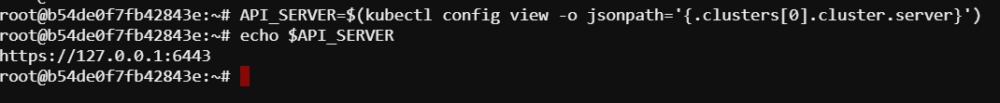

# Check health of the kubernetes API endpoints

In this documentation, we will find out how to check the health of kubernetes API endpoints using `kubectl` command and API endpoints.

## Using kubectl command:

#### Prerequisites

1. **kubectl**: Ensure you have `kubectl` installed and configured to access your Kubernetes cluster.
2. **Kubernetes Cluster**: A running Kubernetes cluster where you can execute commands.

### Step 1: Check Kubernetes API Server Health

You can check the health of the Kubernetes API server using the `kubectl get --raw` command:

1. **Check the API server health:**

    ```sh
    kubectl get --raw='/healthz'
    ```

    The expected output should be `ok`.

2. **Check the API server liveness:**

    ```sh
    kubectl get --raw='/livez'
    ```

    The expected output should be `ok`.

3. **Check the API server readiness:**

    ```sh
    kubectl get --raw='/readyz'
    ```

    The expected output should be `ok`.


### Step 2: Check Other Kubernetes Components

Kubernetes has several components whose health can also be checked using specific endpoints.

#### Check Available Endpoints
List the available raw endpoints to see what health checks are exposed:

```sh
kubectl get --raw='/'
```
Now, you can your required raw endpoints.


## Using Kubernetes API Endpoints for Health Checks

#### Prerequisites

1. **Curl**: Ensure you have `curl` installed for making HTTP requests.
2. **Kubernetes API Server URL**: Know the URL of your Kubernetes API server. This is typically in the format `https://<KUBE_API_SERVER>:6443`.
3. **Certificates** for valid autherization.

### How to know the URL of kubernetes API server?

To find out the Kubernetes API server url you can run the following command:

```sh
API_SERVER=$(kubectl config view -o jsonpath='{.clusters[0].cluster.server}')
echo $API_SERVER
```

### Extract the certificates:

```sh
CERT=$(kubectl config view --raw -o jsonpath='{.users[0].user.client-certificate-data}' | base64 --decode)
KEY=$(kubectl config view --raw -o jsonpath='{.users[0].user.client-key-data}' | base64 --decode)

# Save certificates to files
echo "$CERT" > client.crt
echo "$KEY" > client.key
```



### Step 1: Check the API Server Health Endpoints

Kubernetes API server exposes several endpoints that can be used to check its health:

1. **Healthz Endpoint**

   This endpoint checks the overall health of the API server.

   ```sh
   curl -k --cert client.crt --key client.key https://<KUBE_API_SERVER>:6443/healthz
   ```

2. **Livez Endpoint**

   This endpoint checks if the API server is alive. It's a basic check that the server is running.

   ```sh
   curl -k --cert client.crt --key client.key https://<KUBE_API_SERVER>:6443/livez
   ```
3. **Readyz Endpoint**

   This endpoint checks if the API server is ready to serve traffic. It's more comprehensive than the liveness check.

   ```sh
   curl -k --cert client.crt --key client.key https://<KUBE_API_SERVER>:6443/readyz
   ```

## Expected output:
