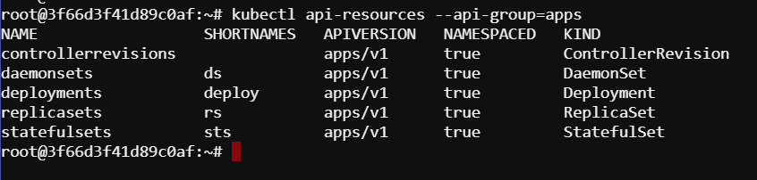
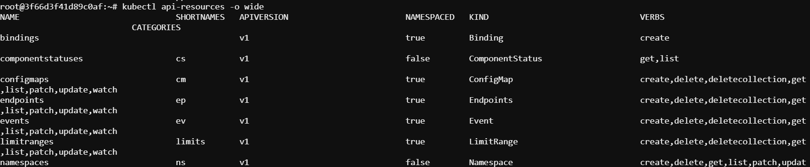

# List Kubernetes API Resoruces

Listing Kubernetes API resources involves interacting with the Kubernetes API server to retrieve information about the various resources available in your cluster. Here's a step-by-step guide on how to list Kubernetes API resources using `kubectl` command-line tool, which is the standard Kubernetes command-line client:

### Prerequisites:
- You need to have `kubectl` configured to communicate with your Kubernetes cluster. Ensure `kubectl` is installed and configured to connect to your cluster.

### Steps to List Kubernetes API Resources:

1. **Basic List Command:**
   The simplest way to list all Kubernetes API resources is by using the following `kubectl` command:
   ```bash
   kubectl api-resources
   ```
   This command will output a list of all available API resources along with their short names, kind, and group.

2. **Filtering by API Group:**
   Kubernetes API resources are grouped based on their functionality (e.g., `core`, `apps`, `batch`). To list resources within a specific group, use:
   ```bash
   kubectl api-resources --api-group=<group-name>
   ```
   Replace `<group-name>` with the actual API group name you want to explore (e.g., `apps`, `batch`, `extensions`).

3. **Output Formats:**
   By default, `kubectl` outputs in a table format. You can also get the output in YAML or JSON format for more detailed information:
   ```bash
   kubectl api-resources -o yaml
   kubectl api-resources -o json
   ```

4. **Verbs and Namespaced Resources:**
   The `kubectl` command can also show which HTTP verbs (`get`, `list`, `watch`, `create`, `delete`, etc.) are supported by each resource and whether the resources are namespaced (scoped to a particular namespace) or cluster-scoped.

   To display the verbs and namespace information:
   ```bash
   kubectl api-resources -o wide
   ```

### Example Scenarios:

#### Example 1: List All API Resources
```bash
kubectl api-resources
```
Output:
```sh
NAME                                SHORTNAMES   APIVERSION                        NAMESPACED   KIND
bindings                                         v1                                true         Binding
componentstatuses                   cs           v1                                false        ComponentStatus
configmaps                          cm           v1                                true         ConfigMap
endpoints                           ep           v1                                true         Endpoints
persistentvolumeclaims              pvc          v1                                true         PersistentVolumeClaim
persistentvolumes                   pv           v1                                false        PersistentVolume
pods                                po           v1                                true         Pod
podtemplates                                     v1                                true         PodTemplate
replicationcontrollers              rc           v1                                true         ReplicationController
resourcequotas                      quota        v1                                true         ResourceQuota
secrets                                          v1                                true         Secret
serviceaccounts                     sa           v1                                true         ServiceAccount
services                            svc          v1                                true         Service
controllerrevisions                              apps/v1                           true         ControllerRevision
daemonsets                          ds           apps/v1                           true         DaemonSet
...
...
```

#### Example 2: List Resources in a Specific API Group (`apps`)
```bash
kubectl api-resources --api-group=apps
```
Output:



#### Example 3: List Resources with Verbs and Namespace Info
```bash
kubectl api-resources -o wide
```
Output:


### Summary:
Listing Kubernetes API resources is essential for understanding what capabilities are available within your cluster. `kubectl api-resources` provides a comprehensive way to explore these resources, their grouping, namespaces, supported verbs, and more. This information is crucial for interacting with Kubernetes objects effectively through the API server.