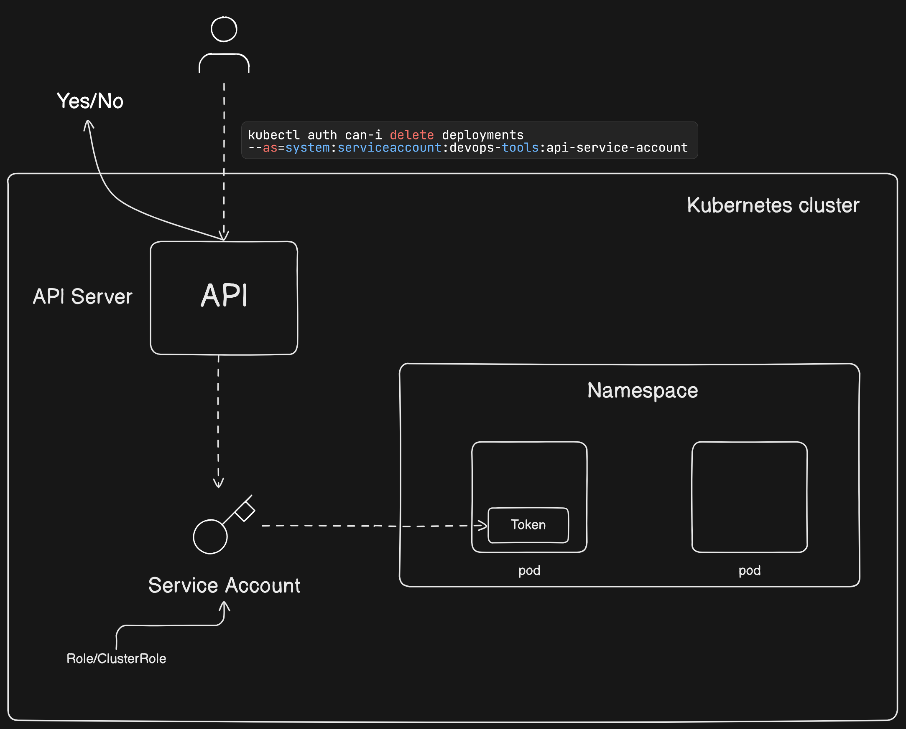

# Verifying Service Account Permissions in Kubernetes

Verifying service account permissions in Kubernetes involves checking what actions a service account can perform on various resources. This is crucial for ensuring security and proper access control. Below is a detailed documentation on how to verify service account permissions using `kubectl` and RBAC (Role-Based Access Control).



### Prerequisites

- **kubectl**: Command-line tool for interacting with Kubernetes clusters.
- **Kubernetes Cluster**: A running Kubernetes cluster.
- **Service Account**: A service account already created in your namespace.

### Step-by-Step Guide

#### 1. **Identify the Service Account**

First, identify the service account you want to verify. List all service accounts in a specific namespace (e.g., `default` namespace):

```bash
kubectl get serviceaccounts -n default
```

#### 2. **Check Service Account Details**

Get the details of the specific service account:

```bash
kubectl get serviceaccount <service-account-name> -n <namespace> -o yaml
```

Replace `<service-account-name>` with the name of your service account and `<namespace>` with the namespace.

#### 3. **List Roles and RoleBindings**

Roles and RoleBindings determine the permissions associated with a service account. List all Roles and RoleBindings in the namespace:

```bash
kubectl get roles -n <namespace>
kubectl get rolebindings -n <namespace>
```

For cluster-wide permissions, list ClusterRoles and ClusterRoleBindings:

```bash
kubectl get clusterroles
kubectl get clusterrolebindings
```

#### 4. **Describe RoleBindings**

Describe the RoleBindings to see which roles are associated with the service account:

```bash
kubectl describe rolebinding <rolebinding-name> -n <namespace>
```

Replace `<rolebinding-name>` with the name of the RoleBinding.

#### 5. **Describe ClusterRoleBindings**

For cluster-wide permissions, describe the ClusterRoleBindings:

```bash
kubectl describe clusterrolebinding <clusterrolebinding-name>
```

Replace `<clusterrolebinding-name>` with the name of the ClusterRoleBinding.

#### 6. **Check Permissions Using kubectl auth can-i**

The `kubectl auth can-i` command allows you to check if a specific action can be performed by the service account. Use the `--as` flag to impersonate the service account:

```bash
kubectl auth can-i <verb> <resource> --as=system:serviceaccount:<namespace>:<service-account-name>
```

Examples:
- Check if the service account can list pods:
  ```bash
  kubectl auth can-i list pods --as=system:serviceaccount:default:my-service-account
  ```

- Check if the service account can create deployments:
  ```bash
  kubectl auth can-i create deployments --as=system:serviceaccount:default:my-service-account
  ```

### Example Scenario

Assume we have a service account named `my-service-account` in the `default` namespace. We want to verify if this service account has permissions to list pods and create deployments.

1. **List Service Accounts in `default` Namespace:**
   ```bash
   kubectl get serviceaccounts -n default
   ```

2. **Get Details of `my-service-account`:**
   ```bash
   kubectl get serviceaccount my-service-account -n default -o yaml
   ```

3. **List Roles and RoleBindings:**
   ```bash
   kubectl get roles -n default
   kubectl get rolebindings -n default
   ```

4. **Describe Relevant RoleBindings:**
   ```bash
   kubectl describe rolebinding <rolebinding-name> -n default
   ```

5. **Check Permissions with `kubectl auth can-i`:**
   ```bash
   kubectl auth can-i list pods --as=system:serviceaccount:default:my-service-account
   kubectl auth can-i create deployments --as=system:serviceaccount:default:my-service-account
   ```

### Conclusion

Verifying service account permissions in Kubernetes ensures that your service accounts have the appropriate level of access. By following the steps outlined above, you can systematically check the permissions assigned to any service account in your Kubernetes cluster. This helps in maintaining a secure and well-regulated Kubernetes environment.