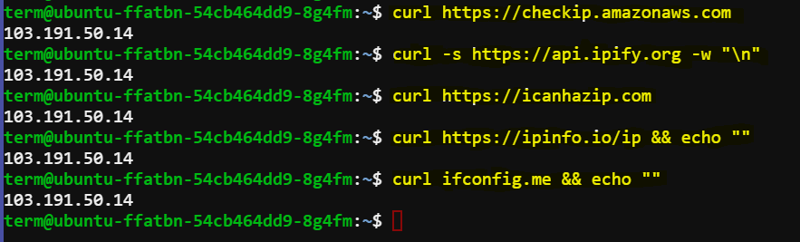

# Retrieving Public IP Address Using `curl`

This documentation provides instructions on how to retrieve the public IP address of a server or client machine using `curl`, a command-line tool for transferring data with URLs. Several methods using different public services are covered, along with considerations for security and reliability.

## Methods

### 1. Using Amazon AWS Service

To fetch the public IP address using Amazon Web Services' dedicated service:

```bash
curl https://checkip.amazonaws.com
```

This command queries Amazon's service specifically designed for retrieving the public IP address of the requesting machine.

### 2. Using ipify.org

ipify.org is a popular service that provides the public IP address. The following command retrieves the IP address from ipify.org:

```bash
curl -s https://api.ipify.org -w "\n"
```

- `-s` flag ensures silent operation (no progress or error messages).
- `-w "\n"` appends a newline character at the end of the output for cleaner formatting.

### 3. Using icanhazip.com

icanhazip.com is known for its straightforward approach to IP address retrieval:

```bash
curl https://icanhazip.com
```

This command directly fetches the public IP address from icanhazip.com.

### 4. Using ipinfo.io

ipinfo.io provides IP address information along with additional details. Use the following command to fetch the IP address:

```bash
curl https://ipinfo.io/ip && echo ""
```

- `&& echo ""` ensures a newline is printed after the IP address for better readability.

### 5. Using ifconfig.me

ifconfig.me is another service that provides the public IP address:

```bash
curl ifconfig.me && echo ""
```

Similar to the previous command, `&& echo ""` ensures a newline is appended after printing the IP address.



## For Production Environments

1. **Using AWS Service**:
   ```bash
   curl http://169.254.169.254/latest/meta-data/public-ipv4 && echo ""
   ```
   This retrieves the public IPv4 address from the AWS instance metadata service, which is the recommended approach within AWS environments.

2. **Using GCP Metadata Service**:
   ```bash
   curl -H "Metadata-Flavor: Google" http://metadata.google.internal/computeMetadata/v1/instance/network-interfaces/0/access-configs/0/external-ip
   ```
   Similarly, this command fetches the external IP address from the Google Cloud Platform metadata service. It's the recommended method within GCP environments.

In production environments, especially within cloud platforms like AWS and GCP, using the respective metadata services (`169.254.169.254` for AWS and `metadata.google.internal` for GCP) is recommended because it provides a reliable and secure way to retrieve instance metadata, including the public IP address.

## Conclusion

Using `curl` to retrieve the public IP address is straightforward and useful for various deployment and troubleshooting scenarios. However, for secure and reliable retrieval in production environments, prefer utilizing cloud provider-specific metadata services or securely configured internal services.

