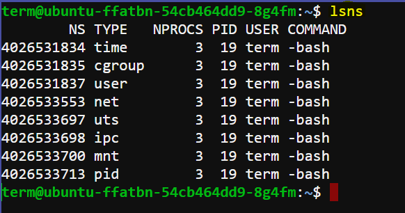
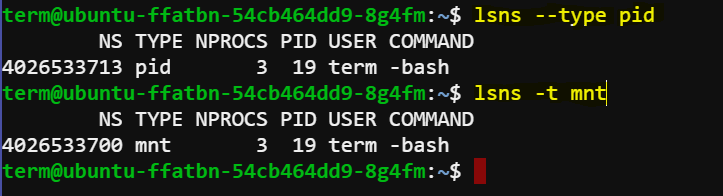
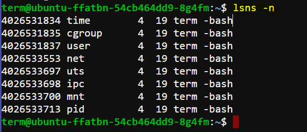

# Linux Namespaces Documentation

## Introduction

Linux namespaces are a core feature of the Linux kernel that enables process isolation and resource partitioning within a Linux system. Namespaces allow different processes to have their own isolated view of system resources. This isolation is fundamental to containerization technology, where each container can operate independently, unaware of other containers or the host system's configuration.

## Purpose

The primary purpose of Linux namespaces is to provide:

- **Process Isolation**: Each namespace provides an isolated environment where processes can run without interfering with processes outside the namespace.
- **Resource Partitioning**: Different namespaces can have separate sets of system resources (like network interfaces, filesystem mounts, and process IDs), ensuring that resources are not shared unless explicitly configured to do so.
- **Security and Resource Management**: Namespaces enable better security by restricting process visibility and resource access, which enhances system stability and resource utilization.

## Using `lsns` Command

The `lsns` command is used to list namespaces on a Linux system. It provides information about existing namespaces and their types. Here's how you can use it:

```bash
lsns [options]
```

### Options

- `-t, --type <type>`: Filters namespaces by type (e.g., pid, mnt, net).
- `-n, --noheadings`: Suppresses headers in the output.

### Example Usage

To list all namespaces on the system:

```bash
lsns
```



To list only PID namespaces:

```bash
lsns --type pid
```



To list namespaces without headers:

```bash
lsns --noheadings
```




## List of Linux Namespaces

1. **PID (Process ID) Namespace**:
   - **Purpose**: Isolates the process ID number space.
   - **Effect**: Processes in different PID namespaces can have the same PID without conflicting with processes in other namespaces.
   - **Usage**: Enables process isolation and facilitates hierarchical process management within containers.

2. **Mount Namespace**:
   - **Purpose**: Provides an isolated view of the filesystem mount points.
   - **Effect**: Processes in different mount namespaces can have different views of the filesystem hierarchy, allowing for independent filesystem mounts and unmounts.
   - **Usage**: Facilitates container filesystem isolation and independent management of mount points.

3. **UTS (Unix Time-Sharing) Namespace**:
   - **Purpose**: Isolates the hostname and the NIS domain name.
   - **Effect**: Processes in different UTS namespaces can have different hostname/domain name settings, which is crucial for container identification and network isolation.
   - **Usage**: Enables containers to have distinct network identities and hostnames.

4. **IPC (InterProcess Communication) Namespace**:
   - **Purpose**: Isolates System V IPC objects and POSIX message queues.
   - **Effect**: Processes in different IPC namespaces can have separate sets of IPC resources, such as semaphores, shared memory segments, and message queues.
   - **Usage**: Ensures IPC resource isolation between containers and improves security by preventing unintended communication between processes.

5. **Network Namespace**:
   - **Purpose**: Provides isolation for network resources.
   - **Effect**: Processes in different network namespaces can have different network configurations, including network devices, IP addresses, routing tables, firewall rules, etc.
   - **Usage**: Facilitates network isolation between containers and allows each container to have its own network stack and IP address.

6. **User Namespace**:
   - **Purpose**: Isolates user and group IDs.
   - **Effect**: Processes in different user namespaces can have different views of user and group identities, allowing non-root users in the namespace to have more privileges than in the parent namespace.
   - **Usage**: Enhances security by limiting the impact of user and group ID conflicts between containers and the host system.

7. **Cgroup (Control Group) Namespace**:
   - **Purpose**: Isolates control group hierarchies.
   - **Effect**: Processes in different cgroup namespaces can have different views of the control group tree, allowing for independent resource management and allocation.
   - **Usage**: Facilitates resource allocation and management for containers, ensuring efficient resource utilization and isolation.


## Conclusion

Linux namespaces are a critical component of modern containerization technologies like Docker and Kubernetes. They provide the necessary isolation and resource partitioning to run applications securely and efficiently in containers. Understanding namespaces is essential for developers, system administrators, and anyone involved in building or managing containerized environments.
