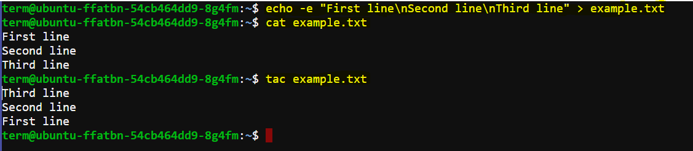
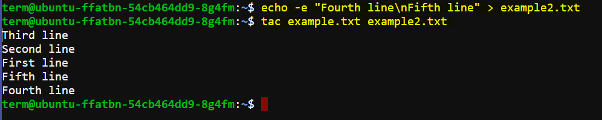
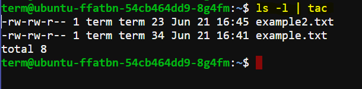

# `tac` Command Documentation

The `tac` command is a utility in Unix-like operating systems that concatenates files and writes them to standard output in reverse order line by line. Its name is the reverse of `cat` (concatenate and print files).

## Usage
```bash
tac [OPTION]... [FILE]...
```

## Options
- **-b, --before**: Attach the separator before instead of after.
- **-r, --regex**: Interpret the separator as a regular expression.
- **-s, --separator=STRING**: Use STRING as the separator instead of newline.
- **--help**: Display this help and exit.
- **--version**: Output version information and exit.

## Examples

Let's create a file named `example.txt` with some content:

```bash
echo -e "First line\nSecond line\nThird line" > example.txt
```

1. **Basic Usage**: Print lines of `example.txt` in reverse order.

   ```bash
   tac example.txt
   ```

   Output:
   ```
   Third line
   Second line
   First line
   ```

   This demonstrates how `tac` reverses the lines of a file, displaying them from the last line to the first.

   

2. **Concatenate Multiple Files in Reverse**:

   Let's create another file named `example2.txt` with additional content:

   ```bash
   echo -e "Fourth line\nFifth line" > example2.txt
   ```

   Now, concatenate both `example.txt` and `example2.txt` using `tac` to print their contents in reverse order:

   ```bash
   tac example.txt example2.txt
   ```

   Output:
   ```
   Third line
   Second line
   First line
   Fifth line
   Fourth line
   ```

   

   Here, `tac` concatenates and displays the lines from `example.txt` followed by `example2.txt` in reverse order.

3. **Using with Pipes**: Reverse the output of another command. For example, let's use `ls -l` to list files in a directory and then reverse the output with `tac`:

   ```bash
   ls -l | tac
   ```

   Output (example):
   ```
   -rw-r--r-- 1 user user   31 Jun 21 12:00 example2.txt
   -rw-r--r-- 1 user user   23 Jun 21 12:00 example.txt
   total 16
   ```

   

   Here, `tac` reverses the output of `ls -l`, showing the directory listing from the last entry to the first.


This documentation provides a clear overview of what the `tac` command does, how to use it with examples, its options, and additional information for further reference.