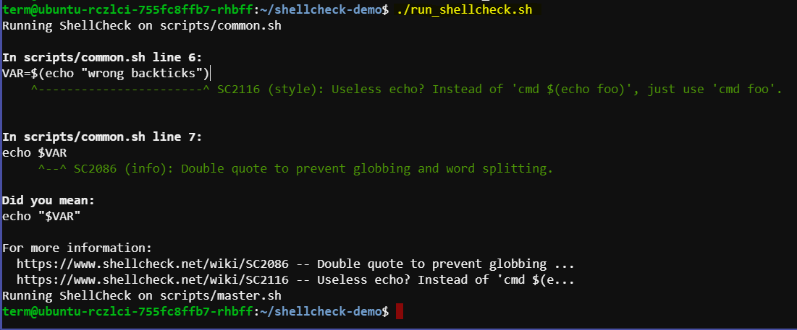

# ShellCheck Configuration and Usage Guide

This guide provides step-by-step instructions on setting up and using ShellCheck with a `shellcheck.yml` configuration file to analyze shell scripts in a Linux terminal.


## Overview

ShellCheck is a static analysis tool for shell scripts that detects common issues and pitfalls. Using a `shellcheck.yml` file allows you to specify which scripts to analyze and provides flexibility in configuring ShellCheck's behavior.

## Setup Steps

### Step 1: Create Sample Shell Scripts

Create a directory and add your sample shell scripts.

```bash
mkdir -p ~/shellcheck-demo/scripts
cd ~/shellcheck-demo/scripts
```

Create `common.sh`:

```bash
nano common.sh
```

Add the following content to `common.sh`:

```bash
#!/bin/bash
# This is a sample common script

echo "Hello, this is the common script!"
# Intentional error for demonstration
VAR=$(echo "wrong backticks")
echo $VAR
```

Create `master.sh`:

```bash
nano master.sh
```

Add the following content to `master.sh`:

```bash
#!/bin/bash
# This is a sample master script

echo "Hello, this is the master script!"
# Another intentional error
for i in {1..5}
do
  echo "Number $i"
done
```

### Step 2: Create a ShellCheck Configuration File (`shellcheck.yml`)

Navigate to your project root directory and create `shellcheck.yml`:

```bash
cd ~/shellcheck-demo
nano shellcheck.yml
```

Add the following content to `shellcheck.yml`:

```yaml
scripts:
  - scripts/common.sh
  - scripts/master.sh
```

### Step 3: Write a Bash Script to Parse and Execute the Configuration

Create a Bash script to read `shellcheck.yml` and execute ShellCheck:

```bash
nano run_shellcheck.sh
```

Add the following content to `run_shellcheck.sh`:

```bash
#!/bin/bash

# Install yq for parsing YAML files if not installed
if ! command -v yq &> /dev/null
then
    echo "yq could not be found, installing..."
    sudo apt-get update
    sudo apt-get install jq
    sudo jq --raw-output '.assets[] | select(.browser_download_url | contains("linux_amd64")) | .browser_download_url' < <(curl -s https://api.github.com/repos/mikefarah/yq/releases/latest) | sudo wget -O /usr/bin/yq -i -
    sudo chmod +x /usr/bin/yq
fi

# Install ShellCheck if not installed
if ! command -v shellcheck &> /dev/null
then
    echo "ShellCheck could not be found, installing..."
    sudo apt-get update
    sudo apt-get install -y shellcheck
fi

# Read and parse shellcheck.yml
if [ ! -f "shellcheck.yml" ]; then
  echo "shellcheck.yml not found!"
  exit 1
fi

# Extract script paths from shellcheck.yml
scripts=$(yq e '.scripts[]' shellcheck.yml)

# Run ShellCheck on each script
for script in $scripts; do
  echo "Running ShellCheck on $script"
  shellcheck "$script"
done
```

Make the script executable:

```bash
chmod +x run_shellcheck.sh
```

### Step 4: Run the Bash Script

Execute the script to run ShellCheck on the specified shell scripts:

```bash
./run_shellcheck.sh
```



## Summary

By following these steps, you can set up a `shellcheck.yml` configuration file and use a Bash script to automate ShellCheck analysis of your shell scripts in a Linux terminal. This approach helps maintain script quality and identify common issues early in development.
