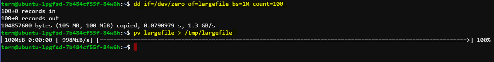

# Introduction to `pv` (Pipe Viewer)

`pv` is a command-line tool that allows you to monitor the progress and throughput of data through a pipeline. It is especially useful for tasks involving large data transfers or where real-time feedback on progress is required.

## Installation

Before using `pv`, ensure that it is installed on your system. If `pv` is not already installed, you can install it using your system's package manager. Here’s how you can install it on Linux distributions:

```bash
sudo apt-get update
sudo apt-get install pv
```

## Example Scenario

### Step 1: Creating a Large File

First, we'll create a large file using `dd`. In this example, we'll create a 100MB file filled with zeros (`/dev/zero`).

```bash
dd if=/dev/zero of=largefile bs=1M count=100
```

- `if=/dev/zero`: Specifies the input file as `/dev/zero`, which provides an endless stream of zeros.
- `of=largefile`: Specifies the output file name as `largefile`.
- `bs=1M`: Sets the block size to 1 megabyte.
- `count=100`: Copies 100 blocks, resulting in a file size of 100MB (`1MB * 100`).

This command creates a file named `largefile` in the current directory filled with zeros.

### Step 2: Copying the Large File Using `pv`

Next, we'll copy `largefile` to another location (`/tmp` in this case) while using `pv` to monitor the progress.

```bash
pv largefile > /tmp/largefile
```

- `pv largefile`: Reads `largefile` and displays progress information.
- `> /tmp/largefile`: Redirects the output of `pv` to `/tmp/largefile`.

### Monitoring the Progress

While `pv` runs, it provides real-time feedback on the progress of the file transfer:

```
98.2MiB 0:00:10 [9.55MiB/s] [==================>   ] 98% ETA 0:00:01
```

- `98.2MiB`: Amount of data transferred so far.
- `0:00:10`: Elapsed time.
- `[9.55MiB/s]`: Transfer rate (speed).
- `[==================>   ] 98%`: Progress bar indicating completion percentage.
- `ETA 0:00:01`: Estimated time remaining until completion.



## Key Features and Benefits of `pv`

- **Progress Monitoring**: Provides real-time feedback on data transfer progress, helping users track how much data has been transferred and the estimated time remaining.
  
- **Transfer Rate**: Displays the current speed of data transfer (`MiB/s` or `KiB/s`), allowing users to gauge performance and optimize operations if needed.

- **Integration with Pipelines**: Easily integrates into command pipelines (`|`) without altering the functionality of the commands involved, making it versatile for various data processing tasks.

## Practical Use Cases

- **Large File Transfers**: When copying or moving large files between directories or systems, `pv` provides visibility into the progress of the transfer, which is particularly useful over slow or networked filesystems.
  
- **Backup and Restore Operations**: Monitoring the progress of backups (`tar`, `rsync`, etc.) ensures that operations proceed as expected and allows for better resource planning.

- **Data Processing Pipelines**: In complex data processing tasks involving multiple stages, `pv` helps monitor data flow between stages and identify potential bottlenecks.

## Conclusion

In conclusion, `pv` is a valuable tool for monitoring and optimizing data transfer operations in Linux environments. By integrating `pv` into your command-line workflows, you gain real-time insights into data throughput, helping you manage tasks more effectively and efficiently.

