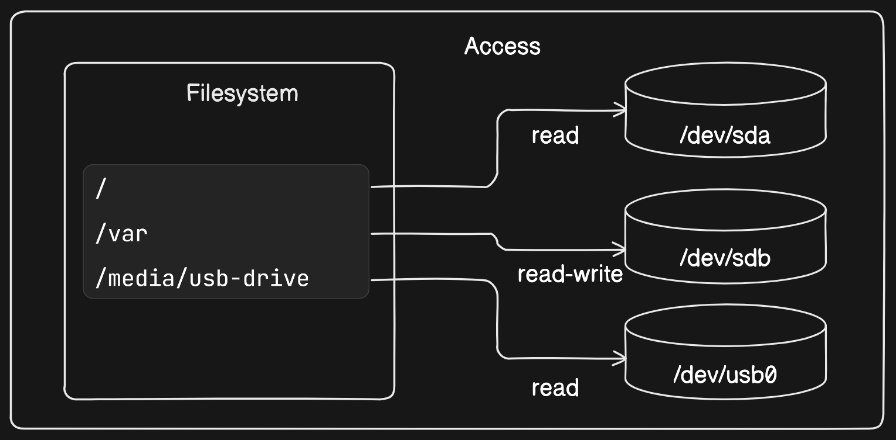
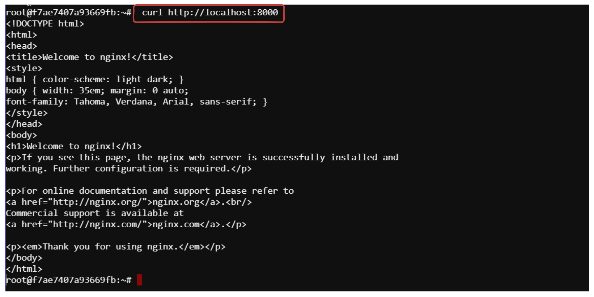

# Docker Bind Mounts

## Overview of File Trees and Mount Points in Linux

In Linux, all storage is consolidated into a `single tree structure`, unlike other operating systems. This structure organizes storage devices such as disk partitions or USB drives by attaching them to specific locations within the tree, known as mount points. Mount points define the location in the tree, access properties, and the source of the mounted data.



**Mount points** enable seamless usage of the file tree in a Linux environment without requiring detailed knowledge of storage device `mappings`. This is particularly advantageous in container environments where each container has its own unique file tree root and set of mount points.
 
**Bind mounts** are a powerful feature that allows mapping directories or files on the host system into a Docker container, enabling *direct interaction* between the containerized application and the host filesystem.

- **What are Bind Mounts?**:
   - Bind mounts allow you to attach specific files or directories from the host system to locations within a container's filesystem. Essentially, they remount parts of the host filesystem tree onto the container.
   - With bind mounts, the files and directories are directly accessible from both the host and the container, facilitating seamless sharing of data between them.

- **How Bind Mounts Work**:
   - When you create a bind mount, you specify a source location on the host system and a target location within the container. The target location within the container effectively becomes a mirror of the source location on the host.
   - Any changes made to files or directories within the bind mount from either the host or the container are immediately reflected in both environments.


## Example Scenario
Consider a scenario where you have an `NGINX` web server running inside a Docker container. The NGINX server requires access to a **configuration file** stored on the host system and needs to write `access logs` to a file on the host. 

## Solution
We can do this by using `bind mounts`, we can map these host files into the container, enabling seamless interaction between the containerized `NGINX` server and the host filesystem. To demonstrate the usage of bind mounts, we can follow these steps:

### Step 1: Create Placeholder Files

First, we need to create the files that the `NGINX` container will use for its `configuration` and `logging`.

1. **Create an empty log file**:
   ```bash
   touch ~/example.log
   ```
   This command creates an empty file named `example.log` in the `home directory`. This file will be used by NGINX to write `access logs`.

2. **Create a custom NGINX configuration file**:
   ```bash
   cat > ~/example.conf <<EOF
   server {
     listen 80;
     server_name localhost;
     access_log /var/log/nginx/custom.host.access.log main;
     location / {
       root /usr/share/nginx/html;
       index index.html index.htm;
     }
   }
   EOF
   ```
   This command creates a file named `example.conf` in the home directory with the provided NGINX server configuration. The configuration sets up an NGINX server to:
   - Listen on port 80.
   - Serve content from `/usr/share/nginx/html`.
   - Write access logs to `/var/log/nginx/custom.host.access.log`.

   

### Step 2: Run NGINX Container with Bind Mounts

Now, we'll run an NGINX container and use bind mounts to map the host files into the container.

1. **Define variables for source and destination paths**:
   ```bash
   CONF_SRC=~/example.conf
   CONF_DST=/etc/nginx/conf.d/default.conf
   LOG_SRC=~/example.log
   LOG_DST=/var/log/nginx/custom.host.access.log
   ```

   - `CONF_SRC` is the path to our custom NGINX configuration file on the `host`.
   - `CONF_DST` is the path where the configuration file will be mounted inside the `container`.
   - `LOG_SRC` is the path to our log file on the `host`.
   - `LOG_DST` is the path where the log file will be mounted inside the `container`.

2. **Run the container with bind mounts**:
   ```bash
   docker run -d --name diaweb \
     --mount type=bind,src=${CONF_SRC},dst=${CONF_DST} \
     --mount type=bind,src=${LOG_SRC},dst=${LOG_DST} \
     -p 8000:80 \
     nginx:latest
   ```
   Here, 
   - `docker run -d` starts the container in **detached** mode (running in the background).
   - `--name diaweb` names the container `diaweb`.
   - `--mount type=bind,src=${CONF_SRC},dst=${CONF_DST}` mounts the host's `example.conf` to the container's `/etc/nginx/conf.d/default.conf`.
   - `--mount type=bind,src=${LOG_SRC},dst=${LOG_DST}` mounts the host's `example.log` to the container's `/var/log/nginx/custom.host.access.log`.
   - `-p 80:80` maps port **80** of the host to port **80** of the container, making the web server accessible via `http://localhost`.
   - `nginx:latest` specifies the Docker image to use.

   Expected Output:

   

### Step 3: Access the Web Server and Logs

After running the container, we can verify the setup.

1. **Access the NGINX web server**:
   - To verify if nginx is running we can run this command to check it from the terminal:
   ```sh
    curl http://localhost:8000
    ```
    we should get this response from nginx server:
    

2. **Check the logs**:
   - Run the command on the host to see the access logs generated by NGINX. These logs are written to the `example.log` file on the host due to the **bind mount**.

    ```sh 
    cat ~/example.log
    ```
    


### Step 4: Make Configuration File Read-Only

To enhance security, we can make the configuration file read-only so that the container cannot modify it.

1. **Remove the existing container**:
   ```bash
   docker stop diaweb
   docker rm -f diaweb
   ```
   This command forcefully removes the `diaweb` container.

   

2. **Run the container with a read-only bind mount**:
   ```bash
   docker run -d --name diaweb \
   --mount type=bind,src=${CONF_SRC},dst=${CONF_DST},readonly=true \
   --mount type=bind,src=${LOG_SRC},dst=${LOG_DST} \
   -p 8000:80 \
   nginx:latest
   ```
   Adding `readonly=true` to the bind mount for `CONF_DST` ensures that the configuration file cannot be modified by processes inside the container.

   

### Step 5: Attempt to Modify Read-Only File

Finally, we can test the read-only restriction by attempting to modify the configuration file inside the container.

**Try to modify the configuration file**:

```bash
docker exec diaweb \
      sed -i "s/listen 8000/listen 8001/" /etc/nginx/conf.d/default.conf
```
This command atteps to modify the NGINX configuration file `(/etc/nginx/conf.d/default.conf)` inside the container using `sed` to change the port in the NGINX configuration file from `8080 to 8081`. Because the file is mounted as `read-only`, this command will fail due to the file being mounted as `read-only`.


The output confirms that the container has been started with the `readonly=true` flag applied to the bind mount for the configuration file. The failed attempt to modify the configuration file verifies that the mount is indeed read-only, preventing modifications to the file inside the container.

### Considerations

- **Portability**: Bind mounts tie the container to specific paths on the host filesystem, which can reduce portability across different hosts.
- **Conflicts**: If multiple containers use the same bind mount for data storage, they can interfere with each other, leading to data corruption.

## Conclusion

Bind mounts are a powerful tool for sharing files and directories between Docker containers and the host filesystem. By understanding their usage and the associated considerations, you can effectively manage data and configurations for your containerized applications.