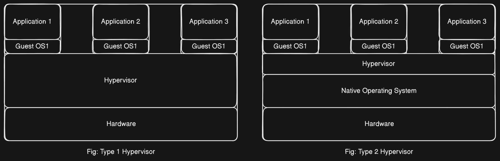

# Understanding Containers in Application Deployment

## Introduction
Containers have emerged as a revolutionary technology in the realm of application deployment, providing a lightweight and efficient way to package and run applications along with their dependencies. This module aims to elucidate the concept of containers, their architectural differences from traditional VMs, their advantages, and their adoption in various industries.

## What are Containers?
### Definition
Containers are an abstraction at the application layer that package code and its dependencies together. This means containers not only ship the application but also the runtime environment, while remaining relatively small in size.

### Comparison with Virtual Machines (VMs)
Unlike traditional VMs, which include a complete operating system, containers share the host OS's kernel and isolate the application processes from each other, leading to more efficient use of resources.

## Traditional VM Architecture

To understand about the traditional VM architecture first we need to know what a Hypervisor is.

#### Hypervisor

A `hypervisor`, also known as a `virtual machine monitor (VMM)`, is a type of software that allows multiple operating systems to share a single hardware host. Each operating system appears to have the host's processor, memory, and other resources all to itself. The hypervisor manages the system's resources so that each operating system has what it needs and that different operating systems do not disrupt each other.

**Types of Hypervisors**
Hypervisors are generally categorized into two types:

1. Type 1 Hypervisor (Bare-Metal Hypervisor)
2. Type 2 Hypervisor (Hosted Hypervisor)

**Type 1 Hypervisor (Bare-Metal Hypervisor)**

A Type 1 hypervisor runs directly on the physical hardware of the host machine. It does not require a host operating system because it installs directly onto the server hardware. Since it interacts directly with the hardware, it generally offers better performance and efficiency. It provides better resource management, leading to more optimized use of physical resources.

Examples: `VMware ESXi`, `Microsoft Hyper-V`, and `KVM (Kernel-based Virtual Machine)`.

**Type 2 Hypervisor (Hosted Hypervisor)**

A Type 2 hypervisor runs on top of a conventional operating system (the host OS). It relies on the host OS for device support and management. Generally easier to set up and use since it runs as an application on a host OS. Offers broader hardware compatibility since it relies on the host OS for device drivers and other functions.
Examples: `Oracle VirtualBox`, `VMware Workstation`, and `Parallels Desktop`.

In a traditional VM setup:

- A **Hypervisor** (Type 1, like Hyper-V or KVM) runs directly on the hardware infrastructure, without needing a host OS. 
- Guest OSes are then provisioned on top of the Hypervisor, creating isolated virtual environments.
- A **Type 2 Hypervisor** (like Oracle's VirtualBox) requires a host OS, but the rest of the process is similar.

## Container Architecture
Containers differ significantly:
- They do not have their own guest OS. Instead, they run on a **container runtime environment**.
- The container runtime manages and runs containers.
- Containers package the application code along with OS-level dependencies, but rely on the host OS's kernel, reducing duplication.

## Advantages of Containers
### Resource Efficiency
Containers consume less storage and memory compared to VMs, as they do not include a full OS. This efficiency translates to smaller sizes (gigabytes to megabytes) and easier shipping and deployment.

### Consistency Across Environments
Since containers include all necessary dependencies, an application running in a developer's environment will run identically in production. This eliminates the common "works on my machine" problem.

### Scalability and Zero Downtime
Containers make scaling easier and more cost-effective. For instance, creating additional replicas of a backend container doesn't necessarily require new servers. Updates can be rolled out with minimal disruption, achieving zero downtime by extending the number of replicated containers during the process.

## Industry Adoption
### Notable Users
Several prominent companies and institutions are utilizing containers:
- **Google**: Pioneered the use of orchestrated containers.
- **Expedia, PayPal, GlaxoSmithKline**: Provide case studies on container use.
- **Cornell University** and **Niantic** (known for Pokémon Go): Also employ containers extensively.

### DevOps and Containers
Containers are integral to the DevOps movement, facilitating continuous integration and continuous deployment (CI/CD) processes. The demand for DevOps professionals with container expertise is rapidly growing.

## Getting Started with Docker
In the following lectures, we will introduce Docker, a popular container platform, and guide you through the basics of using Docker to create, manage, and deploy containers.