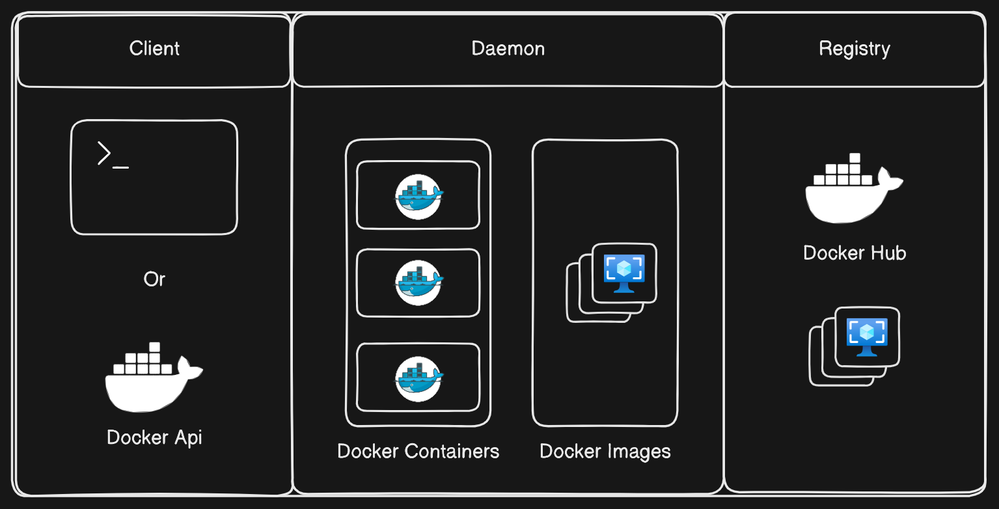

# What is Docker?

Docker is an open-source platform that enables developers to automate the deployment, scaling, and management of applications within lightweight, portable containers. It simplifies the process of creating, deploying, and running applications by using containers, which allow a developer to package an application with all its dependencies into a standardized unit for software development.

### Key Concepts of Docker

1. **Containers**:
   - Containers are lightweight, standalone, executable software packages that include everything needed to run a piece of software, including the code, runtime, libraries, and system tools.
   - They run consistently across different environments, from a developer's local machine to a production server, ensuring that "it works on my machine" issues are minimized.

2. **Docker Engine**:
   - The Docker Engine is the core component of Docker. It is a client-server application that includes:
     - A server with a long-running daemon process (the `dockerd` command).
     - A REST API interface for interacting with the daemon.
     - A command-line interface (CLI) client (`docker` command).

3. **Docker Daemon**

    - he Docker daemon, also known as dockerd, is a critical component of the Docker architecture.
    - It runs as a background process on the host machine and is responsible for managing Docker objects such as images, containers, networks, and volumes.
    - The daemon listens for Docker API requests and performs various actions based on those requests.

4. **Docker Images**:
   - Docker images are read-only templates used to create containers. They are built from a series of layers, with each layer representing a set of file system changes.
   - Images are stored in a Docker registry, such as Docker Hub, which allows for easy sharing and distribution.

5. **Docker Containers**:
   - Containers are running instances of Docker images that run applications. They are isolated from each other and the host system, but they can share resources through defined interfaces.
   - Containers can be started, stopped, moved, and deleted easily using Docker commands.

### Benefits of Docker

1. **Consistency and Compatibility**:
   - Docker ensures that applications run the same way across different environments, from development to production, by encapsulating the application and its dependencies in a container.

2. **Efficiency and Resource Utilization**:
   - Containers share the host OS kernel, making them more lightweight and efficient than traditional virtual machines. They consume fewer resources and start up faster.

3. **Portability**:
   - Docker containers can run on any system that supports Docker, including different Linux distributions, Windows, and macOS, providing true platform independence.

4. **Scalability and Manageability**:
   - Docker makes it easy to scale applications horizontally by adding more container instances. It also simplifies the management of applications through orchestration tools like Kubernetes.

5. **Isolation and Security**:
   - Containers provide process and resource isolation, ensuring that applications run in their own environments without affecting others.

### Use Cases of Docker

1. **Microservices Architecture**:
   - Docker is ideal for deploying microservices, where each service can run in its own container, making it easier to manage dependencies and updates independently.

2. **Continuous Integration and Continuous Deployment (CI/CD)**:
   - Docker integrates well with CI/CD pipelines, allowing for automated testing and deployment of applications in consistent environments.

3. **Development Environments**:
   - Developers can use Docker to create isolated development environments that mimic production, ensuring that applications behave consistently across different stages of the development lifecycle.

4. **Hybrid and Multi-Cloud Deployments**:
   - Docker's portability makes it easy to deploy applications across different cloud providers and on-premises environments.

Through this demonstration we have got an overview of what is Docker. In the following modules, we wil get a deeper understanding of Docker and its components.

