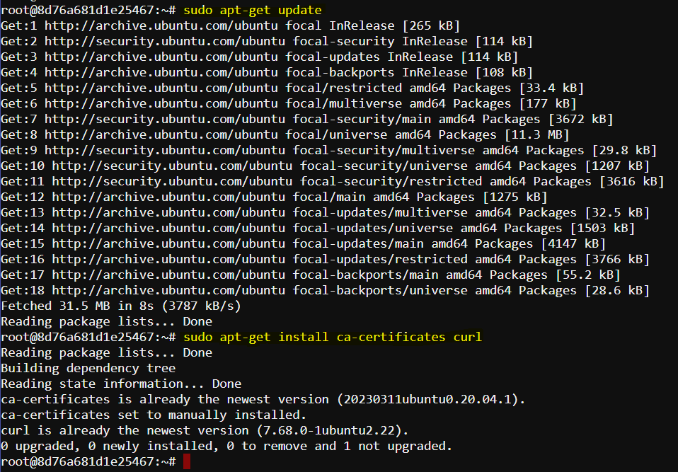

# Docker installation Guide on Ubuntu

## Set up and install Docker Engine from Docker's apt repository.

Before installation of Docker Engine for the first time on a new host machine, the Docker repository must be set up. Afterward, the installation and do update Docker from the repository.

### Steps
Here's a step-by-step breakdown of each command with appropriate headings:

### Step 1: Update Package Index

```bash
sudo apt-get update
```

### Step 2: Install Required Packages

```bash
sudo apt-get install ca-certificates curl
```



### Step 3: Create Directory for Docker Keyrings

```bash
sudo install -m 0755 -d /etc/apt/keyrings
```

### Step 4: Download Docker’s GPG Key

```bash
sudo curl -fsSL https://download.docker.com/linux/ubuntu/gpg -o /etc/apt/keyrings/docker.asc
```

### Step 5: Set Permissions for the GPG Key

```bash
sudo chmod a+r /etc/apt/keyrings/docker.asc
```

### Step 6: Add Docker Repository to APT Sources

```bash
echo \
  "deb [arch=$(dpkg --print-architecture) signed-by=/etc/apt/keyrings/docker.asc] https://download.docker.com/linux/ubuntu \
  $(. /etc/os-release && echo "$VERSION_CODENAME") stable" | \
  sudo tee /etc/apt/sources.list.d/docker.list > /dev/null
```

### Step 7: Update Package Index Again

```bash
sudo apt-get update
```

*!Note*
If you use an Ubuntu derivative distro, such as Linux Mint, you may need to use `UBUNTU_CODENAME` instead of `VERSION_CODENAME`.

### Step 8: Install the Docker Package

To install the latest version, run:

```sh
 sudo apt-get install docker-ce docker-ce-cli containerd.io docker-buildx-plugin docker-compose-plugin
```

### Step 9: Verify that the Docker Engine installation is successful by running the `hello-world` image.

First check the version
```sh
sudo docker --version
```

Run the image
```sh
sudo docker run hello-world
```

### Optional: Enable Docker to Start on Boot

If you want Docker to start automatically at boot, enable the Docker service.

```sh
sudo systemctl enable docker
```

This completes the installation and basic setup of Docker on an Ubuntu system. You can now explore Docker’s capabilities and integrate it into your development and deployment workflows.