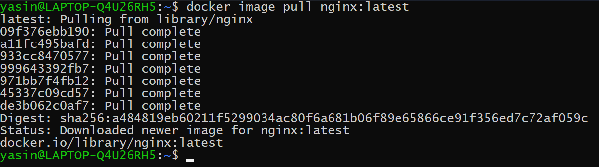
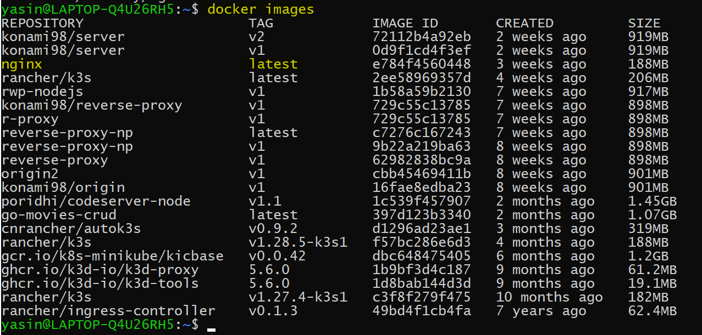
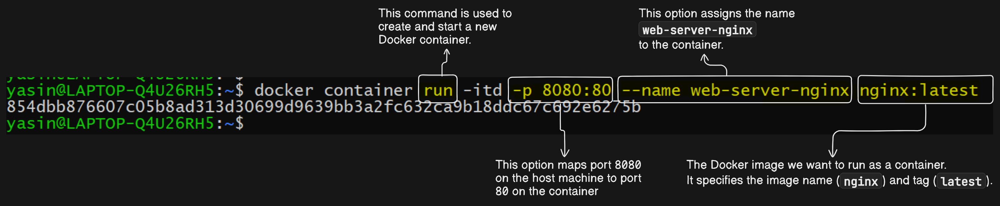
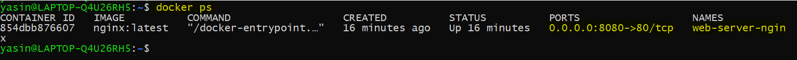
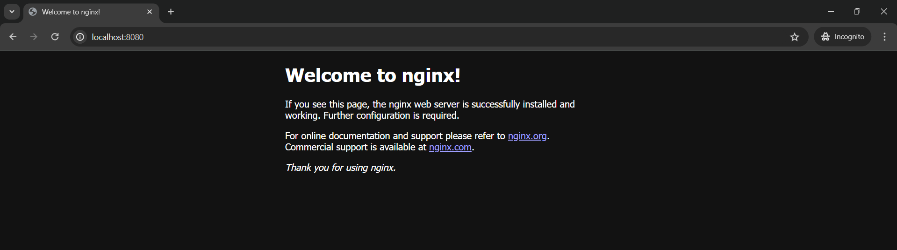
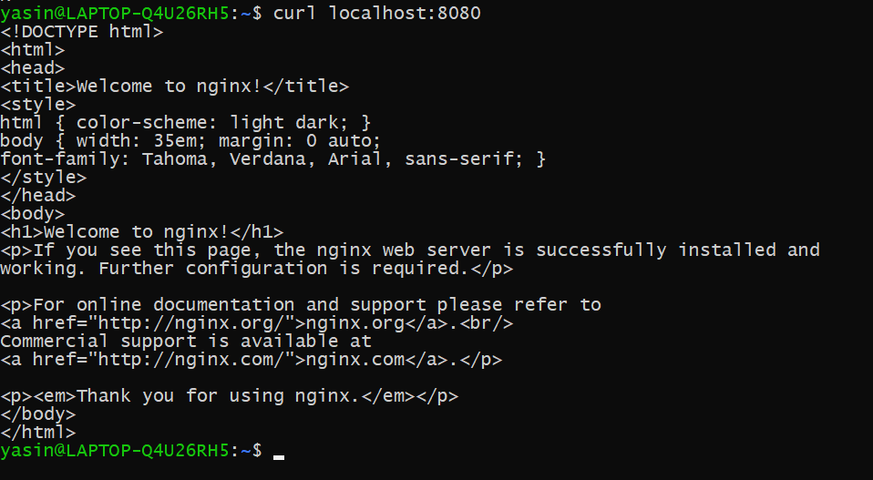

In this demo, we're going to run Nginx as a Docker container. Let's follow the steps outlined:

### Step 1: Pull Nginx Image from Docker Hub

Run the following command to pull the Nginx image from Docker Hub:

```bash
docker image pull nginx:latest
```


This command downloads or pulls an image called `nginx` with the `latest` tag from Docker Hub. The `latest` tag refers to the latest version of the Nginx image available.

### Step 2: Check Docker Images

Verify that the Nginx image has been successfully pulled by running:

```bash
docker images
```



You should see a list of Docker images, including `nginx:latest`, along with their sizes.

### Step 3: Run Nginx Container

Now, let's run the Nginx image as a container using the `docker container run` command. We'll name our container `web-server-nginx` and map port 8080 of our local machine to port 80 of the container. The `-itd` flag stands for interactive, terminal, and detached.

```bash
docker container run -itd -p 8080:80 --name web-server-nginx nginx:latest
```

Here,

- `-itd`: These are options passed to the `docker container run` command:
  - `-i`: This option allows us to keep STDIN open even if not attached. It ensures that we can interact with the container's process.
  - `-t`: This option allocates a pseudo-TTY (terminal) for the container. It allows us to see the output of the container's process.
  - `-d`: This option runs the container in detached mode. It means the container runs in the background and doesn't hold the terminal open.




### Step 4: Verify Container Status

To verify that the container is running, use the following command:

```bash
docker ps
```



This command lists all containers, including those that are currently running and those that are stopped. You should see the `web-server-nginx` container in the list with its status as "Up".

### Step 5: Access Nginx in Web Browser

Finally, open your web browser and navigate to `localhost:8080` to access the Nginx server running inside the Docker container. You should see the default Nginx welcome page, indicating that the container is serving content successfully.



Or you can also curl the address to access it.

```sh
curl localhost:8080
```




By following these steps, we've successfully pulled the Nginx image from Docker Hub, run it as a Docker container, and accessed it through our web browser. Although some of the terminology might be new, the focus of this demo was to demonstrate the process of running Nginx in a Docker container. We'll delve into the details of Docker terminology and concepts in future demos.