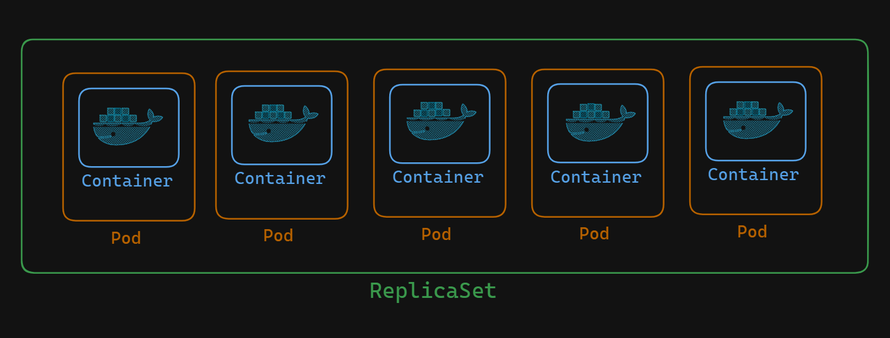

# Understanding Kubernetes Controllers: ReplicaSets

In Kubernetes, controller objects play a crucial role in managing and orchestrating workloads. Among these controllers, ReplicaSets stand out as a fundamental component. Let's delve into what ReplicaSets are and how they function.

## What are ReplicaSets?

ReplicaSets are an advanced unit of orchestration compared to Pods. They act as supervisory objects, ensuring that the desired number of Pod replicas are running at any given time. This capability makes them essential for scaling applications horizontally and maintaining consistent performance and availability.

## Key Functions of ReplicaSets

1. **Scaling Pods**
    
    The primary function of a ReplicaSet is to manage the number of replicas of a Pod. This means you can easily increase or decrease the number of Pod instances to match the required workload. Pods are assigned labels, and ReplicaSets use selectors to identify and supervise these Pods. This relationship allows for efficient management and scaling.

2. **Pod Management**
    
    You can include Pod definitions within a ReplicaSet. When doing so, the creation and management of these Pods are handled by the ReplicaSet itself. This involves providing the Pod specifications as a Pod template within the ReplicaSet's YAML file.

## Best Practices with ReplicaSets

While ReplicaSets are highly useful, the standard practice in Kubernetes involves using them indirectly. Typically, ReplicaSets operate under the supervision of a Deployment. This approach offers additional features and benefits, such as rolling updates and rollback capabilities, making it a more robust solution for managing applications.

## Conclusion

ReplicaSets are a powerful tool in the Kubernetes ecosystem, providing essential functions for scaling and managing Pods. By understanding how to effectively utilize ReplicaSets, administrators can ensure that their applications run smoothly and efficiently. However, leveraging ReplicaSets through Deployments is recommended for a more comprehensive and manageable orchestration strategy.