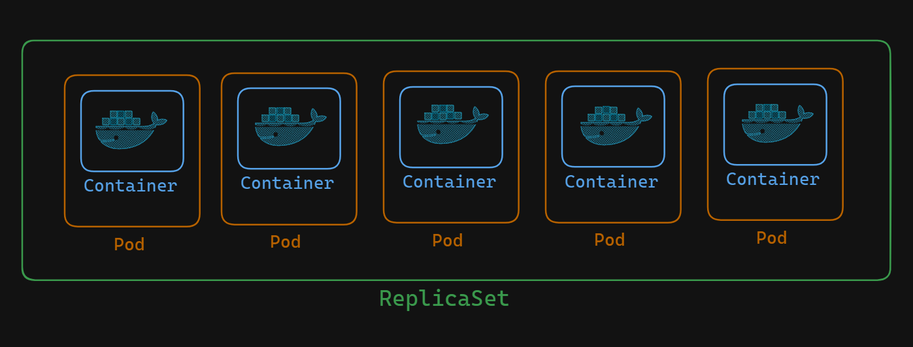

# A Comprehensive Guide to Understanding Kubernetes ReplicaSets

In this guide, we will dive deep into the workings of ReplicaSets in Kubernetes. ReplicaSets are a critical component for managing and orchestrating Pods within a Kubernetes cluster. We will walk through an example YAML configuration and explain each section to give a thorough understanding of how ReplicaSets function.



## Editing the ReplicaSet YAML File

We will open our `replica-pod.yaml` file using `nano`/`vim`:

```sh
vim replica-pod.yaml
```

This YAML file defines a ReplicaSet. Let's parse it section by section.

### YAML File Breakdown

1. **apiVersion**: 
    The `apiVersion` for ReplicaSets is `apps/v1`, which is different from the `v1` used for Pods.

    ```yaml
    apiVersion: apps/v1
    ```

2. **kind**:
    Since we are creating a ReplicaSet, the kind is `ReplicaSet`.

    ```yaml
    kind: ReplicaSet
    ```

3. **metadata**:
    Includes the name and labels for the ReplicaSet. Here, we name our ReplicaSet `replicaset-guestbook` and assign the labels `app: guestbook` and `tier: frontend`.

    ```yaml
    metadata:
      name: replicaset-guestbook
      labels:
        app: guestbook
        tier: frontend
    ```

4. **spec**:
    The `spec` field is the most important part of the YAML file.

    - **replicas**: Specifies the number of Pod replicas to create. In this case, it's set to 3.

    - **selector**: Determines which Pods fall under this ReplicaSet. We use `matchLabels` and `matchExpressions` to specify that Pods with the label `tier: frontend` are managed by this ReplicaSet.

    - **template**: Defines the template for the Pods created by the ReplicaSet. This includes metadata and specifications for the containers.

    ```yaml
    spec:
      replicas: 3
      selector:
        matchLabels:
          tier: frontend
      template:
        metadata:
          labels:
            app: guestbook
            tier: frontend
        spec:
          containers:
          - name: php-redis
            image: gcr.io/google-samples/guestbook-frontend:v3
            ports:
            - containerPort: 80
    ```

## Creating the ReplicaSet

Save and exit the file. To create the ReplicaSet, use the following command:

```sh
kubectl create -f replica-pod.yaml
```

This command creates the ReplicaSet based on the YAML file. We can also create it declaratively.

## Verifying the ReplicaSet and Pods

To see the created Pods, use:

```sh
kubectl get pods
```

We should see 3 Pods created by the ReplicaSet. Each Pod is given a unique name by Kubernetes.

To describe a Pod:

```sh
kubectl describe pod <pod-name>
```

We'll notice a new field, `Controlled By`, indicating that the Pod is managed by the ReplicaSet `replicaset-guestbook`.

### Managing ReplicaSets

To list the ReplicaSets:

```sh
kubectl get rs
```

This command shows that the ReplicaSet `replicaset-guestbook` has 3 desired Pods and 3 ready Pods, indicating it is functioning correctly.

To describe the ReplicaSet:

```sh
kubectl describe rs replicaset-guestbook
```

This provides metadata, Pod status, and events indicating the creation of each Pod.

## ReplicaSet Self-Healing

One powerful feature of ReplicaSets is their self-healing capability. If a Pod is deleted, the ReplicaSet automatically creates a new Pod to maintain the specified number of replicas. Try deleting a Pod:

```sh
kubectl delete pod <pod-name>
```

Then, check the list of Pods again:

```sh
kubectl get pods
```

We will see that a new Pod has been created to replace the deleted one, ensuring the ReplicaSet maintains the desired state.

## Conclusion

ReplicaSets are a powerful tool in Kubernetes for managing and scaling Pods. By understanding the structure and functionality of ReplicaSets, we can effectively maintain the desired state of our applications, ensuring high availability and resilience. This guide provides a comprehensive overview, from creating and configuring ReplicaSets to understanding their self-healing capabilities.