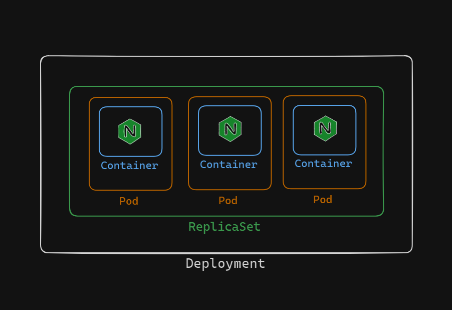

# Understanding Kubernetes Deployments

Deployments in Kubernetes are a step above ReplicaSets in terms of their supervisory capabilities. They have the power to create and manage their own ReplicaSets, which in turn handle the creation and management of Pods. Deployments are versatile and can be used for various purposes, including creating Pods, managing replicas, performing rolling updates, and exposing Pods to external traffic.

## The Power of Deployments

Deployments are more than just a way to manage Pods. They bring a higher level of abstraction and control, making them indispensable for modern container orchestration. Here are some key aspects of Deployments:

1. **Creating and Managing Pods**:
    
    Deployments can automatically create and manage Pods through their associated ReplicaSets. This means we don't have to manually create individual Pods or even ReplicaSets.

2. **Scaling and Managing Replicas**:
    
    Deployments allow us to easily scale our applications by increasing or decreasing the number of replicas. This ensures that our application can handle varying loads efficiently.

3. **Rolling Updates and Rollbacks**:
    
    One of the most powerful features of Deployments is the ability to perform rolling updates. This allows us to update the application version running in our Pods without downtime. If something goes wrong, we can quickly roll back to a previous version.

4. **Exposing Pods**:
    
    Deployments can expose Pods to external traffic, making it easy to manage access to our applications.

## Labels and Selectors

Just like ReplicaSets, Deployments use labels and selectors to identify and manage Pods. Labels are much more than just metadata; they are a fundamental aspect of Kubernetes' architecture, enabling efficient and flexible management of resources.

## Use Cases for Deployments

Deployments are particularly well-suited for hosting stateless applications where the order of Pod creation is not crucial. Their ability to handle various tasks makes them the most widely used container orchestration objects in Kubernetes.

## Conclusion

Deployments bring a higher level of management and orchestration to Kubernetes clusters. They simplify the process of managing Pods and ReplicaSets, provide robust mechanisms for updates and scaling, and ensure our applications are resilient and highly available. By leveraging Deployments, we can efficiently manage our containerized applications and ensure they run smoothly in production environments.