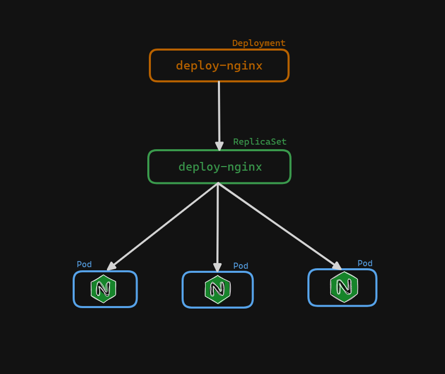
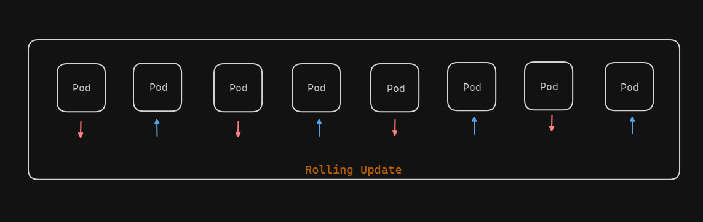

# Working with Kubernetes Deployments

In this guide, we will explore how to work with Deployments in Kubernetes. Deployments offer a higher level of orchestration compared to ReplicaSets and provide powerful capabilities for managing applications. We will start by examining our current Pods and then proceed to create and describe a Deployment.



##  Deployment YAML File

Let's edit our `deployment.yaml` file using a text editor like `vim`:

```sh
vim deployment.yaml
```

Here's the complete `deployment.yaml` file definition:

```yaml
apiVersion: apps/v1
kind: Deployment
metadata:
  name: deploy-nginx
spec:
  replicas: 3
  selector:
    matchLabels:
      app: nginx
  template:
    metadata:
      labels:
        app: nginx
    spec:
      containers:
      - name: deploy-container
        image: nginx
        ports:
        - containerPort: 80
```

### YAML File Breakdown


Let's go through the `deployment.yaml` file section by section.

1. **apiVersion**:
    Deployments use the API version `apps/v1`.

    ```yaml
    apiVersion: apps/v1
    ```

2. **kind**:
    The kind, or object type, is `Deployment`.

    ```yaml
    kind: Deployment
    ```

3. **metadata**:
    We name our Deployment `deploy-nginx`.

    ```yaml
    metadata:
      name: deploy-nginx
    ```

4. **spec**:
    
    **replicas**: Specifies the number of replicas we want, in this case, 2.
    
    **selector**: We use the `matchLabels` strategy to select Pods with the label `app: nginx`.

    **template**: This is the Pod template. We provide labels and container information here.

    ```yaml
    spec:
      replicas: 3
      selector:
        matchLabels:
          app: nginx
      template:
        metadata:
          labels:
            app: nginx
        spec:
          containers:
          - name: deploy-container
            image: nginx
            ports:
            - containerPort: 80
    ```

## Creating the Deployment

Save and exit the file. Create the Deployment using the following command:

```sh
kubectl create -f deployment.yaml
```

## Verifying the Deployment and Pods

To see the created Pods, run:

```sh
kubectl get pods
```

We should see two new Pods created by the Deployment `deploy-nginx`. These Pods have the label `app: nginx` and are controlled by a ReplicaSet, which in turn is controlled by the Deployment.

To describe a Pod:

```sh
kubectl describe pod <pod-name>
```

This will show details including labels, the controlling ReplicaSet, container information, and events.


To describe the Deployment:

```sh
kubectl describe deployment deploy-nginx
```

The Deployment description includes several key details:

- **Metadata**: Name, namespace, labels.
- **ReplicaSet**: Information about the associated ReplicaSet, which ensures the specified number of Pods are running.
- **StrategyType**: The update strategy for the Deployment, which is `RollingUpdate` by default.
- **Pod Template**: Details about the Pod template used by the Deployment.
- **Events**: Events related to the scaling and management of Pods by the ReplicaSet and Deployment.

### Example of RollingUpdate Strategy



The `RollingUpdate` strategy ensures that updates are applied without downtime. For instance, with `25% max unavailable` and `25% max surge`:

- If a Deployment has 4 Pods, `25% max unavailable` means at least 3 Pods must be running during an update.
- `25% max surge` allows up to 5 Pods to be created temporarily during the update.

## Self-Healing and Scaling

Deployments provide self-healing capabilities. If a Pod is deleted, the Deployment's ReplicaSet will automatically create a new Pod to maintain the desired number of replicas.

To delete a Pod:

```sh
kubectl delete pod <pod-name>
```

Check the list of Pods again:

```sh
kubectl get pods
```

We should see that a new Pod has been created to replace the deleted one, ensuring the Deployment maintains the specified number of Pods.

## Conclusion

Deployments are powerful tools in Kubernetes for managing applications. They simplify scaling, updating, and maintaining the desired state of applications. By understanding how to create and manage Deployments, we can ensure our applications run smoothly and efficiently in a Kubernetes cluster.