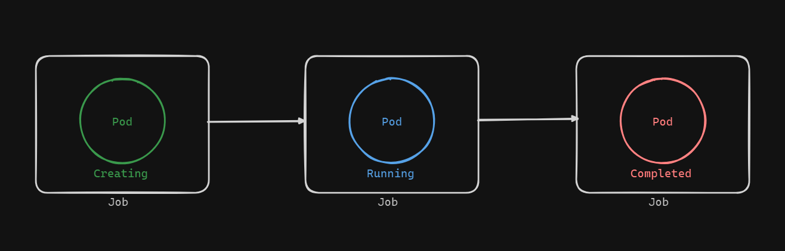

# Understanding Kubernetes Jobs

Jobs in Kubernetes represent a higher-level orchestration unit compared to Pods. Like other controllers, Jobs manage Pods but with a specific purpose: they run Pods whose containers do not run indefinitely. Once the task assigned to a Job is completed, the Pods exit. This makes Jobs suitable for tasks that have a defined completion point, such as batch or parallel processing.

## Characteristics of Jobs

### Finite Execution
Unlike regular Pods that can run indefinitely, Jobs have a finite execution period. Once the assigned task is complete, the container stops gracefully and releases its resources back to the host.

### Pod States
Pods managed by Jobs often transition from the `Running` state to the `COMPLETED` state once their task is done. This is a normal and expected behavior.

### Use Cases
Jobs are ideal for tasks that need to be executed once or a specific number of times. Examples include data processing, sending emails, or performing computations that do not require continuous running.

## CronJobs
CronJobs are a specialized type of Job that run periodically based on a schedule, similar to cron jobs in Unix/Linux systems. They are used for recurring tasks such as:

### Scheduled Checks
- Performing periodic checks on databases.
- Generating and sending reports at regular intervals.

### Regular Updates
- Fetching and printing updated scores or data every few minutes.

## Conclusion

Jobs in Kubernetes are a powerful way to handle tasks that need to be executed to completion. They ensure that resources are used efficiently and only for the duration of the task. With CronJobs, we can automate recurring tasks and ensure they run at specified intervals. By understanding how to create and manage Jobs, we can leverage Kubernetes for both one-time and periodic task automation.
