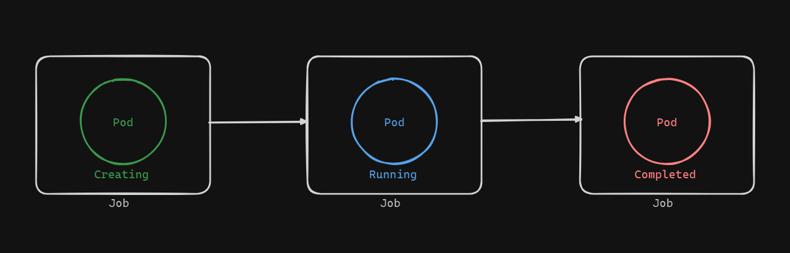

# Working with Kubernetes Jobs

In this example, we will explore Kubernetes Jobs, which are orchestration objects designed to run tasks to completion. Unlike Pods that can run indefinitely, Jobs ensure that a task runs until completion and then exits.



## YAML Definition for a Job

Let's look at the `jobs.yaml` file that defines our Job. We will use `vim` to open and edit this file. Here is what the YAML looks like:

```yaml
apiVersion: batch/v1
kind: Job
metadata:
  name: job-pi
spec:
  template:
    spec:
      containers:
      - name: job-container
        image: perl
        command: ["perl", "-Mbignum=bpi", "-wle", "print bpi(2000)"]
      restartPolicy: Never
  backoffLimit: 4
```

### Explanation of the Job YAML

1. **apiVersion**:
    Jobs use the `batch/v1` API version.

    ```yaml
    apiVersion: batch/v1
    ```

2. **kind**:
    The kind, or object type, is `Job`.

    ```yaml
    kind: Job
    ```

3. **metadata**:
    We name our Job `job-pi`.

    ```yaml
    metadata:
      name: job-pi
    ```

4. **spec**:
    The `template` field contains the Pod template, specifying the containers and commands to be executed.
    The `backoffLimit` is set to 4, meaning the Job will attempt to run the container up to 4 times if it fails.

    ```yaml
    spec:
      template:
        spec:
          containers:
          - name: job-container
            image: perl
            command: ["perl", "-Mbignum=bpi", "-wle", "print bpi(2000)"]
          restartPolicy: Never
      backoffLimit: 4
    ```

## Steps to Create and Verify the Job

1. **Create the Job**:
    
    Use the following command to create the Job:

    ```sh
    kubectl create -f jobs.yaml
    ```

2. **Verify the Job**:
    
    Get the list of Pods to ensure the Job has created a Pod:

    ```sh
    kubectl get pods
    ```

    You should see a Pod named `job-pi` which is newly created.

3. **Describe the Pod**:
    
    Use the describe command to get details about the Pod created by the Job:

    ```sh
    kubectl describe pod <pod-name>
    ```

    Replace `<pod-name>` with the name of the Pod. You will see that it is controlled by the Job `job-pi` and its status is `Succeeded`.

4. **Get Job Details**:
    
    You can also get a list of Jobs and describe the Job for more details:

    ```sh
    kubectl get jobs
    kubectl describe job job-pi
    ```

    The description will include fields like Name, Namespace, Selectors, Labels, start and completion timestamps, and the duration the Job ran. It will also show the status of the Pod managed by the Job.

5. **Check Job Output**:
    
    To see the output of the Job, use the logs command:

    ```sh
    kubectl logs <pod-name>
    ```

    This will display the calculated value of Pi to 2000 decimal points as printed by the Perl script.

## Conclusion

Jobs in Kubernetes provide a robust way to manage tasks that need to be executed to completion. They ensure that resources are used efficiently and that tasks are retried if they fail, up to a specified limit. By understanding how to create and manage Jobs, we can leverage Kubernetes for both one-time and periodic task automation.