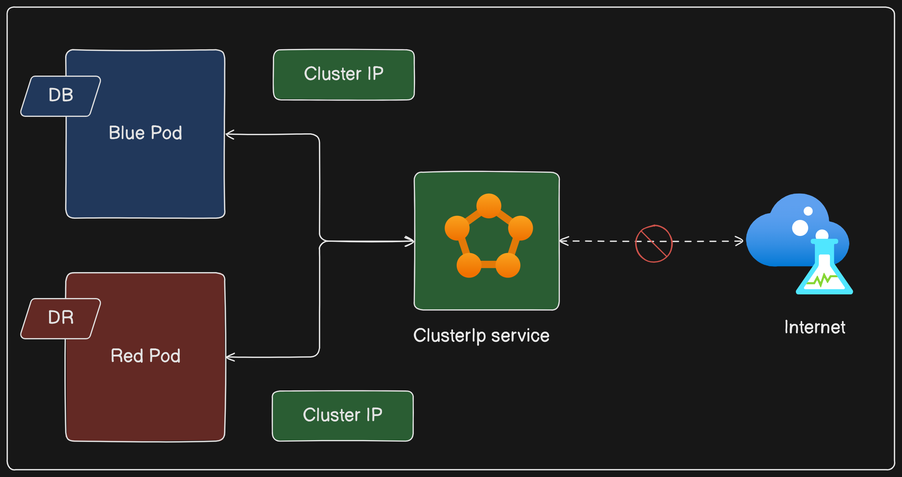
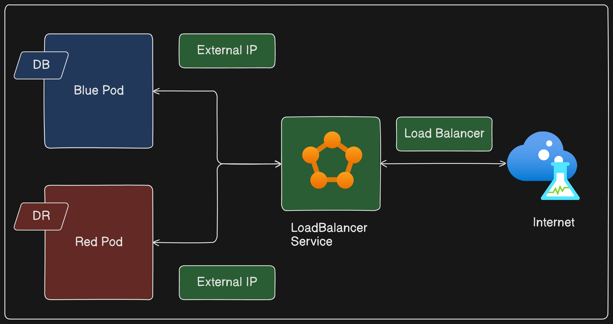
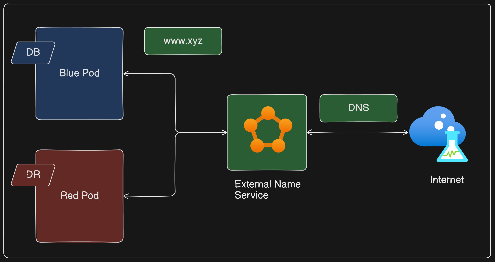

# Understanding Kubernetes Services

## Introduction
Kubernetes is a powerful platform for managing containerized applications in a clustered environment. One of the essential components in Kubernetes is the `Service`, which acts as a networking object for Pods. This document will explain the basic concept of Kubernetes Services, highlighting their types and functionalities.

## What is a Kubernetes Service?
In Kubernetes, a Service is an abstraction that defines a logical set of Pods and a policy by which to access them. This is different from the concept of Services in Docker Swarm, where Services act like deployments that the manager converts into tasks. In Kubernetes, Services are purely about networking and connectivity for Pods.

### Key Characteristics of Kubernetes Services
- **Networking Objects**: Services are used to expose applications running on a set of Pods.
- **Connectivity**: They enable communication between different Pods and can also expose applications to external networks.
- **Labels and Selectors**: Services use labels and selectors to determine which Pods they should connect to, allowing fine-grained control over traffic routing.

## How Do Kubernetes Services Work?
To understand how Services work, consider two example Pods, `Blue Dark` and `Pink Dark`. If we want these Pods to communicate with each other or with the external world, we use a Service. The Service will use `labels and selectors` to identify the Pods it should connect to. For instance, if the Blue Dark Pod has a label `DB` and the Service selector is also looking for `DB`, the Service will manage connectivity for the Blue Dark Pod.

### Labels and Selectors
- **Labels**: Tags assigned to Pods, such as `DB` or `DR`.
- **Selectors**: Criteria used by Services to identify which Pods to connect to, such as `DB`.

### Example
- **Pod Labels**: Blue Dark (`DB`), Red Dark (`DR`)
- **Service Selector**: `DB`

In this example, only the Blue Dark Pod will be connected by the Service because it matches the selector.

## Types of Kubernetes Services
Kubernetes Services come in different types, each designed for specific use cases:

### 1. ClusterIP
- **Description**: Exposes the Service on a cluster-internal IP.
- **Usage**: Only accessible within the cluster.
- **Default Behavior**: Ideal for internal communication between Pods.
- **Purpose**: Facilitates internal communication within the cluster.
- **Scenario**: Microservices architecture where different services (Pods) need to communicate.

### 2. NodePort
- **Description**: Exposes the Service on each Node's IP at a static port.
- **Usage**: Makes the Service accessible from outside the cluster using `<NodeIP>:<NodePort>`.
- **ClusterIP**: Automatically created and used as the target for the NodePort.
- **Purpose**: Makes services accessible from outside the cluster on a specified port.
- **Scenario**: Testing and debugging where external access is required.

### 3. LoadBalancer
- **Description**: Exposes the Service externally using a cloud provider's load balancer.
- **Usage**: Provides a dedicated external IP that routes traffic to the Service.
- **Purpose**: Integrates with cloud providers to offer a single IP address that load balances traffic across the Pods.
- **Scenario**: Production environments requiring reliable external access.

### 4. ExternalName
- **Description**: Maps the Service to the contents of the `externalName` field (e.g., a DNS name).
- **Usage**: Allows access to services outside the Kubernetes cluster by returning a CNAME record with the external name.
- **Purpose**: Provides a way to access external services using a DNS name.
- **Scenario**: Integrating with legacy systems or third-party services not hosted within the cluster.

## Conclusion
Kubernetes Services are a crucial component for managing the networking of applications within a Kubernetes cluster. They provide different types of connectivity options to suit various requirements, from internal communication to exposing applications to external traffic. Understanding these Services and their types helps in designing robust, scalable, and highly available applications.

In the following sections, we will dive deeper into practical examples and configurations of ClusterIP and NodePort Services. We will also explore the LoadBalancer Service when running Kubernetes on a managed cloud provider.

## Further Reading
- [Kubernetes Documentation](https://kubernetes.io/docs/concepts/services-networking/service/)
- [Docker Swarm vs. Kubernetes](https://www.digitalocean.com/community/tutorials/docker-swarm-vs-kubernetes)
- [Understanding Kubernetes Networking](https://kubernetes.io/docs/concepts/cluster-administration/networking/)

---

By understanding and utilizing Kubernetes Services effectively, we can ensure our applications are well-connected and resilient, capable of handling internal and external traffic efficiently.