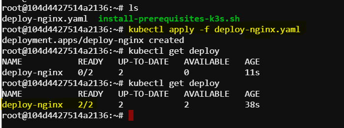
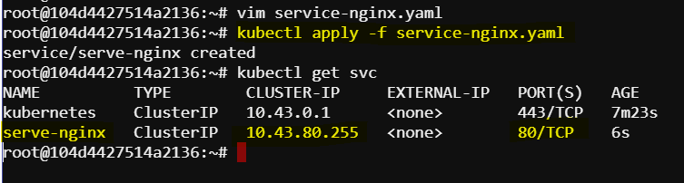
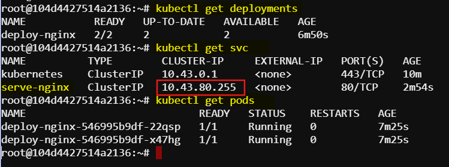
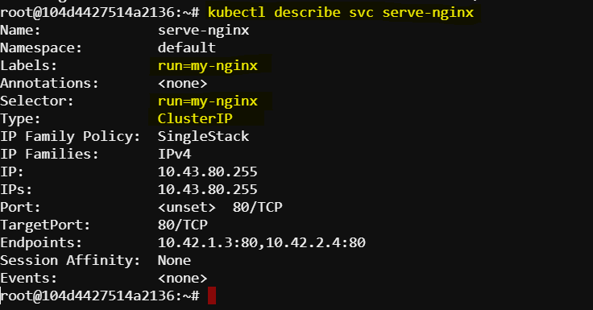
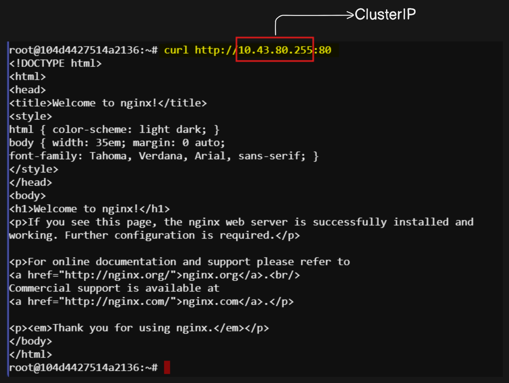

# Working with clusterIP service

## Introduction
In this guide, we will walk through the steps of creating and managing a Kubernetes Deployment and Service using YAML configuration files. We will cover key concepts, commands, and detailed explanations to ensure a comprehensive understanding of Kubernetes Services.

## Pre-requisites
Before proceeding, ensure that you have a Kubernetes cluster up and running, and `kubectl` is configured to interact with your cluster. Then install `vim` as a text editor.

## Deploying NGINX with Kubernetes

### Deployment Configuration
We will create a Deployment to run NGINX containers. The configuration is defined in a file called `deploy-nginx.yaml`.

```yaml
apiVersion: apps/v1
kind: Deployment
metadata:
  name: deploy-nginx
spec:
  replicas: 2
  selector:
    matchLabels:
      run: my-nginx
  template:
    metadata:
      labels:
        run: my-nginx
    spec:
      containers:
      - name: nginx
        image: nginx:latest
        ports:
        - containerPort: 80
```

### Creating the Deployment
Apply the deployment configuration using `kubectl apply`:

```sh
kubectl apply -f deploy-nginx.yaml
```



### Service Configuration
Next, we will create a Service to expose our NGINX Pods. The configuration is defined in a file called `service-nginx.yaml`.

```yaml
apiVersion: v1
kind: Service
metadata:
  name: serve-nginx
  labels:
    run: my-nginx
spec:
  ports:
  - port: 80
    targetPort: 80
  selector:
    run: my-nginx
```

### Creating the Service
Apply the service configuration using `kubectl apply`:

```sh
kubectl apply -f serve-nginx.yaml
```


## Understanding the Configuration Files

### `deploy-nginx.yaml`

- **apiVersion**: Specifies the version of the Kubernetes API to use. For Deployments, it's `apps/v1`.
- **kind**: The type of Kubernetes object, which is `Deployment`.
- **metadata**: Contains data that helps uniquely identify the object, including a `name` and optional `labels`.
- **spec**: The specification of the desired behavior of the Deployment.
  - **replicas**: Number of desired Pods.
  - **selector**: Defines how the Deployment finds which Pods to manage.
  - **template**: The template for creating Pods.
    - **metadata**: Labels assigned to Pods created from this template.
    - **spec**: Specification of the Pod, including containers and their configurations.

### `serve-nginx.yaml`

- **apiVersion**: Specifies the version of the Kubernetes API to use. For Services, it's `v1`.
- **kind**: The type of Kubernetes object, which is `Service`.
- **metadata**: Contains data that helps uniquely identify the object, including a `name` and optional `labels`.
- **spec**: The specification of the desired behavior of the Service.
  - **ports**: List of ports that the Service should expose.
    - **port**: The port that will be exposed by the Service.
    - **targetPort**: The port on the Pod that the traffic will be directed to.
  - **selector**: Defines how the Service finds which Pods to target.

## Verifying the Deployment and Service

### Check Deployment Status
To check the status of your Deployment and Pods, use:

```sh
kubectl get deployments
kubectl get pods
```

### Check Service Status
To get a list of all Services, use:

```sh
kubectl get svc
```



You should see an output showing the `serve-nginx` Service along with its type, which is `ClusterIP` by default.

### Describe the Service
For more detailed information about the Service, use:

```sh
kubectl describe svc service-nginx
```



This command provides details such as the name, namespace, labels, annotations, selector, type, target port, and endpoints.

## Accessing the NGINX Service

### Internal Access
Since the Service type is `ClusterIP`, it exposes the NGINX application within the cluster. We can access the NGINX welcome page by using the `curl` command:

```sh
curl http://<ClusterIP>:80
```

Replace `<ClusterIP>` with the actual IP address of the Service. We can find this IP address by running:

```sh
kubectl get svc serve-nginx
```



## Conclusion
This guide covered the creation and management of a Kubernetes Deployment and Service. We explained the key components of the YAML configuration files and provided commands to verify and access the deployed NGINX service. Kubernetes Services are a powerful way to expose and manage network access to your Pods, enabling robust and scalable application deployments.
