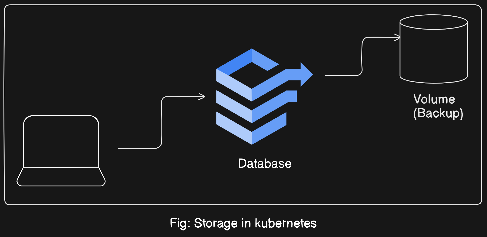
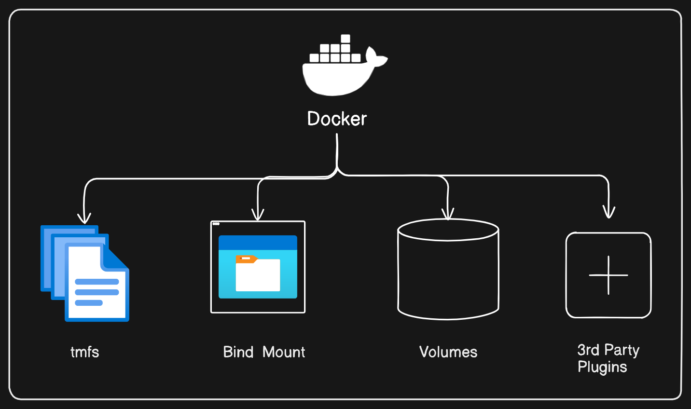

# Kubernetes Storage Objects Guide

## Introduction
In Kubernetes, storage objects are essential for managing data persistence and providing backup solutions for containerized applications. Understanding Kubernetes storage is crucial for ensuring data integrity and resilience in your cluster.

## Why Study Kubernetes Storage?
Although Docker also offers storage provisions, Kubernetes introduces a broader range of storage options, including support for various cloud providers and third-party plugins. Kubernetes supports Persistent Volumes, Temporary Volumes, and Projected Volumes, each serving different purposes and offering unique capabilities. Learning about Kubernetes storage objects enables you to leverage diverse storage solutions tailored to your application requirements.

## Persistent Volumes (PVs)
Persistent Volumes in Kubernetes serve as long-term storage solutions that outlive individual Pods. Kubernetes supports a wide range of storage providers, including AWS Elastic Block Storage, Azure Disk and Storage, Google Cloud Platform, OpenStack, VMware, StorageOS Volume, and Portworx, among others. Unlike Docker's volumes, Kubernetes PVs have a bound lifespan tied to the lifespan of the associated Pod. When a Pod is deleted, its associated Persistent Volume is also removed, preventing the accumulation of dangling volumes and potential storage shortages.

## Temporary Volumes
Temporary Volumes in Kubernetes are ephemeral storage solutions that exist only for the duration of a Pod's lifecycle. These volumes are useful for storing transient data that does not need to persist beyond the Pod's execution. When the Pod terminates, its associated temporary volumes are automatically removed, freeing up resources and minimizing storage clutter.

## Projected Volumes
Projected Volumes in Kubernetes provide a flexible way to project data from different sources into a Pod's filesystem. These volumes can include ConfigMap, Secret, ServiceAccountToken, and DownwardAPI projections, allowing Pods to access configuration data, secrets, service account tokens, and information about the Pod itself. Projected Volumes streamline the management of configuration data and enhance the flexibility of Kubernetes applications.

## Key Differences from Docker Storage
While Docker's volume management revolves around persistent storage solutions that outlive container lifecycles, Kubernetes storage objects offer more granular control over storage provisioning and lifecycle management. Kubernetes volumes have lifespans tied to Pod lifecycles, ensuring that unused volumes are automatically cleaned up when Pods are deleted. This approach minimizes storage clutter and simplifies resource management in Kubernetes clusters.

## Next Steps
In the upcoming demo, we will explore how to use Kubernetes storage objects to provision and manage storage for containerized applications. By gaining hands-on experience with Persistent Volumes, Temporary Volumes, and Projected Volumes, you will develop a deeper understanding of Kubernetes storage concepts and best practices.