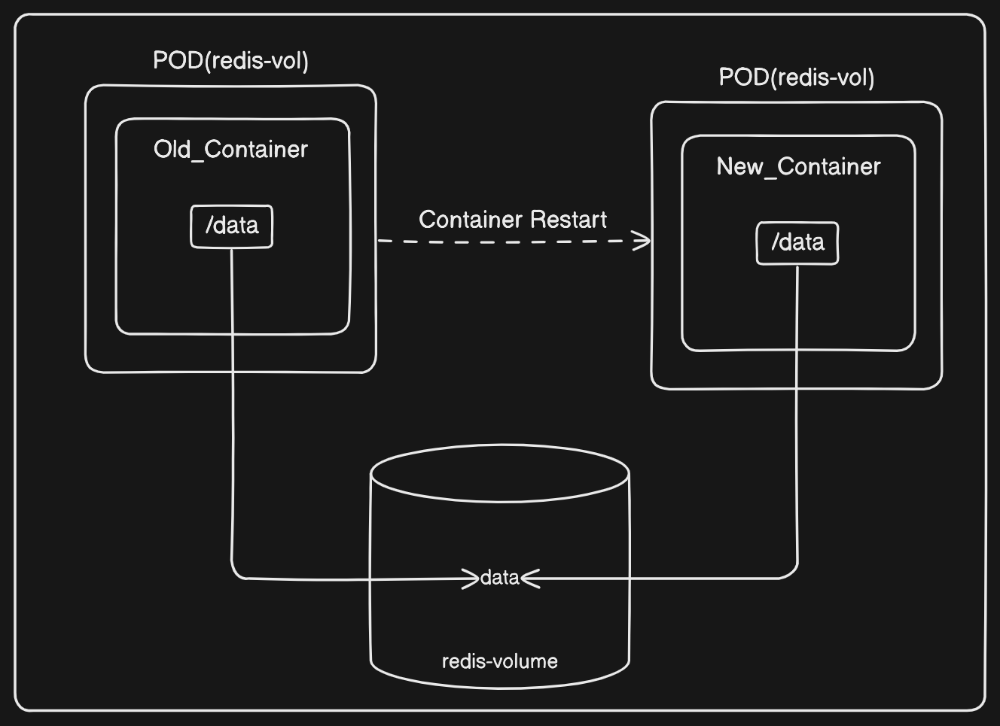
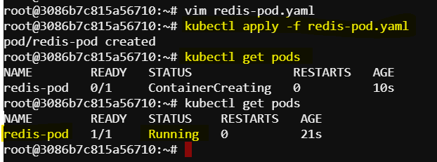
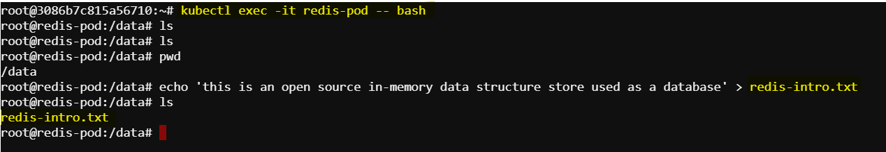
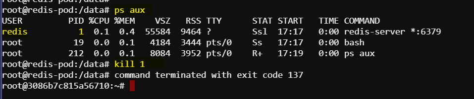
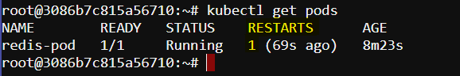
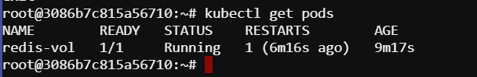
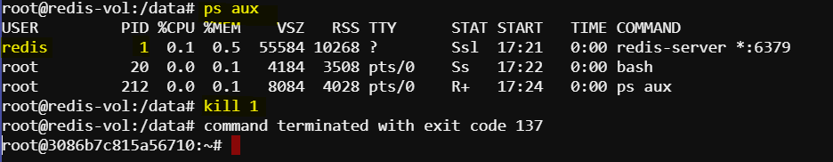
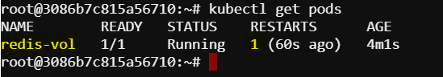
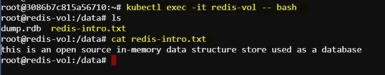

# Demo: Kubernetes Storage Objects and Volume Management

## Introduction
This documentation provides a detailed guide on Kubernetes storage objects and volume management, explaining how they help in maintaining data persistence across container restarts. The example used is a `Redis` database Pod.



## Creating a Redis Pod
We start with creating a clean slate by ensuring no existing Pods or deployments are running. Next, we create a new Pod using a simple YAML file, `redis-pod.yaml`.

### Redis Pod YAML
The `redis-pod.yaml` is a basic YAML configuration file used to create a Redis database Pod. Here is the YAML content:

```yaml
apiVersion: v1
kind: Pod
metadata:
  name: redis-pod
spec:
  containers:
  - name: redis
    image: redis
```

This YAML file includes only the essential information required to create a Redis Pod.

### Creating the Pod
To create the Pod, run the following command:

```bash
kubectl apply -f redis-pod.yaml
```

Check if the Pod has been created successfully:

```bash
kubectl get pods
```


### Modifying the Redis Container
We can execute a shell inside the Redis container to make modifications:

```bash
kubectl exec -it redis-pod -- bash
```

Inside the container, navigate to the root directory and create a file:

```bash
cd data
echo 'this is an open source in-memory data structure store used as a database' > redis-intro.txt
```


### Killing the Redis Process
To simulate a container failure, we kill the Redis process:

```bash
ps aux
kill <redis_process_id>
```


After killing the process, the container restarts automatically. Check the Pod status:

```bash
kubectl get pods
```



Here, we can see the container restarted for one time. 

### Data Loss Demonstration
Upon re-entering the container, we see that the `redis-intro.txt` file has been lost. This demonstrates data loss due to the lack of persistent storage.

## How to  prevent data loss?
To prevent data loss, we use an `emptyDir` volume. Update the YAML file to include volume configurations.

### Updated Redis Pod YAML with Volume
The updated `redis-pod.yaml` with volume configuration looks like this:

```yaml
apiVersion: v1
kind: Pod
metadata:
  name: redis-vol
spec:
  containers:
  - name: redisvol-container
    image: redis
    volumeMounts:
    - mountPath: /data
      name: redis-volume
  volumes:
  - name: redis-volume
    emptyDir: {}
```

### Explanation of Terms
- **apiVersion**: Specifies the API version used to create the object. Here, `v1` is used.
- **kind**: Defines the type of object. In this case, it's a `Pod`.
- **metadata**: Provides metadata about the object, such as its name.
- **spec**: Describes the desired state of the object.
  - **containers**: Lists the containers within the Pod.
    - **name**: The name of the container.
    - **image**: The Docker image used for the container.
    - **volumeMounts**: Specifies the volume mounts for the container.
      - **mountPath**: The directory inside the container where the volume will be mounted.
      - **name**: The name of the volume.
  - **volumes**: Declares the volumes to be used by the Pod.
    - **name**: The name of the volume.
    - **emptyDir**: Indicates that this volume is of type `emptyDir`.

### Creating the Pod with Volume
Apply the updated YAML file to create the Pod with a volume:

```bash
kubectl apply -f redis-pod.yaml
```

Check if the Pod has been created successfully:

```bash
kubectl get pods
```



### Verifying Volume Persistence
To verify that the volume is working, repeat the steps to modify the container and check data persistence after killing the process.

1. Enter the container and create the `redis-intro.txt` file again.
2. Kill the Redis process.

```bash
ps aux
kill <redis_process_id>
```



3. Check if the Pod has restarted.

```bash
kubectl get pods
```



4. Re-enter the container and verify the presence of the file.

```bash
kubectl exec -it redis-vol -- bash
cd data
ls
cat redis-intro.txt
```

If the file is still present, the volume is working correctly, ensuring data persistence across container restarts. Here we can see the file is still present.




## Conclusion
So, we have demonstrated how to manage storage in Kubernetes using volumes to prevent data loss. By understanding and leveraging Kubernetes storage objects, we can ensure data persistence and maintain application stability even during container restarts.