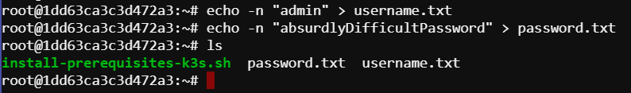
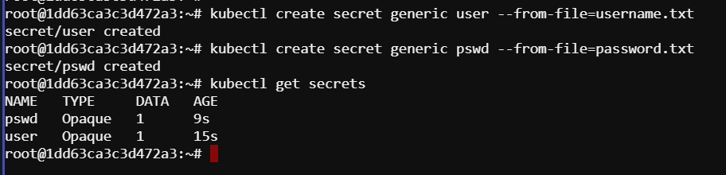
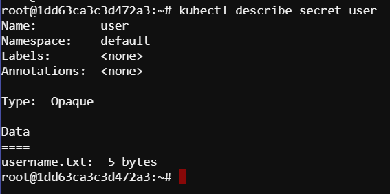
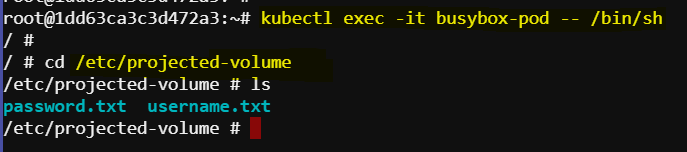
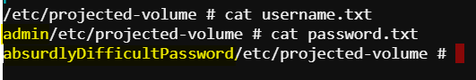

# Kubernetes Secrets and Projected Volumes

This documentation file provides detailed steps and explanations on how to use Kubernetes secrets and projected volumes to securely manage sensitive data such as credentials within a Kubernetes cluster.

## Introduction

In this guide, we will:
- Create temporary files containing sensitive data.
- Convert these files into Kubernetes secrets.
- Mount these secrets as projected volumes in a Kubernetes pod.
  
## Creating Temporary Files

First, let's create two temporary files: `username.txt` and `password.txt`, and fill them with the required credentials.

```bash
echo -n "admin" > username.txt
echo -n "absurdlyDifficultPassword" > password.txt
```



- **Temporary Files:** These are files created for temporary use and will be deleted after their purpose is served.

## Creating Secrets

Next, we create secrets from these files. Secrets in Kubernetes are a way to store and manage sensitive information such as passwords, OAuth tokens, and SSH keys.

```bash
kubectl create secret generic user --from-file=username.txt
kubectl create secret generic pswd --from-file=password.txt
```

- **Secret:** A Kubernetes object that stores sensitive data.
- **generic:** The type of secret used to store arbitrary key-value pairs.

## Listing and Describing Secrets

Let's list the secrets to see what we have created.

```bash
kubectl get secrets
```

We should see something like:



- **Opaque:** Indicates that the data inside the secret is not visible in plain text.

Now, let's describe one of our secrets.

```bash
kubectl describe secret user
```

The output will show metadata about the secret but not the actual data, ensuring that the sensitive information remains protected.



## Mounting Secrets as Projected Volumes

To access the secret data within a pod, we will mount these secrets as projected volumes. Open the `projected-volume.yaml` file:

```yaml
apiVersion: v1
kind: Pod
metadata:
  name: busybox-pod
spec:
  containers:
  - name: busybox-container
    image: busybox
    command: ["sleep", "3600"]
    volumeMounts:
    - name: test-volume
      mountPath: /etc/projected-volume
  volumes:
  - name: test-volume
    projected:
      sources:
      - secret:
          name: user
      - secret:
          name: pswd
```

- **Projected Volumes:** A type of volume that allows multiple sources, such as secrets, config maps, and service account tokens, to be mounted into the same directory.
- **mountPath:** The directory in the container where the volume will be mounted.

Apply the configuration to create the pod:

```bash
kubectl apply -f projected-volume.yaml
```

Check if the pod is created:

```bash
kubectl get pods
```

## Accessing the Mounted Secrets

To verify that the secrets are properly mounted, execute the shell in the `busybox` container:

```bash
kubectl exec -it busybox-pod -- /bin/sh
```

Navigate to the mounted directory and list its contents:

```bash
cd /etc/projected-volume
ls
```

We should see `username.txt` and `password.txt`.



To view the content of the files:

```bash
cat username.txt
cat password.txt
```


The output should match the contents you originally placed in the temporary files.

## Conclusion

By following these steps, we have securely managed sensitive information using Kubernetes secrets and projected volumes. This approach ensures that sensitive data such as usernames and passwords are kept secure within the Kubernetes environment and are accessible to pods that need them. This method is both simpler and more secure compared to packaging sensitive data in other archival formats.