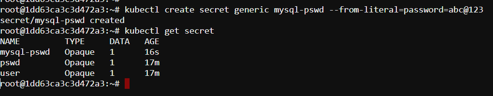
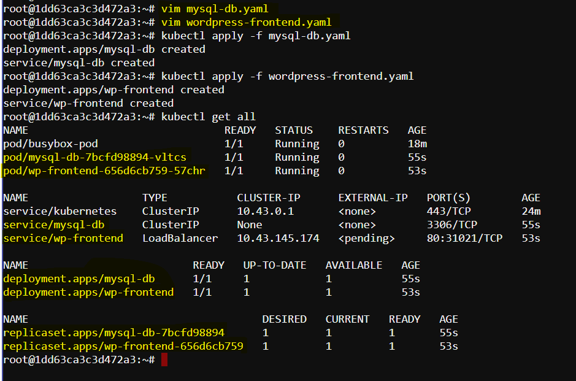
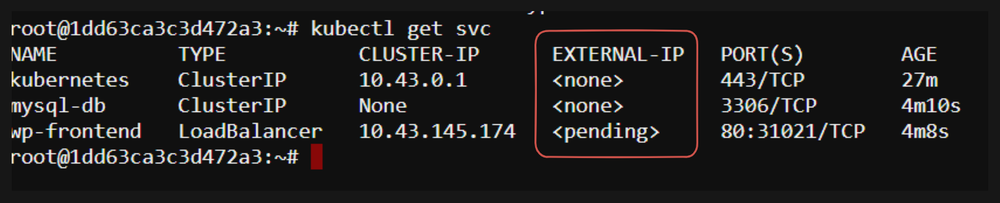

# Comprehensive Application Deployment with Kubernetes

This documentation details the process of creating a comprehensive application using Kubernetes, which demonstrates the use of both Services and Volumes. We will walk through creating secrets, deployments, and services, and explain the significance of each component in detail.

## Creating a Secret

First, we need to create a secret to store sensitive information like passwords securely.

```bash
kubectl create secret generic mysql-pswd --from-literal=password=abc@123
```


This command creates a secret named `mysql-pswd` with a key-value pair.

- **Secret:** A Kubernetes object that stores sensitive data, such as passwords, OAuth tokens, and SSH keys.
- **--from-literal:** This flag allows us to create a secret from a literal value instead of a file.

## Backend Deployment and Service

Next, let's create the backend deployment and service by defining them in a YAML file (`mysql-db.yaml`).

```yaml
apiVersion: apps/v1
kind: Deployment
metadata:
  name: mysql-db
  labels:
    app: wordpress
spec:
  selector:
    matchLabels:
      app: wordpress
      tier: mysql
  template:
    metadata:
      labels:
        app: wordpress
        tier: mysql
    spec:
      containers:
      - name: mysql-container
        image: mysql:5.6
        env:
        - name: MYSQL_ROOT_PASSWORD
          valueFrom:
            secretKeyRef:
              name: mysql-pswd
              key: password
        ports:
        - containerPort: 3306
        volumeMounts:
        - name: mysql-volume
          mountPath: /var/lib/mysql
      volumes:
      - name: mysql-volume
        emptyDir: {}
---
apiVersion: v1
kind: Service
metadata:
  name: mysql-db
spec:
  selector:
    app: wordpress
    tier: mysql
  ports:
  - port: 3306
  clusterIP: None
  type: ClusterIP
```

- **Deployment:** Manages the deployment of Pods, ensuring the desired number of replicas are running.
- **Volume:** Provides storage for data generated by the container.
- **Service:** Defines a logical set of Pods and a policy to access them, exposing the deployment internally within the cluster.
- **ClusterIP:** The default service type, which exposes the service only within the cluster.

## Frontend Deployment and Service

Now, let's create the frontend deployment and service in another YAML file (`wordpress-frontend.yaml`).

```yaml
apiVersion: apps/v1
kind: Deployment
metadata:
  name: wp-frontend
  labels:
    app: wordpress
spec:
  selector:
    matchLabels:
      app: wordpress
      tier: frontend
  template:
    metadata:
      labels:
        app: wordpress
        tier: frontend
    spec:
      containers:
      - name: wordpress-container
        image: wordpress:4.8-apache
        env:
        - name: WORDPRESS_DB_HOST
          value: mysql-db
        - name: WORDPRESS_DB_PASSWORD
          valueFrom:
            secretKeyRef:
              name: mysql-pswd
              key: password
        ports:
        - containerPort: 80
        volumeMounts:
        - name: wp-volume
          mountPath: /var/www/html
      volumes:
      - name: wp-volume
        emptyDir: {}
---
apiVersion: v1
kind: Service
metadata:
  name: wp-frontend
spec:
  selector:
    app: wordpress
    tier: frontend
  ports:
  - port: 80
  type: LoadBalancer
```

- **LoadBalancer:** Exposes the service externally using a cloud provider's load balancer.

## Applying the Configurations

We can now apply the configurations to create the deployments and services.

```bash
kubectl apply -f mysql-db.yaml
kubectl apply -f wordpress-frontend.yaml
```


- **kubectl apply:** Applies a configuration to a resource by filename or stdin.

## Exploring the Services

List the services to verify their creation.

```bash
kubectl get svc
```
- **svc:** Abbreviation for services. Lists all services in the current namespace.



Here we can see the `EXTERNAL-IP` for `wp-frontend` service is showing as `<pending>` because Kubernetes is attempting to provision an external load balancer, but it hasn't been able to complete the process. This typically occurs for one of several reasons:

**Cloud Provider Configuration:** The most common reason for this issue is that the Kubernetes cluster is not running in an environment that supports automatic load balancer provisioning, such as a local development setup (e.g., Minikube, kind, or Docker Desktop) or a cloud provider that does not support LoadBalancer services.

**Lack of Cloud Provider Integration:** If your Kubernetes cluster is running in a cloud provider, ensure that it has the proper cloud provider integration configured. For example, if you are using AWS, GCP, or Azure, the Kubernetes cluster needs the appropriate cloud provider configuration to create external load balancers.

## Troubleshooting:

1. Using Minikube

If you are using `Minikube` or another `local Kubernetes environment` that does not support LoadBalancer services natively, you can use the minikube tunnel command to simulate an external IP.

```bash
minikube tunnel
```

This command will create a network route on your host machine, allowing you to access LoadBalancer services.

## Understanding LoadBalancer Service

The LoadBalancer service type allows the frontend service to be accessible from outside the cluster, which is crucial for user access. 

- **ClusterIP:** Used for internal communication within the cluster.
- **LoadBalancer:** Used for external communication, allowing users to access the application from outside the cluster.

## Conclusion

This comprehensive application demonstrates how to use Kubernetes Services and Volumes to create a functional multi-tier application. The backend MySQL service is securely exposed within the cluster, while the frontend WordPress service is accessible externally, providing a complete and secure application environment.

By following this guide, we've successfully deployed a multi-tier application on Kubernetes, showcasing the power and flexibility of Kubernetes in managing complex applications.