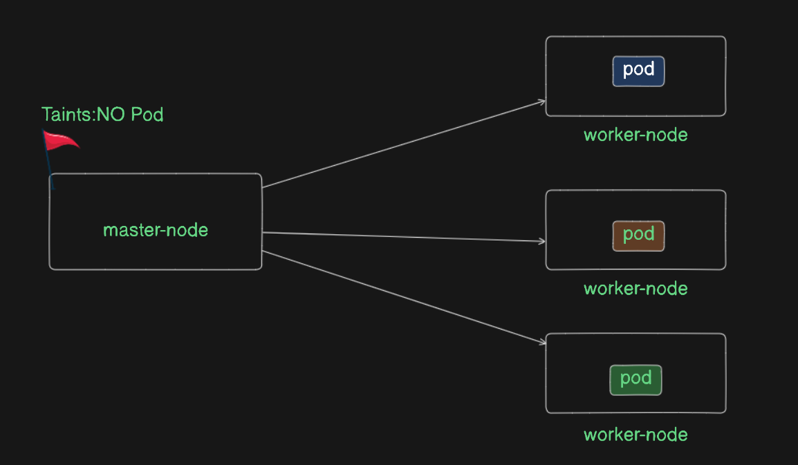
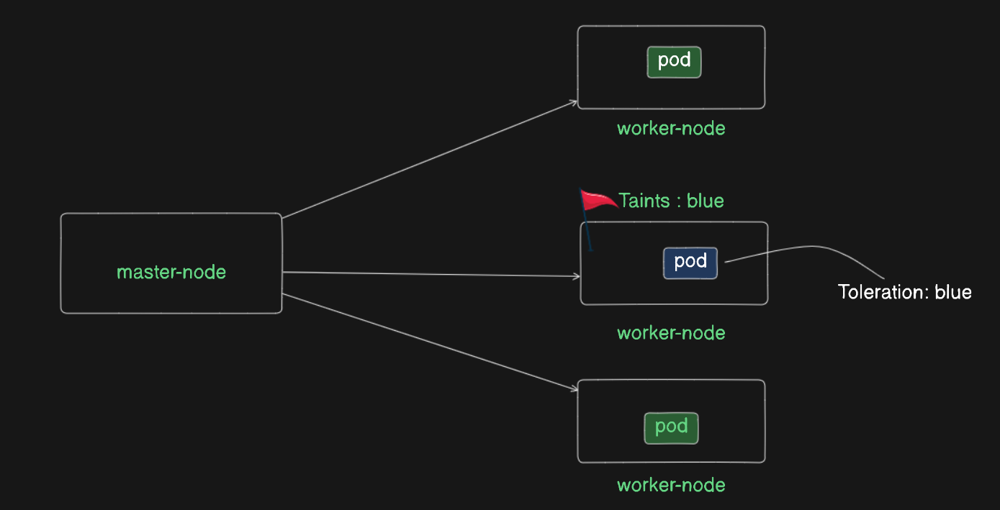

# Kubernetes Master and Node Architecture: Taints and Tolerations

## Overview

In Kubernetes, the architecture consists of a Master and Nodes. The Master node is responsible for managing the cluster, while the Nodes run the workloads. This document explains how Kubernetes schedules Pods, the role of taints and tolerations, and the interaction between the Master and Nodes.

## Scheduling Workloads

When a workload of 3 Pods is created, Kubernetes distributes these Pods evenly among all the Nodes. The Master node does not run any Pods by default. Even if a Pod tries to get scheduled on the Master, it will be blocked.

### Why Pods Are Not Scheduled on the Master

- **Master Taint**: In a normal Kubernetes configuration, the Master node has a taint that prevents any Pods from being scheduled on it. This taint is essentially a flag that says "No Pods."

- **Desired State**: The Master's desired state is to avoid running any workloads to ensure it can manage the cluster effectively. Scheduling a Pod on the Master would bring it to an undesired state.

- **Block Scheduling**: If a Pod tries to get scheduled on the Master, Kubernetes will block it, and the Pod will have to be scheduled on a different Node.

## Taints and Tolerations on Nodes

### Node Taints

Nodes can also have taints that restrict which Pods can be scheduled on them. For example, if Node 2 has a taint that prevents any Pod with the label `LP` (Light Pink) from being scheduled, the following will occur:

- **Node Selector**: Nodes have a selector that looks for specific labels on Pods.

- **Label Matching**: If a Pod has the `LP` label, it will be rejected by Node 2 due to the taint and will need to be scheduled on another Node.

### Pending State

If all Nodes in the cluster have taints that prevent a Pod from being scheduled, or if there are insufficient resources, the Pod will remain in a Pending state. This means that Kubernetes cannot find a suitable Node to run the Pod.

## Tolerations

Tolerations allow Pods to bypass the taints on Nodes and get scheduled despite the restrictions. 

### How Tolerations Work

- **Conditional Immunity**: Tolerations provide Pods with conditional immunity to Node taints. This means that Pods can be scheduled on Nodes with matching taints after fulfilling certain conditions.

- **Default Condition**: By default, the condition is to wait for 300 seconds (5 minutes).

- **Example**: If a Pod has a toleration for a specific taint, it can use this toleration to get scheduled on a Node that would otherwise reject it due to the taint. After waiting for the specified time, the Pod will be scheduled.

## Summary

- **Master Taints**: The Master node has a taint that prevents any Pods from being scheduled on it to maintain the desired state.

- **Node Taints**: Nodes can have taints that restrict certain Pods from being scheduled based on their labels.

- **Tolerations**: Pods can use tolerations to bypass Node taints and get scheduled, even if it brings the Node into a less desired state.
