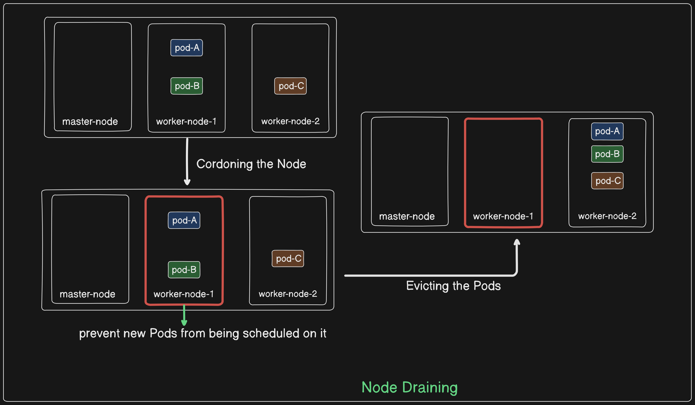

# Node Eviction From a Kuberbetes Cluster

## What is Node Draining?

Draining a node in Kubernetes refers to the process of safely evicting all running workloads (Pods) from a node and marking it as unschedulable. This operation is typically performed during maintenance activities such as upgrades, scaling down the cluster, or troubleshooting node issues. The goal is to ensure that applications running on the node are migrated to other nodes in the cluster without causing downtime or disruptions.

Draining a node involves two main stages:

1. **Cordoning the Node**: Marking it as unschedulable to prevent new Pods from being scheduled on it. Existing Pods continue to run until they are manually evicted.

2. **Evicting the Pods**: Terminating all non-DaemonSet Pods on the node. The Kubernetes scheduler then creates replacement Pods on other available nodes to maintain the desired state and number of replicas.



## Steps

### Step 1: Create an nginx ReplicaSet

1. Create the `nginx.yaml` file for the ReplicaSet:

```yaml
apiVersion: apps/v1
kind: ReplicaSet
metadata:
  name: nginx-replicaset
spec:
  replicas: 2
  selector:
    matchLabels:
      app: nginx
  template:
    metadata:
      labels:
        app: nginx
    spec:
      containers:
      - name: nginx
        image: nginx:latest
        ports:
        - containerPort: 80
```

2. Apply the configuration to create the ReplicaSet:

```sh
kubectl apply -f nginx.yaml
```

3. Get the list of Pods with wide output:

```sh
kubectl get pods -o wide
```

### Step 2: Understand Pod IPs and Scheduling

- Observe that the Pods have IPs (ClusterIPs) even though the ReplicaSet is not exposed by a Service. This is because they are connected to the default Kubernetes Service.
- Note the scheduling information:
  - The first Pod is scheduled on node-2.
  - The second Pod is scheduled on node-1.

### Step 3: Drain Node-2

1. Cordoning node-2 to prevent new Pods from being scheduled on it:

```sh
kubectl cordon node-2
```

2. Draining node-2 to evict its current Pods:

```sh
kubectl drain node-2 --ignore-daemonsets
```

### Step 4: Verify Draining and Pod Rescheduling

1. Get the list of nodes to verify the status:

```sh
kubectl get nodes
```

2. Check the status and scheduling of the Pods to see that the Pod from node-2 was rescheduled to node-1:

```sh
kubectl get pods -o wide
```

- Observe that the rescheduled Pod has a new age, indicating it was newly created on node-1.

### Step 5: Uncordon Node-2

1. Make node-2 schedulable again:

```sh
kubectl uncordon node-2
```

### Step 6: Verify Node Status

1. Get the list of nodes to confirm node-2 is back to normal:

```sh
kubectl get nodes
```

By following these steps, we can manage the scheduling and state of Pods and nodes in a Kubernetes cluster effectively.