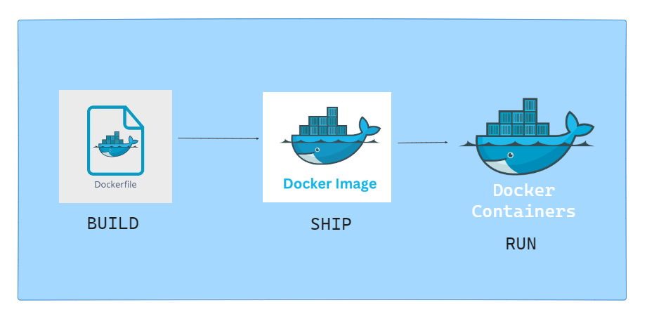

# Introduction to Containerization with Docker

In the previous demonstration, we were introduced to the concept of containers and even ran an instance of one. Now, we will delve deeper into the process of containerization, specifically with Docker. Before we explore Docker in detail, it's essential to understand a few key terms briefly:

1. **Dockerfiles**: These are built to create Docker Images. Think of a Dockerfile as the blueprint for a Docker Image.
2. **Docker Images**: These are built from Dockerfiles and then shipped. They serve as the template for creating containers.
3. **Containers**: These are instances that are run from Docker Images.

## Understanding Docker Components

## Dockerfile

A Dockerfile is a script containing a series of instructions on how to build a Docker Image. It includes the base image, environment variables, commands to install dependencies, and instructions for running applications.

## Docker Image

A Docker Image is a read-only template created from a Dockerfile. It contains everything needed to run an application, including the code, runtime, libraries, environment variables, and configuration files. Images are portable and can be shared or stored in a Docker registry.

## Docker Container

A Docker Container is a runnable instance of a Docker Image. It contains everything needed to execute an application and shares the kernel of the host OS. Containers are isolated from each other and the host system, providing a consistent runtime environment.

## Recap of Nginx Container Demo

In the previous demo, we worked with an Nginx container. This involved:

- **Pulling a Docker Image**: We pulled the Nginx Docker Image from a Docker registry.
- **Running a Container**: We ran a container instance from the Nginx Docker Image.
- **Accessing the Service**: We accessed the Nginx web server running inside the container.

This demo gave us a practical understanding of Docker Images and Containers.

