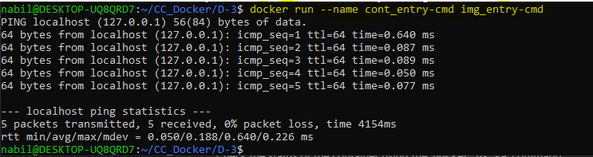

# Understanding ENTRYPOINT and CMD Instructions in Dockerfile

In this demo, we will explore the `ENTRYPOINT` and `CMD` instructions in a Dockerfile. These instructions play a crucial role in defining the behavior of a Docker container at runtime. 

## Step 1: Navigate to the Directory and List Contents

We begin in the `CC_Docker` directory and navigate to the `D-3` directory to locate our Dockerfile.

```sh
cd CC_Docker/D-3
```

## Step 2: Open the Dockerfile

Create an empty Dockerfile using the `touch` command.

```sh
touch Dockerfile
```

Open the Dockerfile in a text editor such as `nano`.

```sh
nano Dockerfile
```

## Step 3: Examine the Dockerfile Instructions

The Dockerfile includes several key instructions:

1. **FROM Instruction:**
   Sets the base image for the Docker image. Here, we use Ubuntu Trusty.

    ```Dockerfile
    FROM ubuntu:trusty
    ```

2. **LABEL Instruction:**
   Adds metadata to the Docker image in the form of key-value pairs. In this example, we add the `Creator` and `Version` labels.

    ```Dockerfile
    LABEL Creator="Cerulean Canvas" \
          Version="1.0"
    ```

3. **RUN Instruction:**
   Executes a command on top of the base image and commits the result as a new layer. Here, it updates the package list.

    ```Dockerfile
    RUN apt-get update -y
    ```

4. **ENTRYPOINT Instruction:**
   Configures the container to run a specific executable as its main process. This example uses the EXEC form to set `/bin/ping` as the ENTRYPOINT, which will ping the specified address when the container starts.

    ```Dockerfile
    ENTRYPOINT ["/bin/ping", "-c", "5"]
    ```

5. **CMD Instruction:**
   Provides default arguments for the ENTRYPOINT. If ENTRYPOINT is defined, CMD will be treated as parameters for the ENTRYPOINT. Here, it specifies `localhost` as the address to ping.

    ```Dockerfile
    CMD ["localhost"]
    ```

## Step 4: Build the Docker Image

Build the Docker image using the `docker build` command and tag it as `img_entry-cmd`.

```sh
docker build -t img_entry-cmd .
```

## Step 5: Verify the Build Process

During the build process, Docker performs the following steps:

1. **Set the Base Image:**
   Downloads the Ubuntu Trusty image from Docker Hub.

2. **Add Labels:**
   Creates labels `Creator` and `Version` for the Docker image.

3. **Run Command:**
   Updates the Ubuntu Trusty-based image and commits the result.

4. **Set ENTRYPOINT:**
   Configures `/bin/ping` as the ENTRYPOINT to be executed.

5. **Set CMD:**
   Provides `localhost` as the default argument for the ENTRYPOINT.

## Step 6: Verify the Built Image

List the available Docker images to verify that `img_entry-cmd` has been created.

```sh
docker images
```

## Step 7: Run a Container from the Image

Run a container based on the `img_entry-cmd` image. The container will execute the ENTRYPOINT command with the CMD argument.

```sh
docker run --name cont_entry-cmd img_entry-cmd
```

The container will ping `localhost` 5 times as per the ENTRYPOINT and CMD instructions. 



## Step 8: Verify Container Execution

Check the status of the container using the `docker ps -a` command.

```sh
docker ps -a
```

You should see that the container `cont_entry-cmd` has exited with a status code of 0, indicating successful execution. The container performed its task (pinging localhost) and then stopped.

## Summary

- **FROM Instruction:** Sets the base image.
- **LABEL Instruction:** Adds metadata to the image.
- **RUN Instruction:** Executes commands to modify the base image.
- **ENTRYPOINT Instruction:** Defines the main process to run when the container starts.
- **CMD Instruction:** Provides default arguments for the ENTRYPOINT.

By following these steps, we explored how to use `ENTRYPOINT` and `CMD` instructions to control the behavior of a Docker container. This example demonstrated setting up a container to ping `localhost` and provided a deeper understanding of how these instructions work together to define container behavior.