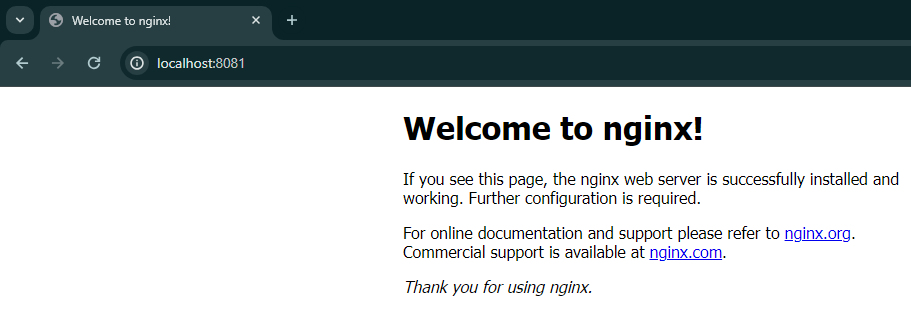

# Understanding Docker Instructions: RUN, EXPOSE, and CMD

In this demo, we will explore several Dockerfile instructions: `RUN`, `EXPOSE`, and `CMD`. These instructions are essential for configuring a Docker container to run a specific application. Let's go through the steps to create and run a Docker container that hosts an Nginx web server.

## Step 1: Navigate to the Directory

First, navigate to the `D-4` directory.

```sh
cd CC_Docker/D-4
```

## Step 2: Open the Dockerfile

Create an empty Dockerfile using the `touch` command.

```sh
touch Dockerfile
```

Open the Dockerfile in a text editor such as `nano`.

```sh
nano Dockerfile
```

## Step 3: Examine the Dockerfile Instructions

The Dockerfile includes the following instructions:

1. **FROM Instruction:**
   Sets the base image for the Docker image. Here, we use Ubuntu 16.04.

    ```Dockerfile
    FROM ubuntu:16.04
    ```

2. **RUN Instruction:**
   Executes a series of commands to update the package index and install Nginx. The commands are chained using the logical AND operator (`&&`), ensuring that each command runs only if the previous one succeeds. It also cleans up the local repositories of retrieved packages to reduce the image size.

    ```Dockerfile
    RUN apt-get update && \
        apt-get install -y nginx && \
        apt-get remove -y && \
        rm -rf /var/lib/apt/lists/*
    ```

3. **EXPOSE Instruction:**
   Documents the port on which the container listens for connections. This instruction does not publish the port; it serves as documentation for the person running the container.

    ```Dockerfile
    EXPOSE 80
    ```

4. **CMD Instruction:**
   Specifies the command to run within the container. Here, it configures Nginx to run in the foreground by turning off the daemon mode.

    ```Dockerfile
    CMD ["nginx", "-g", "daemon off;"]
    ```

## Step 4: Build the Docker Image

Build the Docker image using the `docker build` command and tag it as `img_expose`.

```sh
docker build -t img_expose .
```

## Step 5: Verify the Build Process

During the build process, Docker performs the following steps:

1. **Set the Base Image:**
   Uses the Ubuntu 16.04 image as the base.

2. **Execute RUN Instruction:**
   - Updates the package index of the base image.
   - Installs Nginx.
   - Removes unnecessary packages.
   - Cleans up the local repositories of retrieved packages.

3. **Expose Port:**
   Documents that the container listens on port 80.

4. **Set CMD:**
   Configures Nginx to run in the foreground when the container starts.

## Step 6: Verify the Built Image

List the available Docker images to verify that `img_expose` has been created.

```sh
docker images
```

## Step 7: Run a Container from the Image

Run a container based on the `img_expose` image. Use the `-itd` flags for interactive terminal mode, detached mode, and `--rm` to automatically remove the container once it stops. The `-p` flag maps the container's port 80 to the host's port 8081.

```sh
docker run -itd --rm --name cont_expose -p 8081:80 img_expose
```

The command provides a unique container ID upon successful execution.

## Step 8: Verify Container Execution

Check the status of the container using the `docker ps -a` command.

```sh
docker ps -a
```

You should see that the container `cont_expose` is running and its port 80 is mapped to port 8081 on the host.

## Step 9: Access the Nginx Web Server

Open your web browser (e.g., Chrome) and type `http://localhost:8081` in the address bar. Press enter to see the default homepage of the Nginx web server.



## Summary

- **FROM Instruction:** Sets the base image.
- **RUN Instruction:** Executes commands to update the base image and install software.
- **EXPOSE Instruction:** Documents the port the container listens on.
- **CMD Instruction:** Specifies the command to run within the container.

By following these steps, we configured and ran a Docker container that hosts an Nginx web server, demonstrating how to use `RUN`, `EXPOSE`, and `CMD` instructions in a Dockerfile.