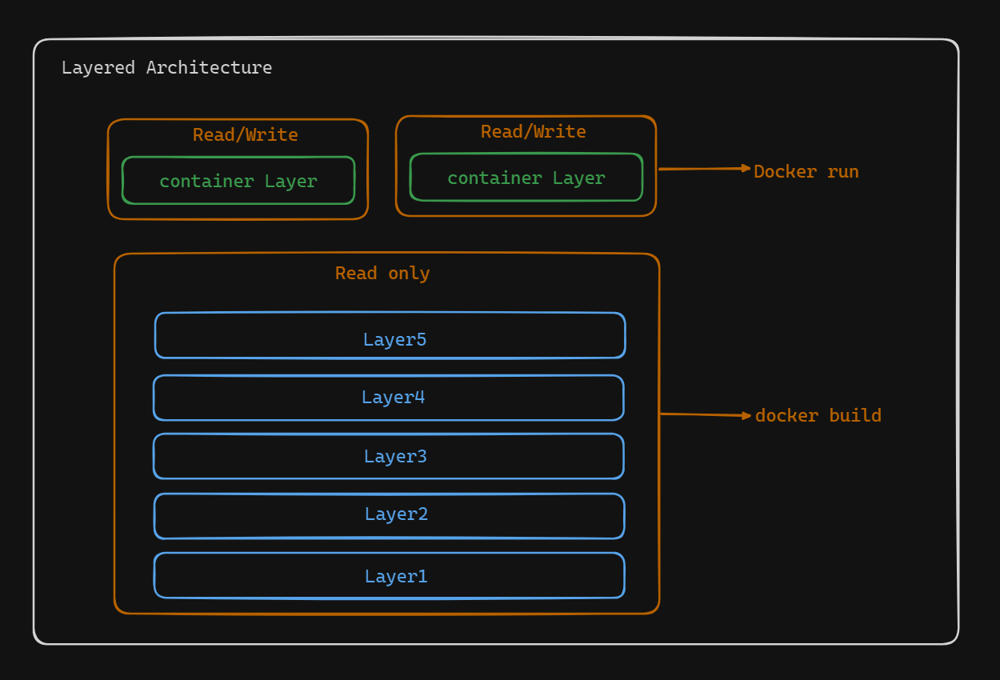

# Docker Images: A Layered Approach

This document explains Docker Images in simple terms, building on your understanding of Dockerfiles.

## What are Docker Images?

Imagine a Docker image as a stack of transparent films, each with specific instructions. These instructions come from a Dockerfile, which we've already explored. 

* **Layers:** Each film represents a layer created by a Dockerfile instruction. These layers are read-only, except for the topmost one (we'll get to that later).
* **Identification:** Images have unique IDs assigned by Docker, but you can also give them user-friendly names or tags for easier reference.

**Think of it like this:**

1. **Base Layer (Boot File System):** This is the foundation, similar to a Linux boot system. It sets up virtual separation between the image and the underlying system (host or cloud).
2. **Base Image Layer:** This layer sits on top and includes the core components needed for your application. Think of it as the building blocks.
3. **Instruction Layers:** On top of the base, you have additional layers created by instructions like `WORKDIR` (working directory), `ENV` (environment variables), `ADD` (adding files), `COPY` (copying files), `EXPOSE` (exposing ports), and `CMD` (default command).





## Intermediate Images: The Power of Reuse

* **Building Blocks:** As you build the image, Docker creates intermediate images for each instruction. These act like checkpoints.
* **Read-Only:** Just like the other layers, intermediate images are read-only for stability. Once built, their content cannot be changed.
* **Unique IDs:** Each intermediate image has its own ID, which you can view using the `docker history` command.
* **Caching Magic:** These intermediate images are key for efficiency. Imagine building two images based on the same base image (like building with Legos). Docker only downloads that base layer once and reuses it for both images if it's the same.

**Example of an Intermediate Image:**

Let's say you have a Dockerfile with the following instructions:

```dockerfile
FROM ubuntu:latest

# Set working directory
WORKDIR /app

# Copy requirements file
COPY requirements.txt .

# Install dependencies
RUN pip install -r requirements.txt

# Copy all project files
COPY . .

# Set default command
CMD ["python", "main.py"]
```

In this example, Docker would create separate intermediate images for each instruction (steps 2, 3, 4, and 5). These intermediate images wouldn't be usable on their own, but they contribute to the final image with your application ready to run.

**Why Intermediate Images?**

* **Efficiency:** By caching layers, Docker avoids unnecessary downloads, saving time and bandwidth.
* **Clarity:** Each layer has a distinct identity, making the build process more transparent.

**Important Note:** Intermediate images cannot run applications on their own. They lack essential elements like the `CMD` or `ENTRYPOINT` instruction needed to start a process.

**The Final Stack:**

* **Union File System:** A special file system called AUFS combines all the read-only layers into a single, unified image. This is the final product you use to create Docker containers.

I hope this explanation clarifies Docker Images and their layered structure, including the concept of intermediate images!