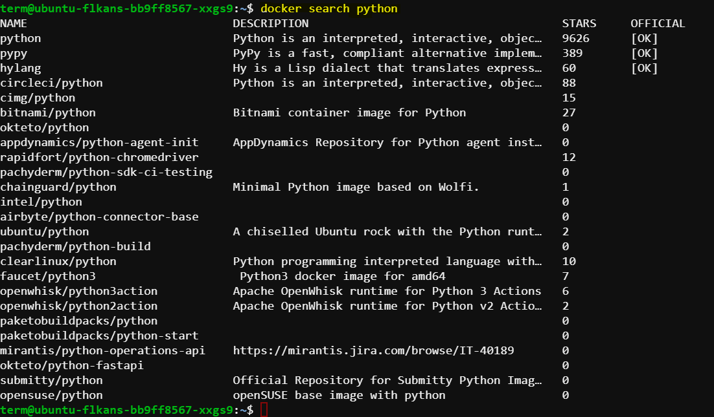
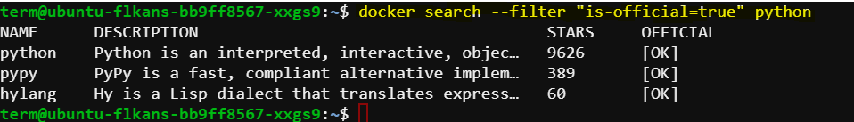
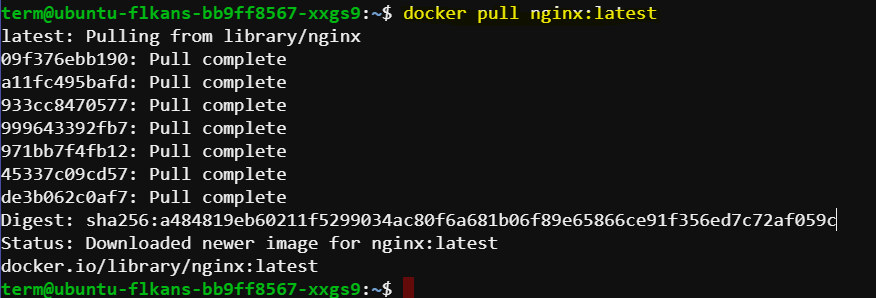
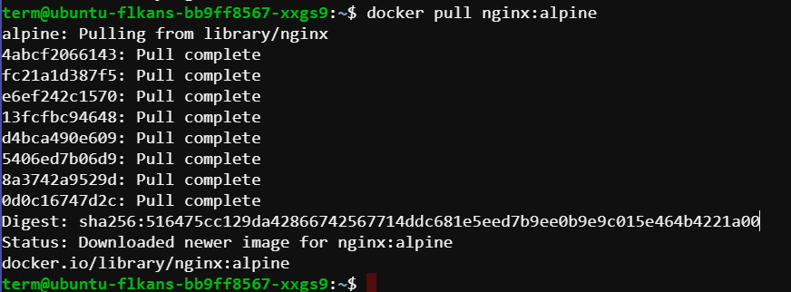
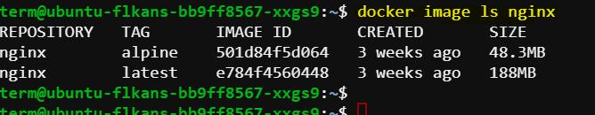

# Docker Commands and Repository Management

## Introduction

In this guide, we will explore various Docker commands, how to use them to search, pull, and manage Docker images, and how to create and manage repositories on Docker Hub. Each command and process will be explained in simple terms with examples to make it easy to understand.

## Command: `docker search` 

The `docker search` command is used to search for images on Docker Hub. You don't need a Docker Hub account to search for or pull images from Docker Hub. However, an account is required to use the web interface of Docker Hub or to push images to it.

### Syntax

The basic syntax of the command is:
```bash
docker search [image_name]:[version]
```

### Example

Let's execute the command to search for Python images:
```bash
docker search python
```
This will give us a list of Python images sorted by the number of stars. The list includes various frameworks built on top of Python since "Python" is one of the keywords. The results include descriptions of the images and whether they are official or not. For example, the official Python image is the first in the list with the most stars.

Expected output:



### Using Filters

We can also filter our search results. For example, to show only official images:
```bash
docker search --filter "is-official=true" python
```
This will display only the official Python image.

### Formatting Results

Docker allows formatting the search results for better readability. For example, to display the results in a tabular format:
```bash
docker search python --format "table {{.Name}}\t{{.Stars}}\t{{.Official}}"
```
This command will create a table with three columns: Name, Stars, and whether the image is Official.



## Command: `docker image`

The `docker image` command is a shorter version of `docker images ls` and both list the images on your host machine.

### Example

To list all Docker images:
```bash
docker image ls
```
This will show the images built during previous sessions.

### Filtering by Image Name

To list all versions of a specific image, for example, Ubuntu:
```bash
docker image ls ubuntu
```
This will show all Ubuntu images along with their sizes. To narrow down the list to a specific version:
```bash
docker image ls ubuntu:20.04
```
### Full Image ID

To see the full image ID without truncation, use the `--no-trunc` flag:
```bash
docker image ls --no-trunc
```

## Command: `docker pull` 

The `docker pull` command is used to pull images from Docker Hub to your Docker host.

### Example

To pull the latest version of the nginx image:
```bash
docker pull nginx:latest
```
Expected output:



This command downloads the latest nginx image. To pull a specific version, such as the Alpine version of nginx:
```bash
docker pull nginx:alpine
```

Expected output:



Listing the nginx images on the host will now show both versions:
```bash
docker image ls nginx
```

Expected output:



The Alpine version is smaller because the Alpine base OS itself is minimal.

### Pulling All Tags

To pull all variants of nginx images for testing purposes:
```bash
docker pull nginx --all-tags
```
This command will download all tagged versions of the nginx image.

## Creating a Repository on Docker Hub

Let's create a repository on Docker Hub and push images to it.

### Steps to Create a Repository

1. **Navigate to Docker Hub Dashboard**: Click on "Create Repository".
2. **Provide Namespace**: This is usually the same as your username. It makes the repository name unique.
3. **Name the Repository**: For example, "repo-nginx".
4. **Add a Description**: Provide a brief description of the repository.
5. **Set Visibility**: Docker offers one free private repository and unlimited public repositories with a free Docker Hub account. We will select public visibility.
6. **Create the Repository**: Click "Create" to finalize.

## Pushing an Image to Docker Hub

Before pushing an image, log in to Docker Hub using:
```bash
docker login
```
Enter your Docker Hub credentials.

### Tagging and Pushing

**Tag the Image**: Create a new tag for an existing image using `docker tag <source_image> <destination_image>`
- `<source_image>`: The image on your machine (e.g., nginx:latest).
- `<destination_image>`: The destination with username/repo and optional tag.

Create a tag for your image specifying the destination. 
```bash
docker tag nginx:latest ceruleancanvas/repo-nginx:cc-nginx
```
This tags the `nginx:latest` image as `ceruleancanvas/repo-nginx:cc-nginx`.


**Push the Image**: Push the tagged image to your Docker Hub repository:
`docker push <destination_image>`. The destination image should include the username/repo and tag 


Use the following command to push the tagged image.
```bash
docker push ceruleancanvas/repo-nginx:cc-nginx
```
Docker will upload each layer of the image to Docker Hub.

### Verifying the Push

Go to Docker Hub, navigate to your repository, and check the "Tags" tab to see your newly pushed image along with its size and tag.

## Conclusion

In this guide, we covered how to use various Docker commands such as `docker search`, `docker image`, and `docker pull`. We also learned how to create and manage a repository on Docker Hub and push images to it. In the next lecture, we will inspect images and look into their history.