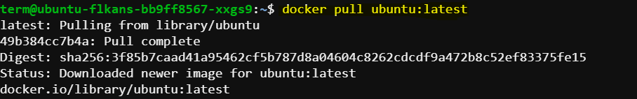
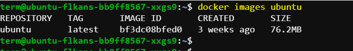
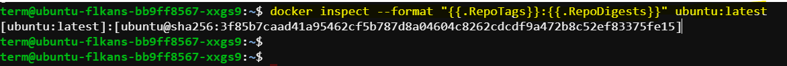
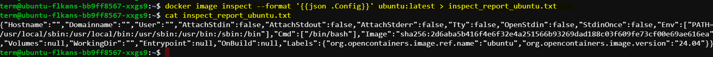
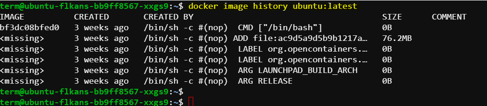

# Inspecting and Understanding Docker Images

In this demo, we will dive deeper into Docker images by using the `docker inspect` and `docker history` commands. These commands allow us to get detailed information about Docker images, which is crucial for debugging and understanding the image's build process.

## Pull Docker Images

To pull Docker images of ubuntu, we will use the `docker pull` command:

```bash
docker pull ubuntu:latest
```

Expected output:



## Listing Docker Images

First, let's list all of the Ubuntu images available on our local machine:

```sh
docker images ubuntu
```

Expected output:



## Inspecting a Docker Image

To get detailed information about a Docker image, we use the `docker image inspect` command. Let's inspect the `ubuntu:latest` image:

```sh
docker image inspect ubuntu:latest
```

This command outputs detailed information in JSON format. Key details include:

- **Id**: The extended image ID.
- **RepoTags**: The repository name and tag.
- **RepoDigests**: The digest of the image.
- **Container**: Identifier for the intermediate container used while building the image.
- **ContainerConfig**: Configuration details of the intermediate container.
- **Architecture**: The architecture of the base image.
- **Size and VirtualSize**: The actual and virtual size of the image.
- **RootFS**: Identifier showing digests of all intermediate layers.

## Formatting Inspect Output

To access specific details, we can format the output of the `docker inspect` command. For example, to get the `RepoTags` and `RepoDigests`:

```sh
docker inspect --format "{{.RepoTags}}:{{.RepoDigests}}" ubuntu:latest
```

Expected output:



## Saving Inspect Results to a File

We can save the inspection results to a file for future reference. For example, to save the configuration details to a text file:

```sh
docker image inspect --format '{{json .Config}}' ubuntu:latest > inspect_report_ubuntu.txt
```


Let's verify the file was created and check its contents:

```sh
cat inspect_report_ubuntu.txt
```

Expected output:



## Viewing Docker Image History

The `docker history` command shows all the intermediate layers of an image. To view the history of the `ubuntu:latest` image:

```sh
docker image history ubuntu:latest
```

Expected output:



The output shows all the layers, their associated image IDs, sizes, and creation times.


## Summary

By using `docker inspect` and `docker history`, we can obtain detailed information about Docker images and understand their build processes. These commands are essential for debugging and managing Docker images effectively. In the next lecture, we will further explore Docker networking.