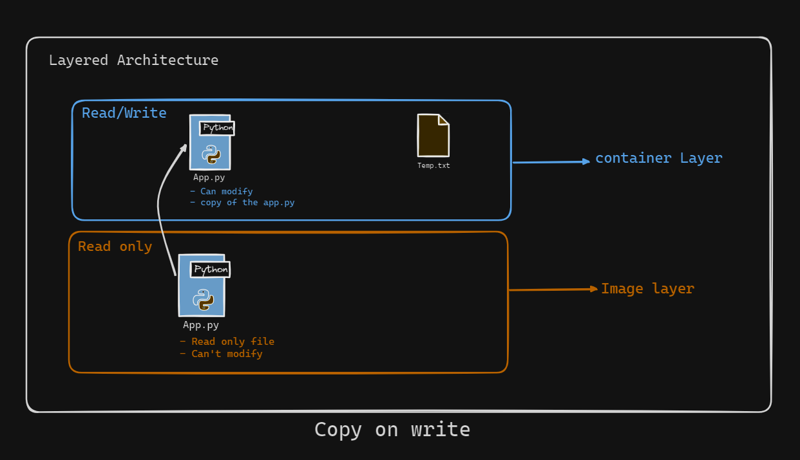

# Introduction to Docker Containers

Now that we have covered Dockerfiles and Docker images, it’s time to focus on the central topic of this course: containers.

## What is a Docker Container?

A Docker container is essentially a running instance of a Docker image. Think of it like this: in Linux, a process is a running instance of a program. Similarly, a container is a running instance of an image. This comparison helps in understanding that while an image is a static blueprint, a container is a dynamic entity created from that blueprint.

### Key Features of Containers

Containers offer several features similar to virtual machines (VMs), but they are much lighter. Each container has its own:
- File system
- Network driver
- Storage driver
- Administrative privileges

Despite these capabilities, containers are significantly more lightweight than VMs, often being at least 100 times lighter while hosting the same set of software.

## Structure of a Docker Container

Docker images are built from layers that are read-only. However, when a container is created from an image, it adds a writable top layer. This writable layer allows the container to make changes without affecting the underlying image, preserving the integrity of the original image.

### Networking in Containers

Containers can communicate with each other over a network. This communication is possible via IP addresses or DNS names, depending on the network configuration.

### Copy-on-Write Policy

Docker containers follow a Copy-on-Write (CoW) policy. This means that when a container modifies a file, a copy of the file is made in the writable layer. The original file in the underlying read-only layer remains unchanged. This approach helps in maintaining the original image’s integrity while allowing containers to make changes as needed.

## What Does "Running an Image" Mean?

Running an image refers to the process of starting a container from that image. When we say "run an image," we are talking about allocating necessary resources such as compute power, memory, and storage to the container. The container then uses these resources to operate independently of the host system and other containers.

## Summary

To summarize, a Docker container is a lightweight, isolated environment created from a Docker image. It has its own file system, network, and storage, and it operates with a writable top layer while maintaining the underlying image intact through Copy-on-Write policy. Running a container involves allocating resources and starting the instance from an image, much like launching a process from a program in a traditional operating system.

By understanding these core concepts, you can effectively use Docker containers to deploy and manage applications in a flexible and efficient manner.