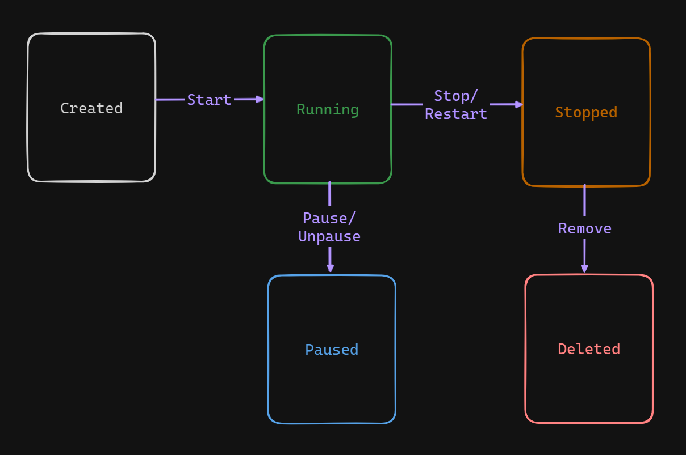
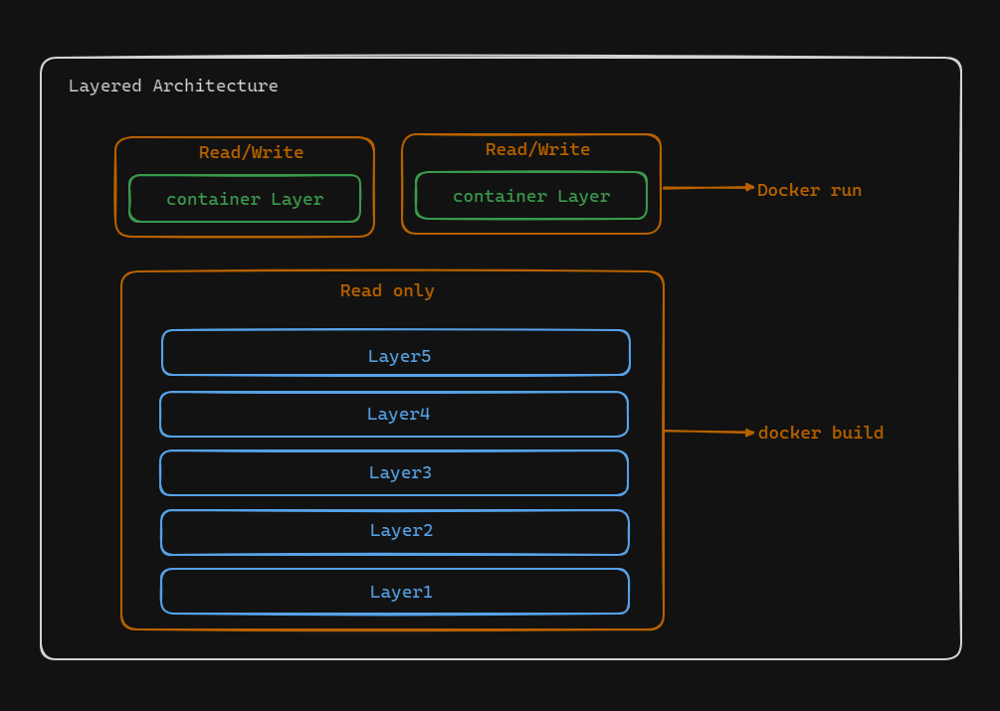
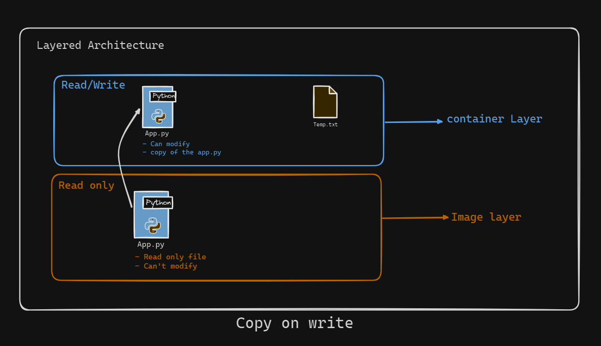

# Lifecycle of a Docker Container

A Docker container's lifecycle is quite similar to a process's lifecycle in Linux. Essentially, a container is a running instance of a Docker image, much like a process is a running instance of a program. Let’s explore the various stages in the lifecycle of a Docker container.



## Stages of a Container's Lifecycle

1. **Created Stage**
    - **Definition**: The container is created but not yet running.
    - **How to Achieve**: This stage can be initiated as part of the `docker run` command or explicitly using the `docker create` command.
    - **Example**: 
      ```sh
      docker create my_image
      ```
      This command creates a container from `my_image` but does not start it.

2. **Running Stage**
    - **Definition**: The container is actively running and using system resources.
    - **How to Achieve**: A container automatically moves to this stage if created with the `docker run` command, or from the Created stage using the `docker start` command.
    - **Example**: 
      ```sh
      docker start container_id
      ```
      This command starts the container if it’s in the Created stage.

3. **Paused Stage**
    - **Definition**: The container is temporarily paused, and its processes are suspended.
    - **How to Achieve**: This stage is manually triggered using the `docker container pause` command and can be resumed with the `docker container unpause` command.
    - **Example**: 
      ```sh
      docker pause container_id
      docker unpause container_id
      ```
      These commands pause and unpause the container, respectively.

4. **Stopped Stage**
    - **Definition**: The container’s processes have been terminated, but the container still exists.
    - **How to Achieve**: This can occur due to an error, a restart policy, or the container completing its task. It can also be manually stopped using the `docker container stop` command.
    - **Example**: 
      ```sh
      docker stop container_id
      ```
      This command stops the running container.

5. **Deleted Stage**
    - **Definition**: The container is completely removed, and its ID is freed.
    - **How to Achieve**: This is done using the `docker container rm` command.
    - **Example**: 
      ```sh
      docker rm container_id
      ```
      This command removes the stopped container from the list.

## Managing Multiple Containers from a Single Image




### Read-Only and Read/Write Layers

Multiple containers can be created from a single Docker image. They share the read-only layers of the image, while each container has its own unique writable layer. This setup ensures data integrity and prevents data corruption, as the read-only layer remains unchanged.

### Storage Optimization

By sharing the read-only layers among containers, Docker optimizes storage on the host system. Each container only needs its own writable layer, significantly reducing the overall storage footprint. 

### Host Limitations

The number of containers you can run on a single host depends on the host's hardware limitations, such as memory and processing power. 

## Copy-on-Write Mechanism



### How It Works

The writable layer of a container is mounted on a copy of the read-only layers' files. The original files in the read-only layers remain untouched. When a container modifies a file, a copy of the file is created in the writable layer, preserving the original file.

### Benefits

- **Data Integrity**: The original files are never modified, ensuring the integrity of the Docker image.
- **Easy Recovery**: If there is unauthorized access or damage to the container's file system, the original layers can be easily recovered.

## Summary

In summary, the lifecycle of a Docker container closely mirrors that of a Linux process, with stages including Created, Running, Paused, Stopped, and Deleted. Docker’s architecture allows multiple containers to efficiently share the same image layers, optimizing storage and maintaining data integrity through the Copy-on-Write mechanism. Understanding these stages and mechanisms helps in managing and utilizing Docker containers effectively.