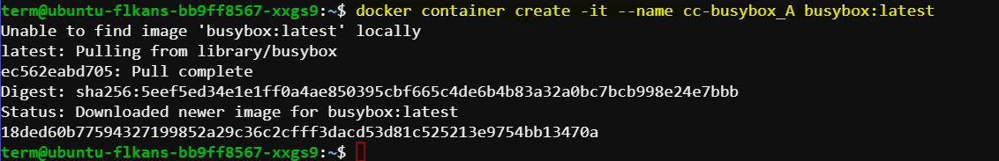
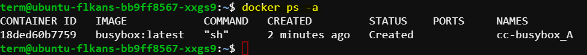
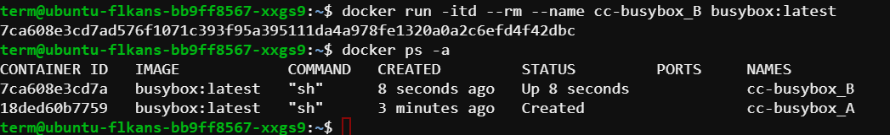

# Container Run Versus Create

In this guide, we'll explore two Docker commands using a BusyBox container: `docker container create` and `docker run`. We'll go through the steps and explain each command with examples.

## Creating a Container

First, let's create a BusyBox container using the `docker container create` command.

### Steps:

1. **Create the Container:**
    
    **Command**: `docker container create -it --name cc-busybox_A busybox:latest`
    
    **Explanation**:
        - `-it`: Enables interactive and teletype (TTY) mode.
        - `--name cc-busybox_A`: Names the container "cc-busybox_A".
        - `busybox:latest`: Specifies the BusyBox image with the latest tag.

    ```sh
    docker container create -it --name cc-busybox_A busybox:latest
    ```

    Expected output:

    

    Since the BusyBox image might not be available locally, Docker will pull it from Docker Hub. After pulling, Docker will create the container and provide a unique container ID.

2. **List All Containers:**
    
    **Command**: `docker ps -a`
    
    **Explanation**: This command lists all containers on the host, including those that are running, stopped, or have exited.

    ```sh
    docker ps -a
    ```

    Expected output:

    
    
    The output shows a list of containers, with the top entry being the recently created BusyBox container. It is not running yet, as indicated in the STATUS column.


## Running a Container

Next, let's run a BusyBox container using the `docker run` command.

### Steps:

1. **Run the Container:**
    
    **Command**: `docker run -itd --rm --name cc-busybox_B busybox:latest`
    
    **Explanation**:
    - `-it`: Enables interactive and TTY mode.
    - `-d`: Runs the container in detached mode.
    - `--rm`: Automatically removes the container after it stops.
    - `--name cc-busybox_B`: Names the container "cc-busybox_B".
    - `busybox:latest`: Specifies the BusyBox image with the latest tag.

    ```sh
    docker run -itd --rm --name cc-busybox_B busybox:latest
    ```

    Docker will start the container and return a container ID. Since the BusyBox image was previously pulled, Docker will use the cached image.

2. **List All Containers Again:**
    
    **Command**: `docker ps -a`
    
    **Explanation**: This command lists all containers on the host, including those that are running, stopped, or have exited.

    ```sh
    docker ps -a
    ```

    Expected output:

    

    The output shows the new BusyBox container "cc-busybox_B" at the top, which is currently running. It also shows that it took a few seconds to transition from creation to running status.

       

## Summary

- **docker container create**: This command creates a container but does not start it. It sets up the container and allocates the necessary resources without running the container's processes.
- **docker run**: This command creates and starts a container. It can run the container in the foreground or background and optionally remove the container after it stops.

### Example Commands Recap

1. **Create Container:**
    ```sh
    docker container create -it --name cc-busybox_A busybox:latest
    ```

2. **List All Containers:**
    ```sh
    docker ps -a
    ```

3. **Run Container:**
    ```sh
    docker run -itd --rm --name cc-busybox_B busybox:latest
    ```

By following these steps, you can effectively manage and run Docker containers using the `docker container create` and `docker run` commands.