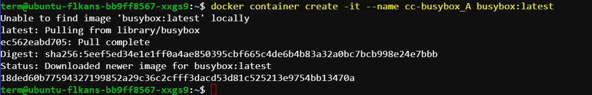
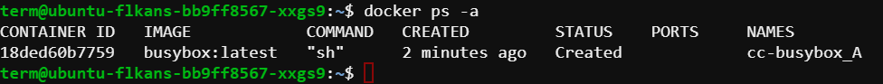
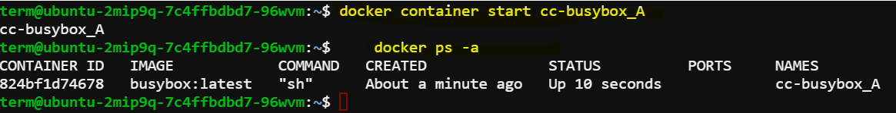
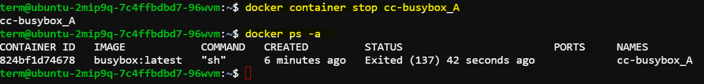
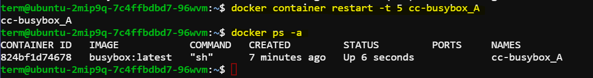
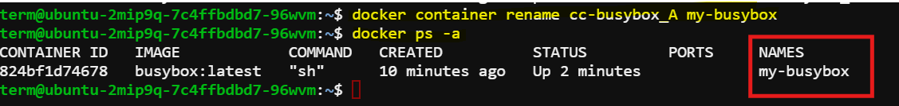

# Starting and Managing Containers

In this demo, we will build on our previous session where we created the container `cc_busybox-A` but did not start it. We will demonstrate how to start, stop, restart, and rename containers using Docker commands.

## Creating a Container

First, let's create a BusyBox container using the `docker container create` command.

### Steps:

1. **Create the Container:**
    
    **Command**: `docker container create -it --name cc-busybox_A busybox:latest`
    
    **Explanation**:
        - `-it`: Enables interactive and teletype (TTY) mode.
        - `--name cc-busybox_A`: Names the container "cc-busybox_A".
        - `busybox:latest`: Specifies the BusyBox image with the latest tag.

    ```sh
    docker container create -it --name cc-busybox_A busybox:latest
    ```

    Expected output:

    

    Since the BusyBox image might not be available locally, Docker will pull it from Docker Hub. After pulling, Docker will create the container and provide a unique container ID.

2. **List All Containers:**
    
    **Command**: `docker ps -a`
    
    **Explanation**: This command lists all containers on the host, including those that are running, stopped, or have exited.

    ```sh
    docker ps -a
    ```

    Expected output:

    
    
    The output shows a list of containers, with the top entry being the recently created BusyBox container. It is not running yet, as indicated in the STATUS column.


## Starting a Container

Let's start the container `cc-busybox_A` which we created earlier.

### Steps:

1. **Start the Container:**
    
    **Command**: `docker container start cc-busybox_A`
    
    **Explanation**: This command starts the container named `cc-busybox_A`. We don't need to provide additional flags like `-itd` because they were already specified during the container's creation.

    ```sh
    docker container start cc-busybox_A
    ```

    The command will output the name of the container (`cc-busybox_A`) to confirm that it has started successfully.

2. **Verify Container Status:**
    
    **Command**: `docker ps -a`
    
    **Explanation**: This command lists all containers, including those that are running, stopped, or exited.

    ```sh
    docker ps -a
    ```

    Expected output:

    

    The container `cc_busybox-A` should now be in the running state.

## Stopping a Container

Next, let's stop the container `cc-busybox_A`, which is currently running.

### Steps:

1. **Stop the Container:**
    
    **Command**: `docker container stop cc-busybox_A`
    
    **Explanation**: This command stops the container named `cc-busybox_A`.

    ```sh
    docker container stop cc-busybox_A
    ```

    The command will output the name of the container (`cc-busybox_A`) to confirm that it has stopped successfully.

2. **Verify Container Status:**
    
    **Command**: `docker ps -a`
    
    **Explanation**: This command lists all containers, including those that are running, stopped, or exited.

    ```sh
    docker ps -a
    ```

    Expected output:

    

    The container `cc-busybox_A` will not appear in the list because we used the `--rm` flag during its creation. This flag automatically removes the container once it stops.

## Restarting a Container

Now, let's restart the container `cc-busybox_A`.

### Steps:

1. **Restart the Container:**
    
    **Command**: `docker container restart -t 5 cc-busybox_A`
    
    **Explanation**: This command restarts the container named `cc-busybox_A` and gives it a 5-second buffer time before restarting.

    ```sh
    docker container restart -t 5 cc-busybox_A
    ```

   

    The command will output the name of the container (`cc-busybox_A`) to confirm that it has restarted successfully.

2. **Verify Container Status:**
    
    **Command**: `docker ps -a`
    
    **Explanation**: This command lists all containers, including those that are running, stopped, or exited.

    ```sh
    docker ps -a
    ```

     Expected output:

   

    The container `cc-busybox_A` should be up and running again.

## Renaming a Container

Finally, let's rename the container `cc-busybox_A` to something simpler.

### Steps:

1. **Rename the Container:**
    
    **Command**: `docker container rename cc-busybox_A my-busybox`
    
    **Explanation**: This command renames the container from `cc-busybox_A` to `my-busybox`.

    ```sh
    docker container rename cc-busybox_A my-busybox
    ```

    
    The command will successfully rename the container without restarting it.

2. **Verify Container Status:**
    
    **Command**: `docker ps -a`
    
    **Explanation**: This command lists all containers, including those that are running, stopped, or exited.

    ```sh
    docker ps -a
    ```

    Expected output:

    

   The container will appear in the list with its new name `my-busybox`.

