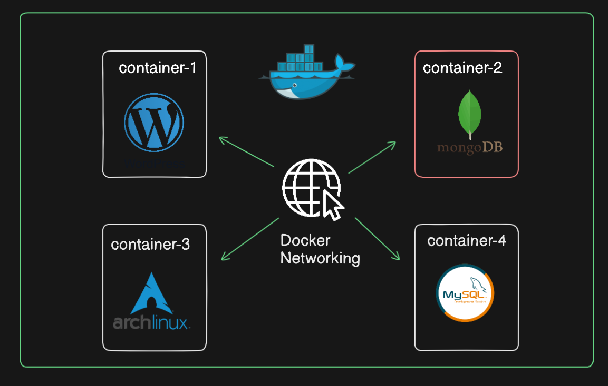

# Understanding Docker Network Drivers and Container Communication

## Introduction
Docker, a pioneering technology in containerization, simplifies application deployment. However, as applications grow in complexity, efficient communication between containers becomes paramount. This document elucidates Docker network drivers, delineating their role in container communication and their various types.

### Overview of Docker Network Drivers
   - Docker network drivers manage container networking, enabling communication within single hosts and across clusters.
   - Native drivers, provided by Docker, offer reliability but limited control over IP ranges and ports.
   - Third-party remote drivers extend Docker's capabilities, focusing on specific use cases like cloud provider networking.

### Importance of Container Communication
   - Inter-container communication is essential for cohesive application delivery, especially in multifaceted scenarios like smartphone apps.
   - Docker network drivers facilitate various communication patterns: one-to-one, one-to-many, and many-to-many.

### Functionality of Docker Network Drivers
   - These drivers handle network configurations, including IP address allocation and port mapping.

### Types of Docker Network Drivers
   - **Native Network Drivers:** Offered by Docker, ensuring reliability but limiting control over IPs and ports.
   - **Remote Network Drivers:** Developed by third parties, catering to specific use cases such as cloud provider networking.
   - **IPAM (IP Address Management) Driver:** Manages IP address ranges and distributions, useful when configurations are unspecified.

### Container Networking Models
   - Docker supports diverse networking models dictating container-to-container and container-to-external resource communication.
   - Further exploration of container networking models and Docker network types will follow in subsequent lectures.

## Conclusion
Understanding Docker network drivers is pivotal for optimizing containerized environments. They underpin efficient communication between containers, ensuring smooth application performance. Subsequent discussions will delve deeper into container networking models and the array of Docker networks available.