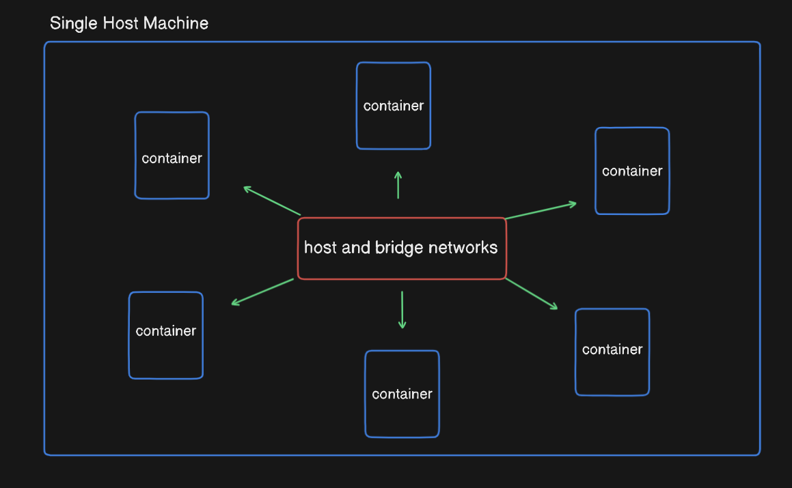
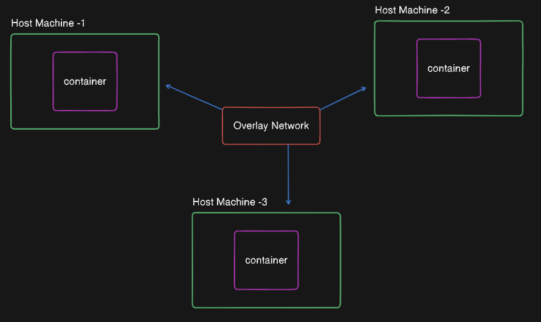

# Native Docker Network Drivers: Host, Bridge, and Overlay

### Host Network
   - Host network credentials are directly reflected on container endpoints.
   - Containers connected to this network share the same IP as the host.
   - Despite sharing the host's IP, containers maintain their individual characteristics.
   - Practical example: Two containers connected to the Host Network communicate via virtual Ethernet, inheriting the host's capabilities and limitations.

### Bridge Network
   - Default network for Docker containers if not explicitly connected to another network.
   - Creates a virtual Ethernet bridge, isolating containers from host network specifications.
   - Containers on this network have different IPs than the host.
   - IP range and subnet mask can be defined for the bridge and subsequent networks, managed by IPAM drivers if not specified.
   - Communication passes through the host's network, aiding in hiding host DNS or IP.

### Overlay Networks (for Swarm Mode)
   - Used in multi-host Docker infrastructures, particularly in Swarm Mode.
   - Swarm Mode orchestrates clusters of Docker hosts running containerized applications.
   - Overlay Network facilitates communication across multiple hosts and containers within the Swarm.
   - Requires tracking container IPs and routing communication to the proper host.
   - Utilizes two layers of information: Underlay Network (source and destination host's IP) and Overlay Information (source and destination container's IP) for routing.
   - Packet headers include IP addresses of both source and destination hosts and containers.

## Conclusion
Native Docker network drivers provide essential networking functionalities for Docker containers. Host and Bridge networks cater to single-host scenarios, while Overlay networks are essential for multi-host setups, especially in Swarm Mode. Understanding these network types is crucial for effectively deploying and managing Docker containers in various environments. Practical exploration of these networks will enhance comprehension, particularly when delving into Swarm Mode in subsequent lessons.