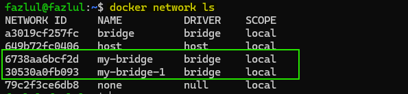
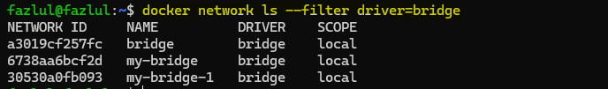

# Creating Docker Networks: Understanding Bridge Networks

## Introduction
In this demonstration, we will create and explore Docker networks using the `docker network create` command. Specifically, we will focus on bridge networks and understand their functionality.

### Creating the First Docker Network
   - Use the `docker network create` command to create a bridge network named `my-bridge`:

     ```
     docker network create --driver bridge my-bridge
     ```

### Creating Another Docker Network with Additional Parameters
   - Create a second bridge network named `my-bridge-1` with additional parameters such as subnet and IP range:

     ```
     docker network create --driver bridge --subnet 172.19.0.0/16 --ip-range 172.19.0.0/24 my-bridge-1
     ```

### Listing Available Docker Networks
   - View all available networks, including the default ones:

     ```
     docker network ls
     ```

     

### Filtering Docker Networks

   - Filter the list to display only bridge networks:
   
     ```
     docker network ls --filter driver=bridge
     ```
     
     
    
## Conclusion
Through this demonstration, we have created two Docker bridge networks, `my-bridge` and `my-bridge-1`, and explored the default bridge, host, and none networks provided by Docker. By understanding the functionality of bridge networks and how to list and filter them, users can effectively manage their Docker networking environment.