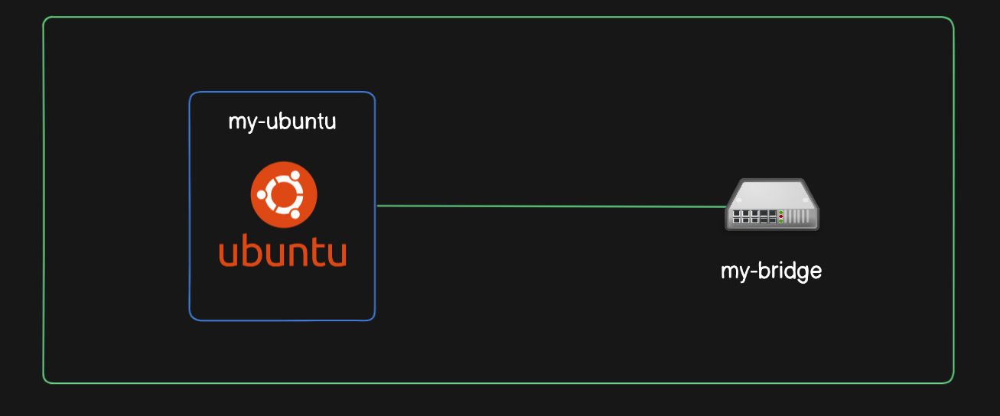
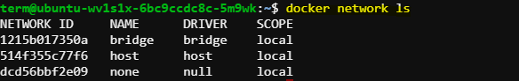
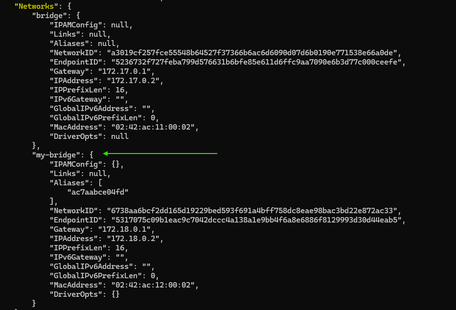
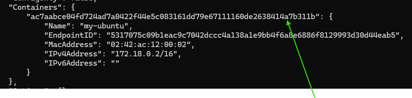

# Connecting Containers to Docker Networks: A Demonstration

## Introduction
In this demonstration, we will connect a container to a Docker network. We'll start by creating a bridge network using the `docker network create` command and then connect a container to it. We will explore the process of checking for running containers, connecting a container to a network, and inspecting the network configuration.



### Creating a Bridge Network

   - Create a bridge network named `my-bridge` using the following command:

     ```
     docker network create --driver bridge my-bridge
     ```

### Checking for Running Containers
   - Verify if there are any running containers using the following command:

     ```
     docker ps
     ```

     


### Starting the Ubuntu Container
   - Start the `my-ubuntu` container to ensure it is running and available for network connection:

     ```
     docker run -itd --name my-ubuntu ubuntu:24.04
     ```

### Connecting the Container to the Network
   - Use the `docker network connect` command to connect the `my-ubuntu` container to the `my-bridge` network:

     ```
     docker network connect my-bridge my-ubuntu
     ```

### Verifying the Connection
   - Check the connection by inspecting the network configuration of the `my-ubuntu` container using the `docker inspect` command:

     ```
     docker inspect my-ubuntu
     ```

     

### Exploring Default Bridge Network
   - Inspect the default bridge network to understand its configuration and endpoints:

     ```
     docker network inspect bridge
     ```

### Inspecting User-defined Bridge Network
   - Use the `docker network inspect` command to examine the configuration of the `my-bridge` network:

     ```
     docker network inspect my-bridge
     ```
     
     
     

     `my-bridge` has the `container ID` ,which was provided when `my-ubuntu` container was created.

     

### Disconnecting the Container from the Network
   - Disconnect the `my-ubuntu` container from the `my-bridge` network using the `docker network disconnect` command:

     ```
     docker network disconnect my-bridge my-ubuntu
     ```

### Verifying Disconnection
   - Confirm that the container is no longer connected to the network by inspecting the network configuration:
   
     ```
     docker inspect my-ubuntu
     ```

## Conclusion
Through this demonstration, we have learned how to create and connect containers to Docker networks, inspect network configurations, and manage network connections effectively. Understanding these processes is essential for building robust and interconnected containerized applications.