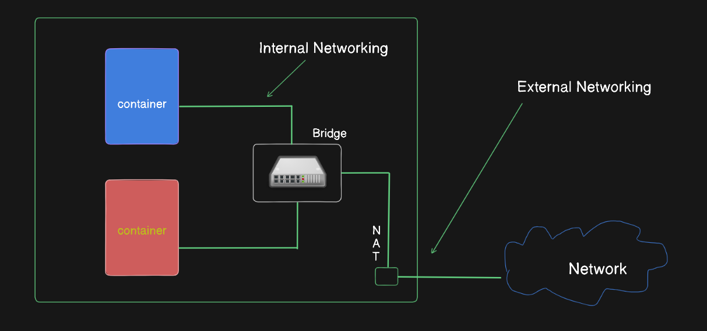
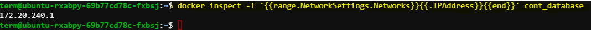
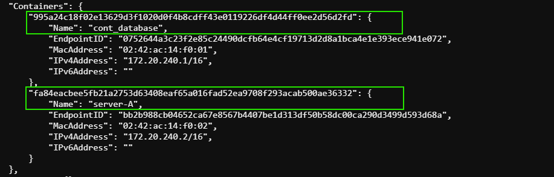
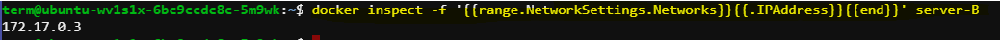
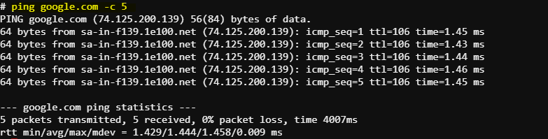
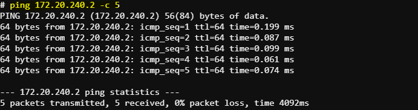
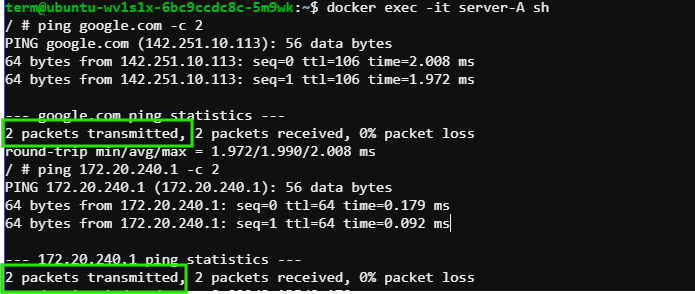
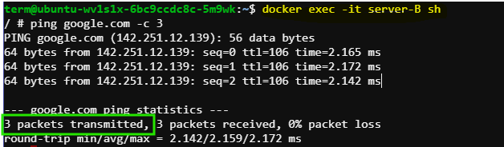
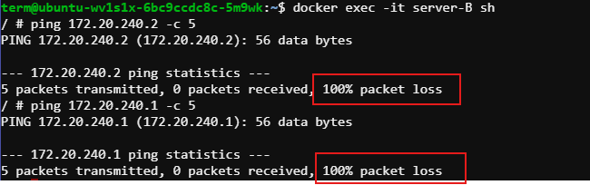

# Container Communication: Internal and External

In this documentation, we will explore Docker networking by creating bridge networks, running containers, and connecting them to different networks. We'll demonstrate how containers communicate within the same network and with the external world. 



## Steps

### 1. List Docker Networks

First, let's list the existing Docker networks to ensure we are starting clean:

```bash
docker network ls
```
This command lists all existing Docker networks.


### 2. Create a Bridge Network

Create a new bridge network called `net-bridge` with specific subnet and IP range:

```bash
docker network create --driver bridge --subnet 172.20.0.0/16 --ip-range 172.20.240.0/24 net-bridge
```
This command creates a new bridge network named `net-bridge` with the specified subnet and IP range.

### 3. Run and Connect Containers to the Bridge Network

#### Run `cont_database` Container

Run a container named `cont_database` from the `redis` image and connect it to `net-bridge` network:

```bash
docker run -d --name cont_database --network net-bridge redis
```

This command runs a new container named `cont_database` from the `redis` image in detached mode.


Fetch its IP address:

```bash
docker inspect -f '{{range.NetworkSettings.Networks}}{{.IPAddress}}{{end}}' cont_database
```
This command retrieves the IP addresses of the `cont_database` container.D


#### Run `server-A` Container

Run another container from the `busybox` image and call it `server-A`, also connect it to `net-bridge` network:

```bash
docker run -d --name server-A --network net-bridge busybox sleep 3600
```
This command runs a new container named `server-A` from the `busybox` image in detached mode, connecting it to `net-bridge`.

Fetch its IP address:

```bash
docker inspect -f '{{range.NetworkSettings.Networks}}{{.IPAddress}}{{end}}' server-A
```
This command retrieves the IP address of the `server-A` container.


### 4. Inspect the `net-bridge` Network

Inspect the `net-bridge` network to see which containers are connected:

```bash
docker network inspect net-bridge
```
This command provides detailed information about the `net-bridge` network, including connected containers.



### 5. Run `server-B` Container

Run a third container from the `busybox` image called `server-B` without specifying any network, which means it will be connected to the default bridge network:

```bash
docker run -d --name server-B busybox sleep 3600
```
This command runs a new container named `server-B` from the `busybox` image in detached mode, connecting it to the default bridge network.

Fetch its IP address:

```bash
docker inspect -f '{{range.NetworkSettings.Networks}}{{.IPAddress}}{{end}}' server-B
```
This command retrieves the IP address of the `server-B` container.



### 6. Verify Network Connectivity

#### Verify `cont_database` Container Connectivity

Execute the `cont_database` container with a shell and install the necessary tools:

```bash
docker exec -it cont_database sh
```
This command opens an interactive shell session inside the `cont_database` container.

Install ping utility (for Redis base image):

```bash
apt-get update && apt-get install -y iputils-ping
```
This command updates the package list and installs the `ping` utility inside the container.

Ping Google to check external connectivity:

```bash
ping google.com -c 5
```
This command pings Google to test external connectivity from the container.



Ping `server-A` to check internal connectivity within the same network:

```bash
ping 172.20.240.2 -c 5
```
This command pings `server-A` to test internal connectivity within the `net-bridge` network.



#### Verify `server-A` Container Connectivity

Execute the `server-A` container:

```bash
docker exec -it server-A sh
```
This command opens an interactive shell session inside the `server-A` container.

Ping Google and `cont_database`:

```bash
ping google.com -c 2
ping 172.20.240.1 -c 2
```
These commands ping Google and `cont_database` to test external and internal connectivity.



#### Verify `server-B` Container Connectivity

Execute the `server-B` container:

```bash
docker exec -it server-B sh
```
This command opens an interactive shell session inside the `server-B` container.

Ping Google to check external connectivity:

```bash
ping google.com -c 3
```
This command pings Google to test external connectivity from the container.



Ping `server-A` and `cont_database` (expected to fail since they are on a different network):

```bash
ping 172.20.240.2 -c 5
ping 172.20.240.1 -c 5
```
These commands ping `server-A` and `cont_database` to test internal connectivity, which should fail due to different networks.



## Summary

- Containers connected to the same user-defined bridge network can communicate with each other and the external world.
- Containers connected to different networks (user-defined vs default) cannot communicate with each other directly.
- External connectivity is possible for all containers via the host network unless restricted by other configurations.

This concludes the Docker networking demo, showcasing the creation and utilization of bridge networks and the communication between containers.