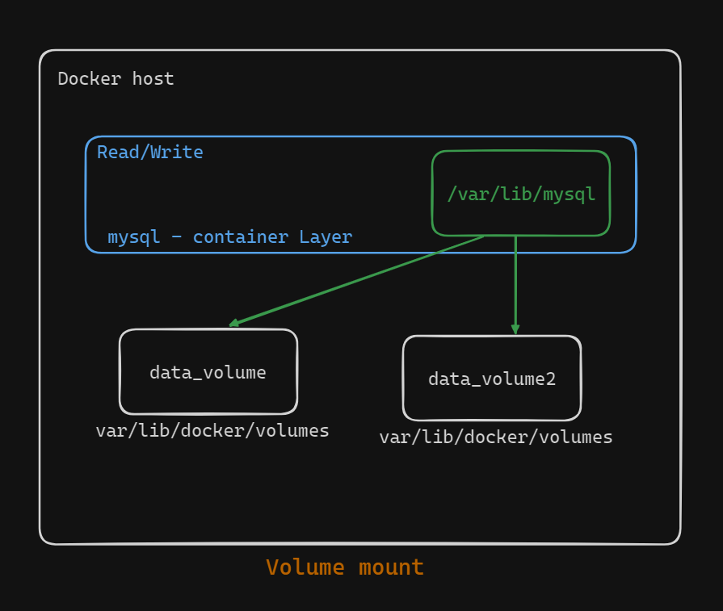
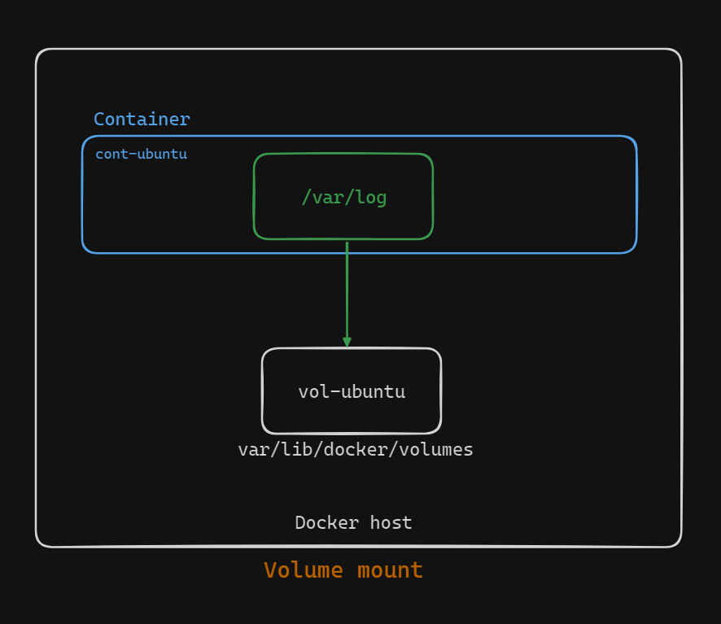

# Docker Volume Usage Demo

In this demo, we will demonstrate how to use Docker volumes to persist data between container instances. We'll start by creating a volume and a container, then make changes inside the container and verify that the data is backed up on the host system.


## Step 1: Create Volume and Container

First, we create a volume named `vol-ubuntu` and a container named `cont-ubuntu` from the Ubuntu image.

```
docker run -it --name cont-ubuntu -v vol-ubuntu:/var/log ubuntu bash
```

Here, we mount `vol-ubuntu` to the `/var/log` directory inside the container.



## Step 2: Verify Volume and Container

We verify the volume and container creation by listing them:

```
docker volume ls
docker container ls -a
```

Inspecting the container confirms the volume is attached:

```
docker container inspect cont-ubuntu
```

## Step 3: Update Container

Next, we execute the container and update the OS:

```
apt-get update
```

We then navigate to the `/var/log` directory and list its contents:

```
cd /var/log
ls
```

This directory contains various log files, which will serve as our test data.

## Step 4: Stop and Inspect

After making changes, we stop the container:

```
exit
docker stop cont-ubuntu
```

On the host machine, we navigate to the Docker volumes directory to verify the backup:

```
sudo -i
cd /var/lib/docker/volumes/vol-ubuntu/_data
ls
```

We should see the same log files that were in the container’s `/var/log` directory.


## Summary

In this demo, we demonstrated how to create a Docker volume and attach it to a container. By updating the container and verifying the persisted data on the host, we illustrated how volumes can be used to maintain data consistency and persistence across container instances. This approach ensures that important data is not lost when containers are stopped or removed, providing a reliable storage solution for Dockerized applications.