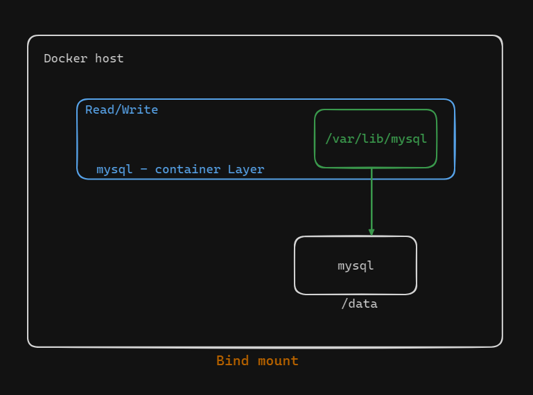
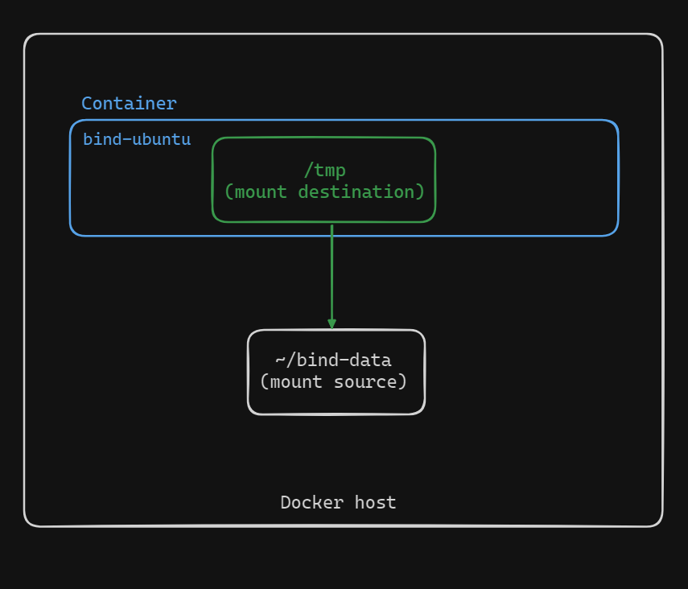

# Docker Bind Mounts Demo

In this demo, we will demonstrate the use of Docker bind mounts, which allow a container to access files on the host machine. This setup is less secure but provides a convenient way to share data between the host and the container.



## Step 1: Create Directory on Host

First, we create a directory called `bind-data` in the home directory on the Docker host.

```
mkdir ~/bind-data
```


## Step 2: Run Container with Bind Mount

Next, we run a container named `bind-ubuntu` from the `ubuntu:latest` image and bind the host directory `bind-data` to the container's `/tmp` directory.

```
docker run -d --name bind-ubuntu -v ~/bind-data:/tmp ubuntu:latest

```



## Step 3: Verify Container and Bind Mount

We check if the container is running:

```
docker ps
```

Inspecting the bind mount details:

```
docker inspect bind-ubuntu
```

The output shows the mount type as `bind`, with the source as `~/bind-data` and the destination as `/tmp`. It also confirms read/write permissions are set to true.

## Step 4: Create File in Container

We execute the `bind-ubuntu` container and create a file named `foo.txt` in the `/tmp` directory.

```
docker exec -it bind-ubuntu bash
cd /tmp
echo "Hello from container" > foo.txt
exit
```

## Step 5: Verify File on Host

We navigate to the `bind-data` directory on the host and verify the presence of `foo.txt`.

```
cd ~/bind-data
ls
```

## Step 6: Create File on Host

With the container stopped, we create another file named `hello.txt` in the `bind-data` directory on the host.

```
echo "Hello from host" > ~/bind-data/hello.txt
```


## Step 7: Verify File in Container

We restart and execute the container to check if `hello.txt` is visible in the `/tmp` directory.

```
docker start bind-ubuntu
docker exec -it bind-ubuntu bash
cd /tmp
ls
```

The output should show both `foo.txt` and `hello.txt`, confirming that the bind mount is working in both directions.


## Summary

In this demo, we demonstrated the use of Docker bind mounts by sharing a directory between a container and the host. We verified the bidirectional nature of the bind mount by creating files on both the container and the host and observing the changes reflected on both sides. This method, although less secure, provides a convenient way to persist data between container instances and the host machine.