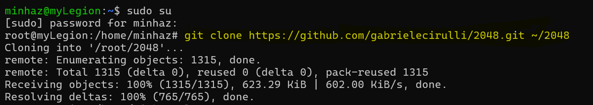
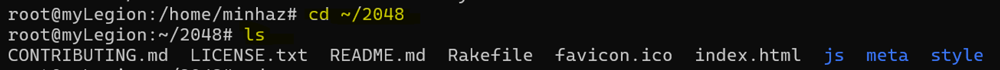
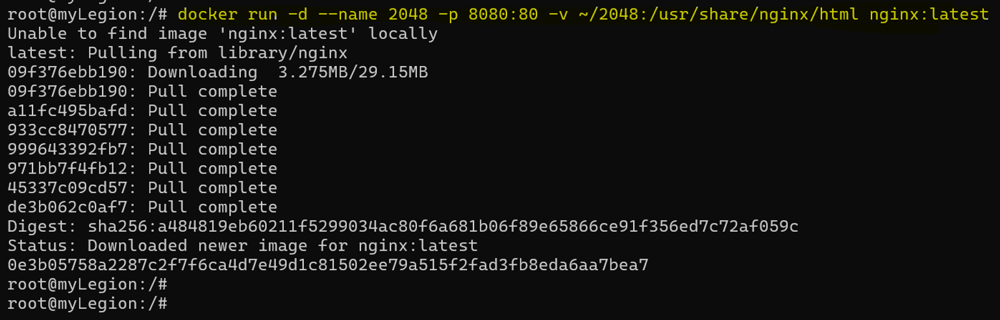
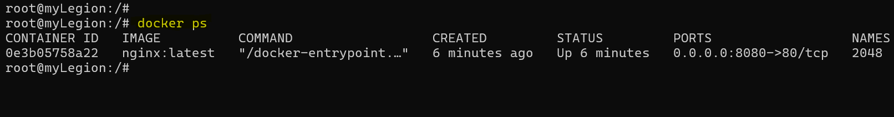
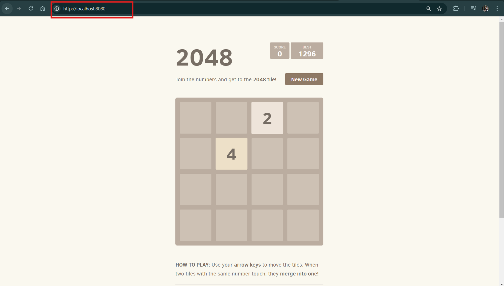

# Running Containerized 2048 Game with Docker

In this demo, we will demonstrate how to run the official open-source 2048 game on your Docker host by using a containerized approach with Nginx. Follow these steps to get the game up and running.

### Step 1: Clone the Git Repository

First, we need to clone the 2048 game repository from GitHub. Open a terminal and run the following command:

```
git clone <https://github.com/gabrielecirulli/2048.git> ~/2048
```

If Git is not installed on your system, please refer to previous articles on how to install Git.


### Step 2: Navigate to the Cloned Repository

Change the directory to the cloned repository:

```
cd ~/2048
```

List the files to confirm the contents of the repository:

```
ls
```

You should see a bunch of files including `index.html`, which will be used by Nginx to serve the game.



### Step 3: Run Nginx Container with Bind Mount

We will now run an Nginx container and bind-mount the cloned `2048` directory to the Nginx `html` directory. This will replace the default `index.html` with the one from the 2048 repository.

```
docker run -d --name 2048 -p 8080:80 -v ~/2048:/usr/share/nginx/html nginx:latest
```



Let's breakdown each part of the command:

- **`docker run`**: This command starts a new container.
- **`d`**: Runs the container in detached mode, meaning it runs in the background.
- **`-name 2048`**: Names the container "2048" for easy reference.
- **`p 8080:80`**: Maps port 8080 on the Docker host to port 80 in the container. This allows us to access the web server running inside the container via `http://localhost:8080`.
- **`v ~/2048:/usr/share/nginx/html`**: Bind-mounts the local directory `~/2048` to the container directory `/usr/share/nginx/html`. This means the contents of the local `2048` directory will be available at the web server's root directory inside the container.
- **`nginx:latest`**: Specifies the Docker image to use. Here, we are using the latest version of the official Nginx image.
    
    ### What Happens Under the Hood?
    
- **Bind Mount**:
    - The `v ~/2048:/usr/share/nginx/html` option tells Docker to mount the local `~/2048` directory into the container at the path `/usr/share/nginx/html`.
    - This means any files in `~/2048` on your host machine will be accessible to Nginx running inside the container. Essentially, Nginx will serve the files from `~/2048` as if they were located in its default document root directory.

### Step 4: Verify Container is Running

Check if the container is running:

```
docker ps
```

You should see the `2048` container listed.



### Step 5: Open 2048 Game in Web Browser

Open a web browser and navigate to `http://localhost:8080`. You should see the 2048 game interface.



### Step 6: Play the Game

Test the game to ensure it works properly. You can use the arrow keys or swipe gestures (if using a touch device) to play the game.

### Summary

In this demo, we successfully cloned the official open-source 2048 game repository and ran it in a containerized environment using Docker and Nginx. The bind-mount feature allowed us to replace the default Nginx `index.html` with the game's `index.html`, enabling us to play the game in a web browser at `http://localhost:8080`.

Go ahead and try it yourself for a fun and interactive experience!

