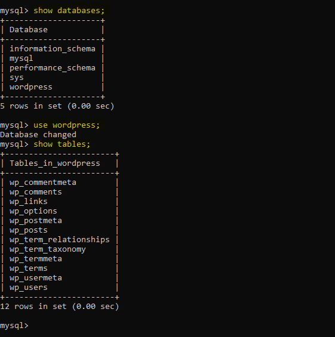

# Executing Docker Compose File and Interacting with Containers

## Introduction

In this document, we will execute the Docker Compose file that we created in the previous session. This Compose file defines a multi-container application consisting of MySQL database and WordPress services. We will observe how Docker Compose creates necessary objects, ensures proper networking between containers, and interact with the running containers.

## Executing the Docker Compose File

Assuming we are in the present working directory containing the `docker-compose.yaml` file, execute the following command to start the containers defined in the Compose file:

```bash
docker-compose up -d
```

The `-d` flag runs the containers in detached mode, allowing them to run in the background.

### Observing Docker Compose in Action

As Docker Compose runs the containers, it performs several actions:

1. **Creating Network**: Docker Compose creates a default bridge network if not explicitly defined.
2. **Creating Volumes**: It creates volumes (`wordpress_files` and `db_data`) using the default volume driver.
3. **Creating Services**: The `db` service (MySQL) is created before the `wordpress` service due to dependency.
4. **Port Mapping**: It automatically maps port 8000 on the host to port 80 in the `wordpress` container.

### Verifying Containers

To verify that the containers are up and running, execute the following command to list the running containers:

```bash
docker ps
```

We should see both `mysql_database` and `wd_frontend` containers listed, indicating they are running successfully.

## Interacting with WordPress

1. **Accessing WordPress**: Open a web browser and navigate to `localhost:8000`. You should see the default page of the WordPress installation, confirming a successful installation.

2. **Working with WordPress**: Create a dummy post and publish it to verify that WordPress is functioning correctly. Click on the "View post" button to view the published post.

## Interacting with MySQL

1. **Accessing MySQL Container**: Return to the terminal and interact with the `mysql_database` container:

```bash
docker exec -it mysql_database bash
```

2. **Navigating MySQL Directories**: Within the container, navigate to the MySQL data directory:

```bash
cd /var/lib/mysql
ls
```

You should see the MySQL data files, indicating that data is successfully stored.

3. **Using MySQL Client**: Run another instance of MySQL as a client, linking it to the `mysql_database` container:

```bash
docker run -it --network=<default_bridge_network> --rm mysql:5.7 mysql -hmysql_database -uroot -p
```

Replace `<default_bridge_network>` with the name of the default bridge network. Here, we have to enter the `MYSQL_ROOT_PASSWORD` in order to access `mysql`.

4. **Querying MySQL**: Run MySQL queries to interact with the `wordpress` database:

```sql
show databases;
use wordpress;
show tables;
```

You should see the `wordpress` database and its tables, confirming the successful interaction between containers.



## Conclusion

In conclusion, we have executed a Docker Compose file that defines a multi-container application with MySQL and WordPress. We observed how Docker Compose manages containers, networking, and volumes. We interacted with both WordPress and MySQL containers to ensure that the application is working as expected. Docker Compose proves to be a powerful tool for managing complex, multi-container applications efficiently.