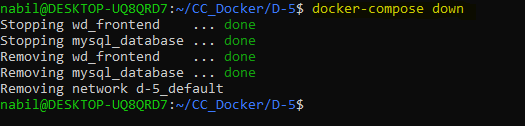

# Docker Compose Command Line Operations

In this document, we will explore various Docker Compose command line operations to manage and interact with our multi-container application defined in the `docker-compose.yaml` file.

## Viewing Docker Compose Configuration

### docker-compose config

The `docker-compose config` command displays the composed YAML file on the terminal screen. It provides all the information about services, networks, and volumes defined in the YAML file.

```bash
docker-compose config
```

### Output:
```yaml
services:
  db:
    image: mysql:5.7
    container_name: mysql_database
    volumes:
      - db_data:/var/lib/mysql
    restart: always
    environment:
      MYSQL_ROOT_PASSWORD: word@press
      MYSQL_DATABASE: wordpress
      MYSQL_USER: wordpress
      MYSQL_PASSWORD: abc@123

  wordpress:
    depends_on:
      - db
    image: wordpress
    container_name: wd_frontend
    volumes:
      - wordpress_files:/var/www/html
    ports:
      - "8000:80"
    restart: always
    environment:
      WORDPRESS_DB_HOST: db:3306
      WORDPRESS_DB_USER: wordpress
      WORDPRESS_DB_PASSWORD: abc@123

volumes:
  wordpress_files:
  db_data:
```

## Listing Docker Compose Images

### docker-compose images

The `docker-compose images` command lists all the images used to create containers for services defined in the Compose file.

```bash
docker-compose images
```

### Output:
```plaintext
         Container               Repository        Tag       Image Id      Size 
--------------------------------------------------------------------------------
   mysql_database          mysql              5.7       f7a5d018d1c2   341 MB
   wd_frontend             wordpress          latest    12c3fcb29ff3   551 MB
```

## Fetching Logs from Services

### docker-compose logs

The `docker-compose logs` command fetches the log output from the services. To limit the logs, you can use the `--tail` flag.

```bash
docker-compose logs --tail=10
```

### Output:
```plaintext
Attaching to mysql_database, wd_frontend
mysql_database | MySQL init process done. Ready for start up.
wd_frontend    | WordPress not found in /var/www/html - copying now...
mysql_database | 2024-05-25T12:34:56.789432Z 0 [Warning] InnoDB:...
...
```

## Listing Docker Compose Containers

### docker-compose ps

The `docker-compose ps` command is similar to `docker ps` and lists all the running containers along with other information such as state, port mapping, and entry point commands.

```bash
docker-compose ps
```

### Output:
```plaintext
    Name                   Command               State         Ports
-------------------------------------------------------------------------------
   mysql_database     docker-entrypoint.sh mysqld   Up      3306/tcp, 33060/tcp
   wd_frontend        docker-entrypoint.sh apach ... Up      0.0.0.0:8000->80/tcp
```

## Displaying Running Processes

### docker-compose top

The `docker-compose top` command displays all the running processes inside all the containers.

```bash
docker-compose top
```

## Stopping and Removing Containers

### docker-compose down

The `docker-compose down` command stops and removes all containers defined in the `docker-compose.yaml` file, along with other resources such as networks.

```bash
docker-compose down
```



## Conclusion

In conclusion, we have explored various Docker Compose command line operations to manage our multi-container application. These commands allow us to view configuration, list images, fetch logs, manage containers, and interact with running processes. Docker Compose proves to be an efficient tool for orchestrating complex applications with multiple services and containers.