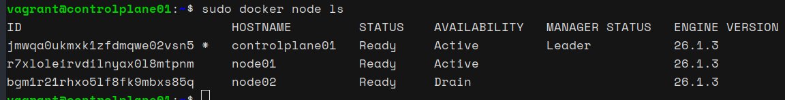
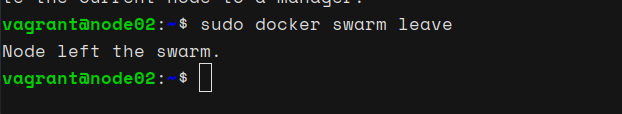
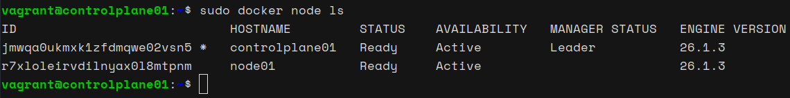
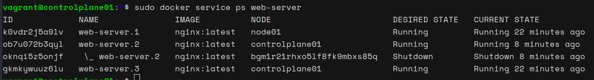

# Managing Docker Swarm Nodes: Draining and Removing a Node

This guide will walk us through the process of safely draining a node in a Docker Swarm cluster, verifying task rescheduling, and then removing the node from the cluster. This is useful for maintenance or in the event a node needs to be taken offline.

### Steps to Drain and Remove a Node in Docker Swarm

#### 1. Draining the Node

Draining a node ensures that it will not receive any new tasks, and any tasks running on it will be rescheduled to other nodes.

For example, to drain `node02`, run:

```bash
sudo docker node update --availability drain node02
```

#### 2. Verifying the Node Status

We can verify that the node is in the drained state by listing all nodes:

```bash
sudo docker node ls
```


We should see that the `node02` has its `AVAILABILITY` status set to `Drain`.

#### 3. Checking Task Rescheduling

To see if tasks have been rescheduled, check the service tasks:

```bash
sudo docker service ps web-server
```

#### 4. Removing the Node from the Swarm

After draining the node, we need to make it leave the Swarm:

**On `node02`:**

```bash
sudo docker swarm leave
```



If we need to force it to leave:

```bash
sudo docker swarm leave --force
```

#### 5. Removing the Node from the Manager's List

After the node has left the Swarm, we can remove it from the manager's list:

**On `controlplane01`:**

```bash
sudo docker node rm node02
```

### Verification

1. **Verify Node List:** Check the remaining nodes to ensure `node02` has been removed:

   ```bash
   sudo docker node ls
   ```

   

2. **Verify Service Tasks:** Ensure the tasks have been redistributed properly:

   ```bash
   sudo docker service ps web-server
   ```

   

By following these steps, we can safely manage the nodes in our Docker Swarm cluster, ensuring that tasks are rescheduled and nodes are properly removed when necessary.