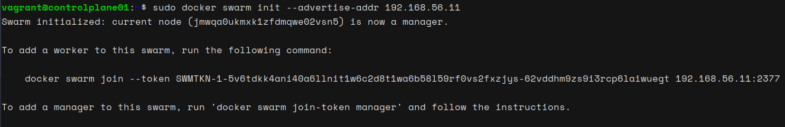
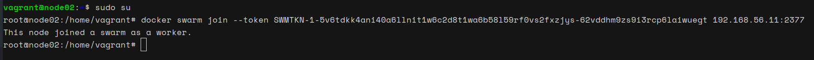
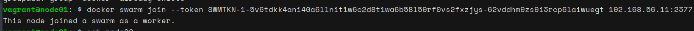
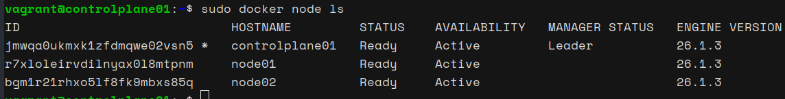

# Setting Up Docker Swarm Cluster: Installing Docker on VMs and Configuring Swarm

**Step 1: Installing Docker on VMs**

1. Install Vagrant and create three virtual machines: `controlplane01`, `node01`, and `node02`.
2. SSH into each VM (`controlplane01`, `node01`, `node02`).
3. Install Docker on each VM by executing the following commands:

   ```bash
   sudo apt update
   sudo apt install -y docker.io
   ```
4. After installation, start and enable the Docker service:

   ```bash
   sudo systemctl start docker
   sudo systemctl enable docker
   ```

**Step 2: Making Control Plane as Swarm Manager**

1. SSH into the control plane node (`controlplane01`).
2. Initialize Swarm mode on the control plane using the `docker swarm init` command:

   ```bash
   docker swarm init --advertise-addr <controlplane_IP>
   ```

   
   

   Replace `<controlplane_IP>` with the IP address of the control plane node.

**Step 3: Joining Worker Nodes to the Swarm**

1. SSH into each worker node (`node01` and `node02`).
2. Join the Swarm cluster as workers using the token obtained from the control plane node:

   ```bash
   docker swarm join --token <token> <controlplane_IP>:2377
   ```

   

   


   Replace `<token>` with the token obtained from the control plane node and `<controlplane_IP>` with the IP address of the control plane node.
   
**Step 4: Verifying Node Joining**

1. SSH back into the control plane node (`controlplane01`).
2. Verify that the worker nodes (`node01` and `node02`) have successfully joined the Swarm cluster:

   ```bash
   docker node ls
   ```

   
   

   We should see all nodes listed, with the control plane node labeled as `Leader` and the worker nodes labeled as `Ready`.

**Conclusion:**

Docker has been successfully installed on the VMs (`controlplane01`, `node01`, `node02`), and a Docker Swarm cluster has been set up with the control plane node (`controlplane01`) as the manager and `node01` and `node02` as worker nodes. Our Swarm cluster is now ready to deploy and manage containers across multiple nodes.
