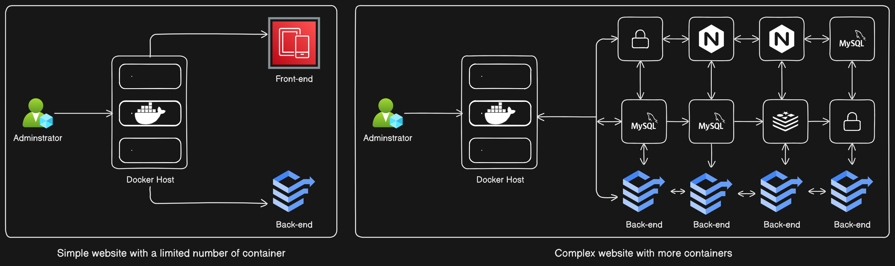
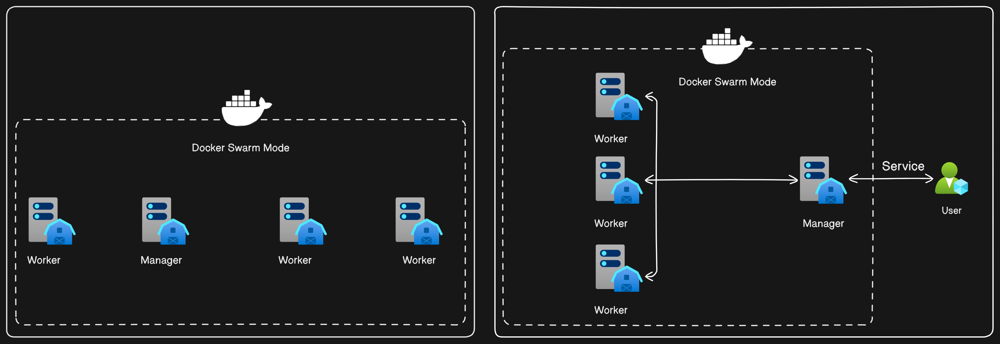
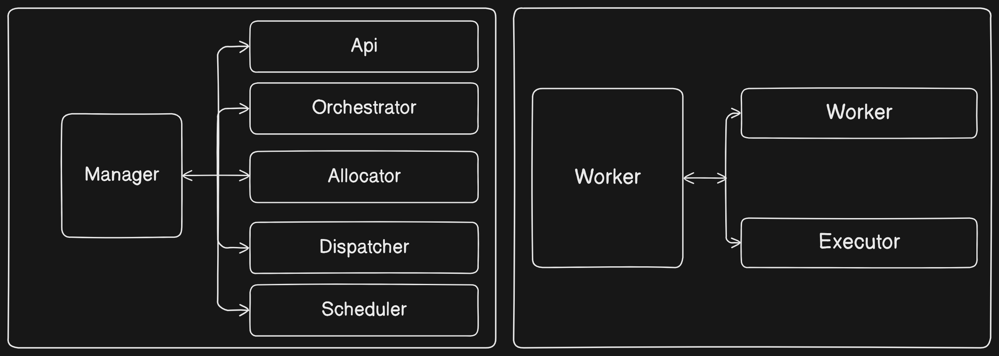

# Understanding Docker Swarm: Managing Containers at Scale

## Introduction
Docker has revolutionized containerization, enabling developers to build and deploy applications efficiently. However, managing containers at scale presents its own set of challenges. Docker Swarm, a container orchestrator developed by Docker, addresses these challenges by allowing seamless management of containers across multiple hosts.

## Why do we need Container orchestration?

First we need to understand what happens during the traditional deployment.

**Traditional Deployment:**

In traditional deployment scenarios, applications are typically deployed on single servers or virtual machines (VMs). `Scaling and managing` applications manually can be cumbersome and time-consuming. High availability and fault tolerance are challenging to achieve, as a single point of failure can lead to downtime. Resource utilization may be inefficient, with underutilized or overburdened servers. Handling updates and rollbacks requires manual intervention and may result in service disruptions.

**Container Orchestration:**

With container orchestration, applications are deployed and managed across a cluster of servers or VMs. Automatic scaling ensures that resources are allocated dynamically based on demand, allowing applications to handle varying levels of traffic. High availability is achieved through automated failover and rescheduling of containers in the event of node failures. Resource utilization is optimized through efficient allocation and management of containers across the cluster.
Rolling updates and rollbacks are facilitated, enabling seamless deployment of new application versions without downtime.

## Docker Swarm as a container orchestrator

While a single host may suffice for simple applications, larger-scale applications, such as those run by Google or PayPal, require a multitude of containers that communicate in various topologies. Additionally, even dynamic websites with tracking and data collection functionalities demand more containers than a basic blog. 

Deploying all these containers on a single host can lead to resource constraints and potential performance issues. Thus, `Docker Swarm` offers a solution for orchestrating containers across multiple hosts, ensuring scalability, resilience, and efficient resource utilization.

## Understanding Docker Swarm
Docker Swarm operates as a cluster of Docker hosts, enabling collaboration and centralized management. Here's how it works:

1. **Initialization**: One host manually initializes the cluster and becomes the manager, while other hosts join as worker nodes.
  
2. **Manager-Worker Hierarchy**: The manager coordinates communication between users and worker nodes, similar to a hierarchical management structure.

3. **Service-Based Interaction**: Users interact with the manager by defining services, which are translated into tasks and distributed to worker nodes for execution.

4. **Key Components**:
   - **Manager**: Equipped with HTTP API endpoints, orchestrator, allocator, dispatcher, and scheduler for managing services and tasks.
   - **Worker**: Connects to the manager's dispatcher to receive tasks and executes them, creating containers, volumes, and networks.

## Handling Failures and Resilience
Docker Swarm ensures resilience in the face of failures:
- **Node Failure**: If one or more nodes go down, Docker Swarm automatically redistributes tasks to available nodes, ensuring continuity of services.

## Conclusion
Docker Swarm simplifies the management of containers at scale, offering resilience, scalability, and centralized control. By leveraging Docker Swarm, developers and DevOps engineers can efficiently deploy, manage, and scale containerized applications, ensuring optimal performance and reliability in large-scale environments.